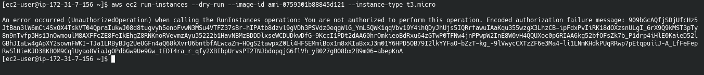
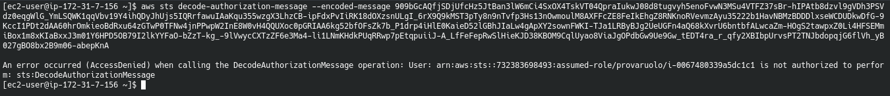
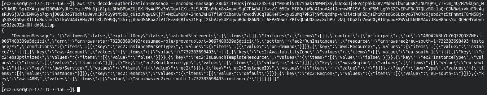

# Introduzione 
Molti dei documenti presentati utilizzano l'interfaccia grafica di AWS ma per poter automatizzare i nostri servizi in maniera veloce si consiglia l'utilizzo di AWS CLI, interfaccia a riga di comando di AWS che permette l'interazione con qualsiasi servizio AWS in maniera rapida ed in oltre permette l'implemetazione di script di automazione dei servizi AWS.

# Installazione in Windows
Per l'istallazione in windows basta scaricare il file msi dal segunete link https://awscli.amazonaws.com/AWSCLIV2.msi . Dopo aver effettuato l'istallazione basta aprire il cmd e digitare `AWS --version` se vi viene mostrata la versione del CLI di AWS allora è stato correttamente installato.

# Installazione Linux
per l'installazione in linux i comandi da lanciare da termiale sono i seguenti :  
```bash
curl "https://awscli.amazonaws.com/awscli-exe-linux-x86_64.zip" -o "awscliv2.zip"
unzip awscliv2.zip
sudo ./aws/install
```

Per controllare che l'istallazione sia avvenuta correttamente basta digirare il comando : `aws --version`

**NB per qualsiasi chiarimento potete andare nella sezione AWS relativa all'installazione dei CLI al segunete indirizzo : https://docs.aws.amazon.com/cli/latest/userguide/cli-chap-install.html**

Una domanda che può capitare nel'esame è : se dopo l'istallazione del CLI dovessi avere una risposta dal termiale quale : aws:command not found quale è il problema ? la risposta è che l'eseguibile non è nella variabili d'ambiente.


# Configurazione
Per poter utilizzare il CLI bisogna inserire le credenziali del proprio account. Per suddividere gli accessi dai vari dispositivi conviene creare delle nuove credenziali. Per crearle basta andare su IAM -> Users -> selzionare il proprio utente -> cliccare su crea chiavi di accesso -> salvare il file csv. 
Prima di chiudere la finestra di dialogo apriamo il termianle e digitiamo : `aws configure` .
Dopo aver lanciato il comando ci verrà chiesto di inserire l'ID dell'account, la chiave di accesso, la regione (milano eu-south-1) e il formato con la quale vogliamo salvare le credenziali (per il momento andiamo con none).

Una volta che abbiamo salvato le credenziali il cli è pronto. Possiamo inserire nuove credenziali lanciando nuovamente il comando `aws configure`

# CLI da un istanza EC2
In generale per avviare il cli da delle istanze è **sconsigliatissimo** inserire le proprie credenziali all'interno poiché se l'istanza dovesse per qualche motivo essere compromessa o è un istanza che viene maneggiata da più persone i propri dati verrebbero condivisi creado falle di sicurezza. La procedura precedente deve essere utilizzata solo dal proprio persona computer.

Il modo corretto per dare dei permessi ad un istanza EC2 è attraverso i ruoli dell'IAM. I ruoli sono il metodo migliore per dare dei permessi alle istanze o in generale alle applicazioni poiché per ogni ruolo che definiamo esso è seguito da una specifica policy che ne descrive i permessi e di default, non ne ha. Le istanze EC2 utilizzeranno automaticamente questi profili per eseguire le operazioni richieste basta creare un ruolo con i permessi specifici e attaccarlo all'istanza tramite l'opzione operazioni -> sicurezza -> modifica il ruolo IAM. Da questo punto quando lanciamo in ssh l'operazione aws l'istanza potrà eseguirla a patto che il ruolo assegnatogli abbia i relativi permessi. NB ogni istanza può avere un solo ruolo quindi bisogna essere quanto più specifici possibile nella definizione del ruolo e non lesinare sui ruoli ma nel caso creare ogni ruolo ad hoc per ogni singola occorrenza.

# Ruoli 
i ruoli per l'utilizzo della cli sono molto importati poiché permetto un controllo sulle azioni che si possono o non possono fare. Oltre ai ruoli che non sono altro che un raccoglitore di permessi ci sono le policy che specificano i permessi veri e propri. Tramite le polici possiamo indicare cosa un istanza può o non può fare, definire gli accessi avviare altri servizi, ecc. Per definire le policy possiamo aiutarci con l'editor visuale dove selezionaeremo : 
+ il servizio per la quale vogliamo dare il permesso
+ set di operazioni disponibili
    + per ogni set possiamo andare a selezionare una specifica operazione
+ La risorsa specifica alla quale vogliamo accedere con l'opzione precedente 
+ Eventuali condizioni di accesso

# Dry run

Quando utilizziamo un comando cli ma non vogliamo eseguire fisicamente l'operazione, ad esempio la creazione di un istanza EC2, possiamo utilizzare l'opzione `--dry-run` per inidicare al cli che vogliamo solo sapere se questa operazione verrebbe eseguita e nel caso di insuccesso ci specifica quale permesso non è stato accettato.

Nel caso in cui l'operazione non viene effettuata abbiamo un messaggio di errore con una serie di caratteri. Questa dicitura in realtà ci da un indicazione più specifica rispetta al semplice messaggio di errore solo che essa è criptata. Per decodificare il messaggio possiamo utilizzare il comando `sts` che esegue un **decode-authorization-message**

Un esempio di un messaggio di errore è il seguente :  



Come potete vedere dopo la scritta "you are not authoraized" abbiamo tutto un lungo messaggio che dovrebbe specificare l'errore. Per poter decodificare il messaggio dobbiamo digitare il comando :   
`aws sts decode-authorization-message --encoded-message <valore>`  
dove per valore dobbiamo inserire tutto il codice criptato come nella seguente immagine :  



Questa operazione può essere automatizzata aggiungendo la policy al ruolo per decodificare il messaggio di errore : 
+ scegliamo il servizio **STS**
+ nelle operation scegliamo write e selezioniamo decodeAuthorizationMessage
+ non selezioniamo nessuna risorse e condizione 

e attacchiamo questa policy ai ruoli per la quale ci viene mostrato questo messaggio di errore.

A questo punto se rieseguiamo le operazioni precedenti otterremo il segunete output :  



Questo messaggio non è altro che un json con le indicazioni dell'errore, per renderlo legibile dobbiamo lanciare il comando : `echo <messaggio>`  con l'accortezza di selezionare il messaggio solo con la parte che segue "DecodedMessage"
e il risultato sarà un file json leggibile :  
```json
{
    "allowed": false,
    "explicitDeny": false,
    "matchedStatements": {
        "items": []
    },
    "failures": {
        "items": []
    },
    "context": {
        "principal": {
            "id": "AROA2VHLYLY6Q92QDXZNG:i-0067830339f5id1b1",
            "arn": "arn:aws:sts::73238367234:assumed-role/provaruolo/i-0067830339f5id1b1"
        },
        "action": "ec2:RunInstances",
        "resource": "arn:aws:ec2:eu-south-1:73238367234:instance/*",
        "conditions": {
            "items": [
                {
                    "key": "ec2:InstanceMarketType",
                    "values": {
                        "items": [
                            {
                                "value": "on-demand"
                            }
                        ]
                    }
                },
                {
                    "key": "aws:Resource",
                    "values": {
                        "items": [
                            {
                                "value": "instance/*"
                            }
                        ]
                    }
                },
                {
                    "key": "aws:Account",
                    "values": {
                        "items": [
                            {
                                "value": "73238367234"
                            }
                        ]
                    }
                },
                {
                    "key": "ec2:AvailabilityZone",
                    "values": {
                        "items": [
                            {
                                "value": "eu-south-1b"
                            }
                        ]
                    }
                },
                {
                    "key": "ec2:ebsOptimized",
                    "values": {
                        "items": [
                            {
                                "value": "false"
                            }
                        ]
                    }
                },
                {
                    "key": "ec2:IsLaunchTemplateResource",
                    "values": {
                        "items": [
                            {
                                "value": "false"
                            }
                        ]
                    }
                },
                {
                    "key": "ec2:InstanceType",
                    "values": {
                        "items": [
                            {
                                "value": "t3.micro"
                            }
                        ]
                    }
                },
                {
                    "key": "ec2:RootDeviceType",
                    "values": {
                        "items": [
                            {
                                "value": "ebs"
                            }
                        ]
                    }
                },
                {
                    "key": "aws:Region",
                    "values": {
                        "items": [
                            {
                                "value": "eu-south-1"
                            }
                        ]
                    }
                },
                {
                    "key": "aws:Service",
                    "values": {
                        "items": [
                            {
                                "value": "ec2"
                            }
                        ]
                    }
                },
                {
                    "key": "ec2:InstanceID",
                    "values": {
                        "items": [
                            {
                                "value": "*"
                            }
                        ]
                    }
                },
                {
                    "key": "aws:Type",
                    "values": {
                        "items": [
                            {
                                "value": "instance"
                            }
                        ]
                    }
                },
                {
                    "key": "ec2:Tenancy",
                    "values": {
                        "items": [
                            {
                                "value": "default"
                            }
                        ]
                    }
                },
                {
                    "key": "ec2:Region",
                    "values": {
                        "items": [
                            {
                                "value": "eu-south-1"
                            }
                        ]
                    }
                },
                {
                    "key": "aws:ARN",
                    "values": {
                        "items": [
                            {
                                "value": "arn:aws:ec2:eu-south-1:73238367234:instance/*"
                            }
                        ]
                    }
                }
            ]
        }
    }
} 
```

Normalmente questa operazione viene fatta a livello di scripting per eseguire una serie di attivita atte alla comunicazione o alla risoluzioni di tali problemi.


# EC2 Metadata
Ci sono alcune informazioni che potrebbero essere utile nell'esecuzione delle tue macchine virtuali quando si vuole automatizzare alcune procedure. Nelle istanze EC2 queste infromazioni sono salvate su di un indirizzo privato raggiungibile solo dall'istanza in questione. tale indirizzo è http://169.254.169.254/latest/ .
se da terminale lanciamo il comando :  
```bash
curl http://169.254.169.254/latest/
```
ci verranno mostrare 3 cartelle e sono : 
+ dynamic
+ meta-data 
+ user-data (se sono stai impostati all'atto della creazione dell'istanza)

se andiamo nella cartella meta-data possiamo avere molte informazioni sull'istanza. Lanciando il comando :  
```bash
curl http://169.254.169.254/latest/meta-data/
```
abbiamo tutta una serie di cartelle quali :  
+ ami-id
+ ami-launch-index
+ ami-manifest-path
+ block-device-mapping/
+ events/
+ hostname
+ iam/
+ identity-credentials/
+ instance-action
+ instance-id
+ instance-life-cycle
+ instance-type
+ local-hostname
+ local-ipv4
+ mac
+ metrics/
+ network/
+ placement/
+ profile
+ public-hostname
+ public-ipv4
+ public-keys/
+ reservation-id
+ security-groups
+ services/

Dove c'è la barra vuol dire che sono directory altrimenti sono valori. 
Tutte queste informazioni sono utili per andare a creare degli automatismi che semplificano l'elaborazione, poiché permetto di ottenere dati utili all'esecuzione di script.

# Profile
Quando bisogna gestire più account di AWS da CLI è comodo poter eseguire operazioni specifiche per ogniuno di essi. Per risolvere il problema possiamo utilizzare dei profili. Per creare un profilo basta aggiungere il seguente comando alla configurazione :  
`aws configure --profile nome-profilo`  
così facendo si inseriranno le credenziali come visto in precedenza solo che esse saranno legate ad un nome.

Per poter avviare una richiesta per uno specifico profilo basta utilizzare la dicitura :  
`aws s3 ls --profile nome-profilo`  
Così facendo si avvierà la procedura richiesta per il profilo indicato. In questo modo possiamo interagire con AWS utilizzando vari profili slegando le azioni da un unico account o da un unico utente.


