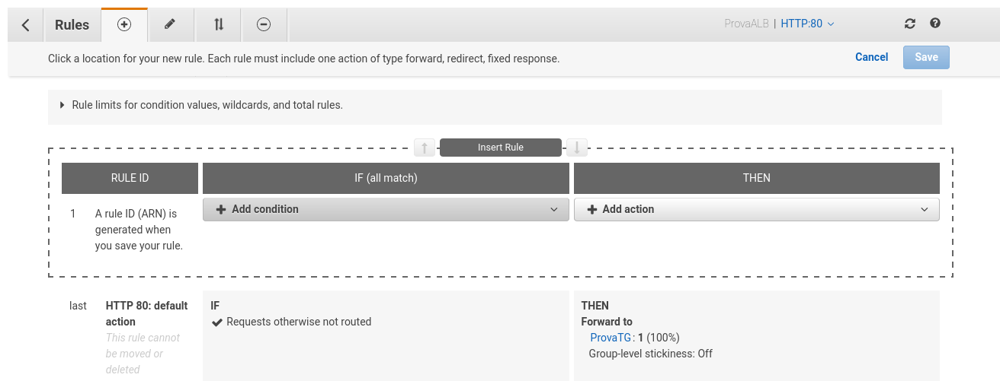
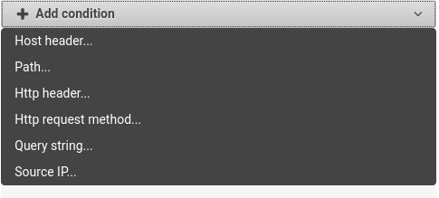

# Introduzione 
La scalabilità viene intesa come la capacità di allocare risorse in funzione del carico di lavoro che il sistema deve affrontare. La scalabilità viene suddivisa in due tipologie e sono :
+ Verticale : consiste nel ridimensionamento della risorsa per far fronte al lavoro (eg nei sistemi non distribuiti quali DB)
+ Orizontale : consiste nell'aggiunta di istanze, questo implica che i sitemi cosi costituiti devono essere ingrado di cooperare (in AWS questa soluzione viene implementata tramite gli Auto Scaling Group e gli Elastic Load Balancer )

Per alta disponibilità si intende la capacità del sistema di rimanere disponibile in presenza di guasti (Per far fronte a questo problema in AWS abbiamo L'Auto Scaling Group multi AZ e gli Elastic Load Balancer multi AZ)

# Elastic Load Balancing 
Un sistema di inoltro del traffico sulle varie istanze di back end. Questo sistema permette di suddividere il carico di lavoro su più istanze cosi da non sovraccaricarle e in modo da riuscire a far fronte ad una richiesta sempre maggiore del servizio. Un altra utilità è la funzione di access point per le istanze quasi come un DNS. Il load balancer controlla lo stato delle istanze sia per dimensionare il carico tra esse sia per identificare eventuali fault di una delle istanze e redistribuire il carico tra le rimanenti. Permette anche di interagire con le EC2 tramite ssh e https. Gestisce la disponibilità delle istanze anche su differenti AZ. Divide il traffico intra istanza (tra) da quello inter istanza(da e verso).

Come detto prima il Load Balancer si occuperà di comunicare con le istanze cosi da comprendere lo stato di ogniuna di loro, questa comunicazione viene implementata tramite l'health check. Questo metodo consiste nel comunicare con l'istanza su di una specifica porta chiedendo lo stato dell'istanza, se essa risponde con il codice 200 verrà considerata idonea ad elaborare il traffico altrimenti verra considerata come inattiva. Questa comunicazione avviene ogni 5 secondi ma può essere implementata anche con periodi più lunghi

AWS mette a disposizione 3 tipologie di ELB e sono :
+ Classic load balancer (v1) : vecchia generazione creata nel 2009, supporta il traffico HTTP, HTTPS e TCP
+ Application Load Balancer (v2) : nuova generazione creata nel 2016, supporta HTTP, HTTPS e WebSocket 
+ Network Load Balancer (v2) : nuova generazione creata nel 2017, supporta TCP, TLS (Trasport Layer Security), UDP

Si raccomanda l'utilizzo di load balancer di seconda generazione per la loro semplicità di utilizzo e di configurazione.

In generale i bilanciatori di carico possono essere interni alla tua struttura (non visibili dall'esterno) o esterni.
Tramite gli ELB possiamo monitorare il traffico tramite gli access log dove vengono registrate le richieste e su CloudWatch.

## CLB
Classic Load Balancer Supporta come layer livello 4 il TCP mentre come layer livello 7 HTTP e HTTPS. L'Health check viene effettuato sulla risposta ad una richiesta TCP o HTTP. 

Un primo esempio del load balancer classico è la sua introduzione come layer ad un EC2 che ci fa da server per un sito.
Per creare un load balancer andiamo nel menu laterale fino alla sezione Load Balancing. Da qui basta cliccare sul pulsante Create load balancer. In questa schermata vi verranno presentati le tre tipologie di load balancer, andiamo sul classic.
Dopo avergli dato un nome e scelto la VPC sulla o nella quale inserirlo ci viene chiesto se vogliamo che sia interno. A questo punto bisogna configurare il listner che rappresenta i metodi di comunicazione da e verso il load balancer lato esterno lato istanze. Settiamo il SG con TCP sulla pota 80. Ora ci vengono presentate le opzioni per il Health check e sono :  
+ ping protocol : con quale protocollo vogliamo effettuare il controllo 
+ port : su quale porta 
+ path : su quale percorso
+ tempo per la risposta 
+ ogni quanto vogliamo richiedere il check
+ numero di volte che l'istanza risulta non raggiungibile prima di dichiarala non sana
+ numero di controlli riusciti viene considerata sana

Ora andiamo avanti nella sessione e ci chiede di selezionare le istanze EC2 da aggiungere al load balancer. Subito dopo inseriamo eventuali tag e dopo la review possiamo crearlo.

Ora per accedere alla nostra istanza basta utilizzare l'indirizzo presente nel DNS name e vedremo la stessa pagina proposta nell'esempio della sezione introduttiva.

Ora l'ultima modifica da effettuare è la modifica del SG della nostra istanza in modo che sia raggiungibile solo dal CLB e non da altri inirizzi. Per modificare questa impostazione basta andare sul SG dell'istanza e modificare l'ingresso affinche solo il SG del load balancer possa comunicare sulla porta 80, per aggiungere direttamente il SG e non l'indirizzo basta scrivere al posto dell'indirizzo le lettere sg e di seguito ci verranno mostrati tutti gli SG in nostro possesso. Sostituiamo il sg del CLB.

## ALB
Sfrutta un bilanciamento di livello 7 (di livello applicativo stack iso-osi) HTTP, inoltre permette un indirizzamento per gruppi di VM attraverso i target group, il bilanciamento multi applicazione sulla stessa macchina tramite la containerizzazione e supporta HTTP2 e WebSocket.

l'ALB può essere considerato più come un applicazione di routing che come un classico loadbalancer poiché supporta algoritmi di routing basati su path, URL e query string. Questa tipologia di LB funziona molto bene con applicazioni basate su microservizzi basando il suo funzionamento sul port mapping per il reindirizzamento dinamico delle risorse.
 
I target group sono un insieme di servizi che possono essere gestiti tramite un ASG e sono :  
+ EC2 istanze di VM
+ ECS manager di microservizi
+ lambda function 
+ IP address

Come per i CLB anche gli ALB eseguono il health check ma rispetto al CLB lo eseguono sui target group.
Un altra differenza con l'CLB sta nel fatto che l'ALB si pone sul confine dell'area esterna del nostro sistema comunicando con gli user esterni tramite l'indirizzo publico e con le istanze con l'indirizzo privato facendo variare le porte sulla quale comunica. Questo meccanismo crea un astrazione anche per le istanze di back end che per ottenere i dati delle macchine che richiedono l'accesso al ALB devono andare a leggere alcuni paramentri delle richieste portate dal ALB e sono :
+ X-Forworded-For : indirizzo ip del client inserito nell'header della richiesta 
+ X-Forworded-Port : porta del client inserita nell'header della richiesta
+ X-Forworded-Proto : protocollo di comunicazione del clent

Per creare un ALB andiamo nel menu laterale alla voce load balancer, da li avviamo la creazione di un load balancer selezionando Application Load Balancer. La prima scermata chiede di inserire il nome , se si vuole creare una configurazione interna o esterna, lo standard IP, il listner che in questo caso è riferito solo alle chiamate dall'esterno, La selezione di un AZ attraverso la VPC e altre opzioni avanzate.
Dopo alcuni eventuali avvisi sulla sicurezza passiamo alla creazione dei SG, in questo caso il SG è lo stesso del CLB.
Successivamente ci viene presentata la sezione di routing dove dovremo creare dei target group inserendo dati quali : nome, tipologia del target, protocollo e porta e le impostazioni dell'health check con alcune aggiunte. Dopo aver selezionato le istanze e aggiunte al registro avremo la review dei settaggi e potremo creare la ALB.

Una volta creata essa gestira il traffico in funzione delle regole definite e dei target group alla quale le deve fare eseguire. Quindi possiamo creare più target goup che verranno attivati in funzione di eventuali regole.

Per definire un target group possiamo andare nella sezione load balancer alla voce target group e creare i nostri gruppi, ps una volta inserite le istanze che devono essere attive bisogna attendere l'health check. 

Per definire le regole bisgona andare sul load balancer e nella sezione listner cliccare su edit rule. vi si aprirà la seguente pagina :  

In questa pagina possiamo definire regole basete su condizioni seguenti : 
  
Che apriranno tutta una serie di oparazioni eseguibili

## NLB 
I Network Load Balancer sono bilanciatori di carico che lavorano al livello trasporto utilizzando gli standard TCP e UDP, vengono utilizzati per elevare le prestazioni e la latenza è circa un quarto di quella degli ALB. 
Gli NLB hanno un indirizzo statico per ogni AZ alla quale possiamo definire un elastic ip. 

Gli NLB non sono nel piano gratuito quindi se li si utilizza si avra un costo che può variare in funzione del tempo di attività, numero di nuove connessioni al secondo, flussi o connessioni attive al secondo e numero di GB elaborati normalmente per un ora di test non si hanno cifre esorbitanti considerando che il numero di dati elaborati è al di sotto dei mega e il numero di connessioni sono molto limitate al test avendo cifre che si aggirano intorno ai 0.05 dollari all'ora ma se proporzionato ad un traffico costante molto elevato durante tutto il mese possiamo arrivare fino ai 50 dollari. Valori simili sono anche per le ALB

Come per gli ALB possiamo definire dei target group e delle regole solo che esse si baseranno verso l'esterno sugli standard TCP e UDP mentre dal lato interno avremo vari standard utilizzabili come ad esempio HTTP.

Una sostanziale differenza con l'ALB è che il NLB non crea un layer ma smista semplicemente le richieste e quindi le richieste fatte alle istanze vedranno sempre il client e non la NLB. A raforzare questo concetto è il fatto che quando si crea un NLB non configuriamo alcun SG, quindi per poter utilizzare l'NLB bisogna aprire nel SG dell'istanza verso l'esterno.

# Stickiness
La traduzione letteraria è viscosità, un esempio di questa proprietà è la possibilità di indirizzare un client sempre verso la stessa istanza. Questà proprietà è dei CLB e ALB. Questa proprietà viene implementata attraverso i cookie con un timeout e fin tanto che questa è valido rimane invariata la viscosità. Questa proprietà viene utilizzata ogni qual volta abbiamo bisgno di salvare i dati di sessione. Questa proprietà non permette di avere un carico equamente distribuito tra le istanze.

Questa propietà e settabile solo da CLB dalle sue impostazioni o sul'ALB indirettamente tramite i target group. Una volta attiva può essere impostato solo il tempo entro la quale i client possono essere reindirizzati.