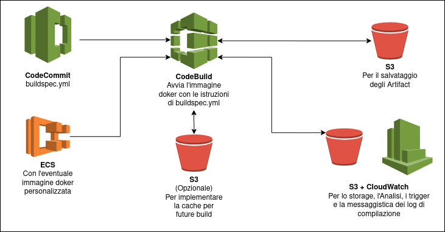

# Introduzione
Come in ogni sviluppo di un software bisogna definire delle fasi con del codice che vine scritto testato e in fine caricato affinche possa far funzionare i servizi che abbiamo pensato. Tramite una serie di tool messi a disposizione da AWS possiamo implementare tutte queste fasi. I servizi che vedremo sono :
+ AWS CodeCommit 
+ AWS CodePipeline : implementare automaticamente il codice sviluppato in Beamstalk
+ AWS CodeBuild : compilare e testare il proprio codice
+ AWS CodeDeploy : invia il codice testato nelle istanze di AWS

In generale quando si parla di CI/CD parliamo della continua integrazione di funzionalità nel nostro codice e della continua consegna di codice per avere sempre sistemi aggiornati e funzionanti.
Tra i servizi che più vengono utilizzati per la CI troviamo : 
+ servizi di repository
    + git (con le sue versioni di repository online come github, Bitbucket e gitlab)
    + CodeCommit 
    + ...
+ Servizi di testing/build
    + CodeBuild
    + Jenkins CI
    + ...
+ In generale questi sistemi sono consecutivi e servono alla ricerca di bug all'interno del codice cosi da automatizzare la produzione e il controllo in maniera semplice e funzionale

Mentre per la CD Continuous Delivery permette di integrare il codice sviluppato in architetture esistenti in maniera automatica per evitare errori nel'upload e semplifica la vita degli sviluppatori.
I tools utilizzabili sono :
+ CodeDeploy
+ Jerkins CD
+ Spinnaker
+ ...

Le fasi del CICD sono :
+ Code  AWS Commit
+ Build  AWS CodeBuild
+ Test  AWS CodeBuild
+ Deploy    AWS CodeDeploy
+ Provisioning  CloudFormation

Mentre per poter gestire tuttolo lo stack troviamo AWS CodePipeline.


# CodeCommit
Il sistema di versioning di AWS. Salva i cambiamenti che sono avvenuti nel codice e permette il roll back. Questo servizio è privato ed è al pari di repository git online privati, in più di integra con gli altri servizi di CICD di AWS e con la piattaforma, ciò non toglie che se si vuole si può utilizzare anche un repository esterno.
Non ci sono limiti di dimensione dei repository. Il codice caricato è posto nel tuo account AWS. Ha tutta una serie di coontrolli tra cui : criptazione, controllo degli accessi, ecc. Si integra perfettamente con altri provider di repositoring online. 

## Sicurezza 
Per le interazioni con CC si utilizza lo standard Git. L'authentication viene fatta attraverso lo scambio di chiavi ssh gestite dall'IAM console. Basato su HTTPS utilizzabile tramite le API del CLI che genererà le credenziali. Si può abilitare anche l'MFA. L'Authorization come per tutti i servizi AWS deve essere definita tramite i permessi utente o i ruoli. La criptazione è automatica con chiavi KMS e avviene anche nel trasferimento tramite HTTPS.  Quanto riguarda la condivisione cross account mai dare le proprie chiavi SSH o l'accesso al proprio account, ma creare un ruolo nel proprio IAM e utilizzare AWS STS (per assegnare il ruolo a delle API). 

## Utilizzo 
Nella sezione di CodeCommit abbiamo in realtà tutti gli strumenti presentati in questa sezione.  
**PS non in tutte le regioni sono attivi questi servizi, quindi non è detto che siano tutti peresenti nella pagina.**  
Iniziamo creando un nuovo repository, dove dovremo inserire nome, descrizione e tag. Nella sezione successiva ci chiederà di scegliere il metodo di accesso remoto (HTTPS, SSH, HTTPS(GRC)), se usi l'account root non vedremo SSH. 

Tra le varie opzioni che abbiamo nel menu di CodeCommit trovaiamo : 
+ Code : gestore di codice dove possiamo effettuare l'upload e vedere i file
+ Pull request : In questa sezione vengono mostrate le richieste per l'uninone di branch
+ Commit : qui vedremo tutti i commit fatti sul repository, e potremo comparare le differenze tra i rami
+ Branches : verranno mostrati tutti i rami del repository
+ Tags
+ Settings : vedremo tutte le impostazioni del repository e potremo anche impostare 
    + notifiche : per aggiurnarci sui cambiamenti che avvengono sul repository 
    + trigger : permette di attivare SNS o lambdafunction quando abbiamo delle specifiche azioni

### Gestione delle connessione al repository 
Per poterci connettere al repository senza dover usare la dashboard bisogna generare le credenziali nell'IAM per il proprio utente andando nella sezione specifica delle credenziali di sicurezza, li troveremo due voci collegate esplicitamente a CodeCommit, una per SSH (dove bisogna caricare la pripria chiave publica) e una per HTTPS (Basta generare le credenziali di accesso). 


# CodePipeline
Un tool visuale per gestire il workflow del CICD dal code al deploy. Funziona attraverso delle operazioni che possono essere sequenziali o parallele al fine di automatizare tutto il CICD. Permette anche di implementare approvazioni manuali al fine di avere un controllo maggiore su tutta la filiera. L'insieme di queste azioni viene definito stage che genera degli elementi che in AWS vengono chiamti Artifact. Gli Artifact sono i risultati dell'elaborazione di ogni fase dello stage, un esempio è il seguente : quando effettuiamo un push di un codice si può attivare un trigger dello stage che copia il codice appena caricato in un bucket, la copia risultate è il primo artifact, una volta che il codice è stato caricato viene riestratto per effettuare un building e ricaricato nell'bucket, gli oggetti risultanti saranno un alto artifact.

Ad ogni passaggio di stato viene generato un evento CloudWatch che può a sua volta attivare una notifica SNS se impostiamo l'azione. Quando abbiamo un evento di fallimento viene automaticamente bloccata tutta la filiera automatica dello stage per evitare di creare problemi nel deploy finale.

## Configurazione
Per creare una Pipeline basta andare su CodePipeline dalla barra di ricerca che riporterà alla dashboard del CICD. Da li possiamo creare una nuova pipeline. Nella richiesta bisogna inserire : il nome, il ruolo che può essere uno già esistente o un nuovo ruolo e ci verrà chiesto se autorizziamo questo nuovo ruolo nel caso in cui lo stiamo creando. tra le impostazioni avanzate ci viene chiesto se vogliamo creare un nuovo bucket per gli artefatti o se vogliamo utilizzare un bucket già esistente (purché sia nella stessa regione) e la chiave di crittografia. Successivamente ci vinene richiesta la fonte dalla quale far partire il traching delle operazioni (CodeCommit, GitHub, ECR, S3), Scegliamo il nome del repository e il branch che vogliamo seguire e in che modo vogliamo che ci siano notificate gli stati (CloudWatch o dashboard Pipeline). Successiavamete abbiamo l'opzione per il building dove possiamo scegliere codeBuild o jenkins o in alternativa possiamo passare questo passaggio. Per lo step di deploy possiamo scegliere tra molte opzioni quali: CloudFormation, CodeDeploy, Beanstalk ecc. Per ogniuno di essi abbiamo varie opzioni. Una volta che abbiamo creato la pipeline possiamo modificarla aggiungendo ulteriori step, per ogniuno di essi possiamo aggiungere delle action che permetto di interagire con molti servizi di AWS e come detto prima possiamo anche inserire le approvazioni manuali non che azioni in parallelo.   


# CodeBuild
Un servizio completamente gestito per la compilazione di codice che effettua anche una serie di test. Senza dover gestire servizi su MV che effettuano lo stesso lavoro. Il costo del servizio è legato al tempo di computazione. Tutti gli artifact generati dal build sono sicuri poiché criptati tramite KMS e gestiti tramite permessi IAM, posti nella VPC e accedibili tramite API monitorabili tramite ClodTrail. Le specifiche di compilazione devono essere specificate nel file **buildspec.yml**. I log di output possono essere posti in un bucket e visibili tramite CloudWatch. Le build vengono compilate in doker che alla fine dell'elaborazione vengono eliminati quindi alla fine del processo rimangono solo i log. CodeBuild può essere utilizzato da solo o integrato in CodePipeline. I linguaggi supportati sono : 
+ Java 
+ Ruby
+ Python
+ Go
+ NodeJS
+ Android
+ .NET Core
+ PHP
+ Utilizzo di doker per estendere la compilazione a framework o altri linguaggi

Il funzionamento di CodeBuild può essere riassunto in questa immagine :  


Dove troviamo CodeCommit che possiede il codice da compilare e il file buildspec.yml per la configurazione del builder (Possiamo GitHub o Bitbucket), eventualmente avere un immagine doker per la compilazione, Codebuild che effettua la compilazione e può sfruttare un bucket come cache per future compilazioni, durante la compialzione possono essere creati log che possono essere salvati in bucket e storicizati per la visualizzazione e l'attivazione di altri servizi in CloudWatch, infine l'artifact viene caricato nel bucket specifico.

Il file buildspec.yml deve essere chiamato specificatamente in questo modo e deve risiedere nella cartella root del progetto. Nel file vanno specificate : 
+ Definizione di variabili d'ambiente
    + Plaintext (variabili utili alla compilazione)
    + Secure Secret (Funzioanlità sperimentale, utilizza il SSM parameter store)
+ Fasi
    + Install (comandi per l'installazione delle dipendenze)
    + Pre Build (altri comandi da eseguire prima della compilazione)
    + Build (comandi per la compilazione)ù
    + Post Build (ritocchi finali ad esempio zippare il contenuto)
+ Caricamento degli Artifact (dove devono essere caricati e criptazione KMS)
+ Cache (quali file sono utili a future compilazioni e dove devono essere caricate)


CodeBuld può essere utilizzato anche in locale sul proprio pc per conmprendere al meglio il funzionamento ed eventuali errori a valle dell'istallazione del doker. per utleriori info andate al seguente link : https://docs.aws.amazon.com/codebuild/latest/userguide/use-codebuild-agent.html


## buildspec.yml

Un esempio di buildspec.yml è il segunete :  
```yml
version: 0.2
# questo è un commento
# come per il python l'indentazione è impostante
# abbiamo una prima parte dove indichiamo le varibili d'ambiente
env:
  variables:
    JAVA_HOME: "/usr/lib/jvm/java-8-openjdk-amd64"
  #password per l'utilizzo di un doker personalizzato
  parameter-store:
    LOGIN_PASSWORD: /CodeBuild/dockerLoginPassword
# qui definiamo le fasi indicando la fase di installazione
phases:
  install:
    #predirettiva per la versione del software
    runtime_versions:
        nodejs: 10 
    # Per la fase di intallazione abbiamo tutta una serie di comandi che devono essere eseguiti di seguito 
    commands:
      - echo Entered the install phase...
      - apt-get update -y
      - apt-get install -y maven
      #Alla terminazione abbiamo il messaggio
    finally:
      - echo This always runs even if the update or install command fails 
  # fase di prebuild
  pre_build:
    #Elenco dei comandi della fase di pre build
    commands:
      - echo Entered the pre_build phase...
      #avvio dell'immagine docker
      - docker login –u User –p $LOGIN_PASSWORD
    finally:
      - echo This always runs even if the login command fails 
  build:
    commands:
      - echo Entered the build phase...
      - echo Build started on `date`
      # lancio del comando di build per l'immagine scelta
      - mvn install
    finally:
      - echo This always runs even if the install command fails
  post_build:
    commands:
      - echo Entered the post_build phase...
      - echo Build completed on `date`
# elenco dei contenitori report dove inviare le rispettive richieste
reports:
  arn:aws:codebuild:your-region:your-aws-account-id:report-group/report-group-name-1:
    files:
      - "**/*"
    base-directory: 'target/tests/reports'
    discard-paths: no
  reportGroupCucumberJson:
    files:
      - 'cucumber/target/cucumber-tests.xml'
    discard-paths: yes
    file-format: CUCUMBERJSON # default is JUNITXML
#elenco degli artefatti che vanno caricati dopo la buid
artifacts:
  files:
    - target/messageUtil-1.0.jar
  discard-paths: yes
  secondary-artifacts:
    artifact1:
      files:
        - target/artifact-1.0.jar
      discard-paths: yes
    artifact2:
      files:
        - target/artifact-2.0.jar
      discard-paths: yes
# settaggio della cache
cache:
  paths:
    - '/root/.m2/**/*'

```
Al più delle fasi il resto del file sono direttive che possiamo inserire anche tramite dashboard e molte delle operazioni sviluppate sono solo dei messaggi su terminale che verranno mostrati tra i log di compilazione.

Di default i container per la build sono lanciati al di fuori della VPC, quindi CodeBuild non ha accesso ne ai dati ne ai servizi in essa contenuti. Per poter dare accesso alla VPC bisogna inserire le configurazioni in CodeBuild, quali : VPC id, Subnet id, security groups id. In questo modo ha accesso non solo alla VPC ma anche a tutti i servizi avviabili in essa. 

# CodeDeploy 
Un servizio che distribuisce il codice nelle istanze EC2. Le istanze EC2 non sono automaticamente gestite da CodeDeploy ma devono essere preconfigurate da noi. CodeDeploy è un servizio al pari di Ansible, Terraform, Chef, Puppet ecc. Per poter implementare CD nelle EC2 visogna innanzitutti inserire al loro interno un CodeDeploy agent che effetturà un polling al servizio CD al fine di interrogarlo se ci sono nuovi artifact da caricare. CD invierà ad ogni agente un appspec.yml contentente le informazioni per aggiornare l'istanza EC2. Durante l'esecuzione dell'aggiornamento verranno salvati dei log alla pari di quelli di CodeBuild. 
Un eempio del funzionamento viene presentato in questa immagine :  


# CodeStar
Un servizio che unifica tutto lo stack precedente al fine di velocizzare la CICD.