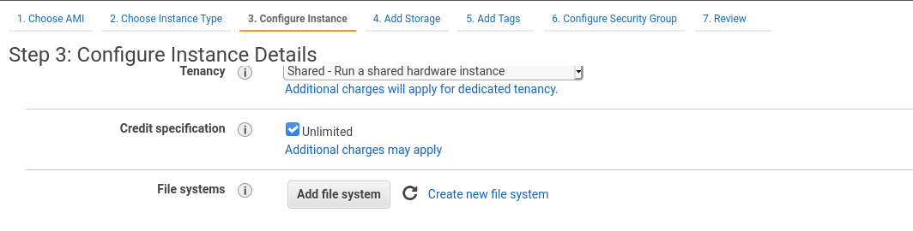

# Introduzione
Quando avviamo un istanza questa per essere utilizzabile deve avere un sistema operativo per poter funzionare. Quindi ogni volta che avviamo un istanza essa dovrà possedere una memeria dove risiederà il SO.

# EBS
Questo è il volume standard dove verranno caricati i dati della nostra istanza. Ogni volta che termineremo un istanza essa perderà il volume collegato. Questo può succedere anche in maniera non volontaria ad esempio in un Auto Scaling Group. Per evitare ciò bisogna utilizzare una memoria che non viene cancellata quando terminiamo una istanza per ciò ci viene in aiuto gli EBS (Elastic Block Store), questo è un driver di rete che viene agganciato all'istanza che stai per lanciare permettendo di salvare i tuoi dati in maniera persistente.

L'EBS possiamo pensarlo come una pennetta usb solo che non è un elemento fisico ma solo una memoria virtuale sulla rete. Può essere attaccato a qualsiasi istanza purché sia sulla stessa AZ. Quando creiamo un EBS dobbiamo dare come indicazione la sua dimensione e questa ne fornirà il costo assieme agli IOPS (Input Output operations Per Second). Per evitare di richiedere più memoria di quella che effettivamente necessitiamo è possibile incrementare la dimansione durante l'utilizzo.

Gli EBS disponibili sono quattro : 
+ GP2 (SSD) : sono general purpose adatti a qualsiasi utilizzo
+ IO1 (SSD) : sono per le alte prestazioni bassa latenza alto throughput
+ ST1 (HDD) : per accessi frequenti e lavoro intensivo
+ SC1  (HDD) : per accessi non frequenti

Quando creiamo un istanza EC2 nella configurazione inseriamo un EBS che di default è un GP2 da 8GB e nelle impostazioni possiamo vedere che c'è una spunta su elimina alla terminazione. Nella stessa sezione possiamo aggiungere altre EBS scegliendo : la path del nuovo volume, un immagine di sistema, la dimensione, la tipologia, la possibilità di eliminarla alla terminazione e la possibilità di criptare il contenuto. Quando creiamo un nuovo EBS e lo colleghiamo ad un istanza esso non sarà montato quindi bisogna effettuare alcune operazioni da terminale per poterlo utilizzare : 
+ lsblk : mostra l'elenco di volumi collegati e il punto di mount
+ sudo file -s /pathEBS : da come output il file system del volume
+ sudo mkfs -t ext4 /pathEBS : nel caso non sia stato ancora assegnato al volume un file system questa operazione crea un nuovo FS di tipo ext4
+ sudo mkdir /path_nuova_cartella : creerà una cartella nella path che abbiamo indicato
+ sudo mount /pathEBS  /path_nuova_cartella : monta il volume EBS sulla cartella creata precedentemente cosi che sia possibile l'accesso.

Se vogliamo che questo volume venga montato all'avvio possiamo procedere come segue : 
1. copiamo il file rinominiamo il file /etc/fstab tramite il comando : `sudo cp /etc/fstab /etc/fstab.origin` cosi facendo per ripristinare il file originale basterà solo eliminare il nuovo e togliere l'estensione .origin dal vecchio.
1. Modifichiamo il file /etc/fstab con il comando : `sudo nano /etc/fstub`
1. A questo punto dobbiamo aggiungere una riga per ogni volume che vogliamo montare all'avvio con le seguneti informazioni : 
    + pathEBS 
    + path_nuova_cartella
    + file system 
    + opzioni di mount 

    Un esempio è il segunete :  
    `/dev/xvdb  /data  ext4  defaults,nofail  0  2`
1. Salviamo il file appena modificato e ora ad ogni avvio della nostra istanza verrà montato anche il volume.
1. Per testare il funzionamento del file fstab possimo lanciare il comando seguente : `sudo mount -a`

## Tipologie di EBS

### GP2
generalmente utilizzato come volume di avvio, per le app con bisogni di bassa latenza, ambiente di sviluppo e testing. Le dimensioni posso variare da 1GB a 16TB e il più piccolo volume ha un **burst** di 3000 IOPS mentre il massimo ottenibile per le GP2 è 16000 IOPS. In generale si ottengono 3 IOPS per GB con una base di 100 IOPS. Per burst si intende un utilizzo ulteriore delle risorse concesse per un determinato lasso di tempo questo permette di avere prestazioni ottimali in particolari situazioni, se si supera la soglia concessa per il burst abbiamo dei cali di rendimento ed in genere al burst segue un periodo di prestazioni inferiori fino al ritorno della sogli standard. Il burst si ha anche per le istanze t.

### IO1
Sono memorie SSD per alte prestazioni. Se si ha il bisogno di superare il limite di 16000 IOPS. Vengono utilizzati per DB di largo utilizzo con diversi standard sia SQL che NoSQL. le dimensioni variano dai 4GB ai 16TB. Le IOPS vengono gestite alla configurazion e  possono essere da un minimo di 100 ad un massimo di 64000 per le istanze Nitro, ma in generale il massimo è 32000 IOPS. Il rapporto tra GB e IOPS è 1:50 come massimale cioè se ho 10GB di memoria non posso impostare più di 500IOPS per questa istanza.

### ST1
Memorie HDD per carichi intensi con elevato throughput a basso costo. Utilizzati per elaborazioni immagini, streaming, in generale dove abbiamo grosse mole di dati che devono transitare. Da non utilizzare come memorie di boot. Le dimensioni variano tra 500GB e i 16TB, max 500 IOPS, con un throughput di 500 MB/s. Il throughput viene incrementato di 40 MB/s per ogni TB.

### SC1
Sono memorie con alto throughput ma da utilizzare raramente. Generalmente utilizzate per i backup. le dimensioni sono le stesse degli ST1 ma il rapporto di conversione è 2 MB/s per TB, ma con la possibilità di avere un burst.

### Istance Store
Le istance store non sono classici volumi virtuali ma veri e propri dischi fisici collegati all'istanza. Generalmente vengo utilizzate per operazioni con elevatissimi carichi di IOPS si arriva a valori di milioni. Essi sono allocati con alcune tipologie di istanze nello specifico tutte quelle che contengono una **d** nel codice iniziale. Per questo tipo di istanze non è possibile richiedere dei ampliamenti in run. Essendo un disco fisico esso non possiede ridondanze quindi i dati contenuti vanno persi in caso di rottura del disco, è quindi preferibile non inserire dati sensibili all'interno di questi dischi ma utilizzarli per operazioni di cache.

# EFS
Acronimo di Elastic File System, è un network FS che può essere collegato a più istanze EC2 contemporaneamente in diverse AZ. servizio molto performante, scalabile ed estensibile, molto costoso ma paghi solo per lo spazio effettivamente utilizzato. Per permettere un collegamento sicuro tra le istanze esso viene fornito con un SG con i controlli in ingresso e in uscita e può collegare diverse istanze in diversi AZ.
Viene utilizzato generalemente per : gestire file in comune a più istanze, web serving, data sharing.
Utilizza il protocollo NFSv4 e i SG per il controllo degli accessi. Essendo linux based non funziona con le AMI windows. Usa chiavi KMS e scala automaticamente senza dover fare alcuna richiesta.
EFS è stata progettata per avere 1000 clienti in contemporanea com più di 10GB/s di throughtput. Può essere creata con due modalità e sono : general purpose che ha una latenza media e Max I/O elevato throughtput, elevato parallelismo ma alta latenza in generale per file molto grandi. Questa memoria è suddivisa in livelli che permettono di gestirla tramite dei cicli di vita e ne permetto anche lo schedule. Normalmente viene utilizzata per accessi frequenti, ma ha una modalita EFS-IA che viene utilizzata per salvare dati con accesso poco frequente (questa modalità costa meno ma esige un costo aggiuntivo per gli accessi).

## Configurazione 
Una volta selezionato la creazione del file system vi viene chiesto in quale AZ della regione deve lavorare e sotto quale VPC non che i SG da applicare per l'accesso da ogni AZ. Dopo viene chiesto i tag che vogliamo porre su questo EFS, La policy (per diminuire i costi del EFS si può impostare un lasso di tempo entro la quale i file non richiesti vengono inseriti in un EFS-IA), modalità di throughput per prestazioni elevate, la modalità performance (standard per poche istanze I/O max per un elevato numero di istanze) e la crittografia.
Una parte molto importante è la gestione degli accessi. Da questa schermata possiamo gestire le policy riguardo all'accesso tramite i ruoli definiti nell'IAM sia con una modalità assisstita che tramite l'utilizzo di uno script JSON che definisce il livello di accesso in maniera più approfondita. Un altra impostazione è la creazione di punti di accesso che permettono alle applicazioni di accedere allo storage (DA APPROFONDIRE).

### SG per l'EFS
Nella sezione inbound : 
+ inseriamo come tipo NFS
+ come origine il SG del EC2 che vogliamo collegare 

## Allaccio a EC2
Normalmente è possibile agganciare un EFS ad un istanza quando l'EC2 viene creata :  
  

Nel caso in cui si vuole agganciare un EC2 ad un EFS al di fuori della modalità guidata i passi sono i seguenti :  
1. Accedi in SSH all'istanza
1. Istalla L'utility per il collegamento tramite il comando : `sudo yum install -y amazon-efs-utils` nel caso usi un istanza proprietaria vedi il pacchetto relativo ad essa
1. creaimo una cartella con il comando : `sudo makedir /efs`
1. montiamo ora l'EFS in questa cartella con il comando : `sudo mount -t efs id-FS:/ efs`

Cosi facendo abbiamo collegato il nostro file system alle istanze.