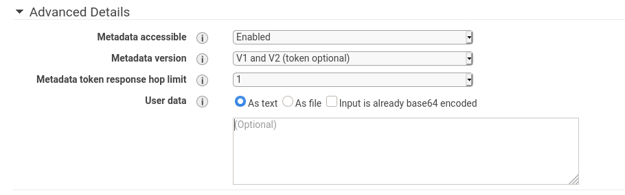

# Introduzione 

AWS è un servizio di cloud computing che permette la gestione della sua infrastruttura tramite i modelli SaaS, PaaS e IaaS. Offre molti servizi che permetto diversi livelli di astrazione e che semplifiano la gestione delle risorse.


# Account 
Innanzi tutto va creato un account. 
É una procedura guidata quindi non l'approfondirò, sappi solo che per poter avere l'account funzionante bisogna inserire i dati di una carta di credito.

# Budget 

Un importante opzione è la possibilità di definire un budget mensile oltre la quale AWS vi avviserà di eventuali superamenti di soglia.

É possibile definire un budget alla voce : il mio account -> budget -> crea budget

tra le opzioni più interessanti troviamo :
+ Tipologia di budget 
    + per costi (budget base che consiglio ai principianti)
    + per uso (analisi dei servizi avviati e specifiche di consumo per singolo servizio )
    + per servizi prenotati
    + per saving plan (piani di pagamento anticipato)

Una volta definito il proprio budget possiamo avere la sicurezza che AWS ci avviserà se superiamo le soglie indicate. Un budget base per l'apprendimento è intorno ai 10$ per mese.

# Come controllare i costi 

Nella stessa sezione di Budget è possibile avere il dettaglio di ogni servizio avviato durante uno specifico mese. 
Alla voce **fatture** avremo il dettaglio per mese di ogni servizio che abbiamo avviato e il relativo costo.

# AWS Regions

AWS è un fornitore globale di servizi cloud e ha molti cluster datacenter sparsi per il modo. Per sapere dove stiamo gestendo i nostri dati AWS ha implementato una gestione di risorse nelle regioni che sono una raccolta di più datacenter in una specifica area geografica. Ogniuna di queste regioni è identificata da un nome e un codice.
Conoscere la suddivisione delle regioni è molto importante sia ai fini legali definiti dal GDPR che per quanto riguarda l'utilizzo di specifici servizi che potrebbero non essere attivi in una specifica regione.

## Availability zones

L'acronimo per le Availability zones è AZ. Per ogni regione possiamo avere da un minimo di 2 AZ fino ad un massimo di 6AZ. Le AZ rappresentano un cluster di datacenter differenti tra loro e posti in aree geografiche distinte ma che comunicano tra loro.

## Come vedere regioni e AZ sulla console

Una volta entrato nella console, nella schermata principale è possibile selezionare la regione sulla quale si vuole lavorare. Una volta selezionata una regione è possibile ricercare il servizio che si vuole utilizzare.

# IAM
Identity access management sono software per l'autenticazione e per la getione dei permessi di un utente su di una piattaforma. IAM di AWS è un servizio globale per la gestione delle identità.
Una volta creato l'account si effettuerà l'accesso con l'utente **root** questo utente dovrebbe essere utilizzato solo per la creazione dell'accunt e di un nuovo utente con permessi elevati per poi non utilizzarlo più onde evitare probelmi di sicurezza.  
Per l'utilizzo dei servizi esistono 3 possibili configurazioni e sono :
+ User che sono le persone fisiche 
+ Group che sono un insieme di persone o di programmi che hanno delle relazioni in comune 
+ roule sono i ruoli che possono essere dati al fine di limitare l'accesso a specifici servizi, questi vengono dati alle macchine

Questi elementi vengono gestiti tramite le policy che sono file JSON dove vengono impostate le cose che le tre entità possono o non possono fare.
Di base una volta creato un acocunt abbiamo delle policy predefinite, tramite queste polici è possibili impostare ad esempio le MFA (Multi Factor Authentication). Come in tutti i sistemi, i permessi di accesso devono sempre essere dati con il principio del minimo privilegio ed è sempre buona norma creare un user per ogni persona fisica non cedendo mai le proprie credenziali ad un altra persona e un ruolo per ogni applicazione. Come per le persone anche nel codice non bisognerebbe mai inserire le credenziali. 

**Per quanto riguarda l'utente root utilizzare credenziali uniche e non perderle per alcun motivo.**

## MFA
Per impostare l'MFA basta andare sulla dashboard e al primo accesso con l'utente root nella lista delle best practice ti proporra di attivare l'MFA. Nella sezione **Your Security Credentials** la seconda voce è MFA e cliccando su **active MFA**
si avvierà una procedura guidata. Prima ti viene chiesto se vuoi effettuare l'autenticazione con un mezzo virtuale o fisico:
+ Mezzo virtuale
    + utilizzare un programma per l'autenticazione a due fattori come ad esempio Authenticator di Google, ma in generale c'è tutta una serie di questi programmi.  
    + Ti viene mostrato un QRcode che devi scansionare con lo smartphon tramite l'app
    + L'app ti restituirà un codice che dovrai inserire nella prima casella di testo 
    + una volta inserito procedere sull'app per ottenere il secondo 
    + inserire anche il secondo per aver accesso al servizio
    + fine attivazione
    ---
    + per raggiungere la schermata basta andare sul'elenco utenti
    + selezionare l'utente 
    + credenziali di sicurezza 
    + Dispositivo MFA gestione
    + stessa procedura di prima

+ Mezzo fisico
    + una volta selezionato ti verranno chiesti i dati del dispositivo 
    + inserire la prima password che ti viene fornita cliccando il pulsante 
    + attendi 30 sec e ripremi il pulsante per la seconda password
    + assegna MFA 


## User
Per la creazione del primo user bisogna :
+ dalla dashbord cliccare su user piccolo link con un numero che indica il numero di utenti registrati
---
+ cliccare su add user 
---
+ inserire il nome dell'utente
+ spuntare la casella dell'accesso programmatico e nel caso l'utente deve avere accesso alla console anche la seconda
+ Spuntare se si vuole una password temporanea oppure inserire una propria password
+ Ultima spunta per chiedere di reimpostare la password al primo accesso 
+ cliccare avanti
---
+ Aggiungere un utente ad un gruppo , dare le stesse autorizzazioni di un altro utente oppure scegliere delle impostazioni di default per questo utente 
+ Per il primo utente spuntare l'accesso come amministratore 
+ Sotto la lista è possibile anche implementare delle policy personalizzate
+ clicca avanti
---
+ Pagina per l'inserimento di tag che facilitano la ricerca dell'utente con versione chiave valore (opzionale)
+ clicca avanti 
---
+ riassunto delle informazioni e delle richieste che hai inserito
+ clicca crea
---
+ Ultima pagina dove sono presenti le password temporane è **importante scaricare il csv per avere la password per il primo accesso, in alternativa è possibile vedere le password nelle sezioni dedicate**
+ Chiudi la pagina


## Group
I gruppi servono per semplificare la gestione delle policy, ogni utente iscritto ad un gruppo ha in automatico tutti i privilegi dello stesso. Per creare un gruppo :
+ Vai sul link gruppi della dashboard 
---
+ crea un nuovo gruppo
---
+ inserisci il nome
---
+ Scegli la policy per il gruppo
---
+ chiudi

Per inserire un Utente al gruppo basta :
+ andare nella lista degli utenti e cliccare l'utente che si vuole inserire
---
+ tra le varie finestre ci sarà anche quella gruppi
+ aggiungi utente a gruppi
---
+ verranno visualizzati tutti i gruppi e si potrà scegliere in quale inserirlo

Buona norma quando si inserisce un utente in un gruppo è quella di togliere le autorizzazioni **dirette** che l'utente possiede ma che gli vengono già date dal gruppo.

## Impostazione policy password
Per far in modo che gli utenti abbiano password complesse che vengano cambiate regolarmente è possibile impostare delle policy per le password.

Il procedimento è il seguente : 
+ Andare su impostazioni account
+ Imposta policy per le password
---
+ C'é tutto un elenco di caratteristiche che deve possedere la password degli utenti 
+ seleziona quelle che più ti interessano e salva

# EC2
É la macchina vistuale proposta da AWS. Lo spazio di memoria dedicato alla macchina è il servizio EBS. Il load balancing per le macchine virtuali è ELB. ASG è lo scaling della macchina cioè il servizio che ridimensiona le risorse.

Innanzi tutto etriamo nella sezione dedicata a EC2 e controlliamo la regione. 
Per avviare una macchina i passaggi sono : 
+ avviare la macchina dalla dashboard 
+ selezionare l'immagine
+ selezionare il tipo di EC2
    + elenco delle differenze tra le versioni
+ next configuration
---
+ numero di istanze da avviare
+ spunta se vuoi un istanza spot
+ creare un VPC oppure lasciare quella di default
+ subnet : su quale AZ vuoi lanciarlo
+ auto-assing : IP publico puoi lasciare le impostazioni della AZ oppure decidere se disattivare o o abilitare includendo altre caratterisctiche di accesso
+ ci sono altri parametri avanzati
---
+ storage
+ lasciamo le impostazioni di default (8GB ssd delete_on_termination)
---
+ Tag sono coppie chiave valore che servono generalmente per identificare l'istanza 
---
+ Security group é una sorta di Fire Wall per gli accessi all'istanza
+ assicuriamoci di poter accedere all'istanza tramite ssh
+ creiamo un nuovo security group
+ Source : rappresenta l'ip di accesso all'istanza che di default è 0.0.0.0/0 cioè tutti gli IP
+ aggiungiamo un adescrizione all'accesso SSH
---
+ Review : riassunto delle richieste effettuate ed eventuali worning
+ Lanciamo l'istanza
---
+ Richiesta di download delle chiavi di accesso per l'accesso all'istanza tramite ssh


Una volta che l'istanza è stata lanciata è possibile andare in EC2 per vedere quali istanze sono attive o stoppate.
Quelle in run faranno spendere soldi anche se non utilizzate, quelle stop sono state salvate ma non genereranno fatture ,mentre se terminate una istanza essa verrà eliminata compreso il contenuto. Per poter decidere cosa fare basta cliccare con il tasto destro del mouse sull'istanza in questione e andare su istance state da li scegliere l'operazione.


# SSH
Per poter accedere all'istanza di EC2 si utilizza lo standard ssh. Mentre per linux e Mac Basta un terminale per windows si è quasi costretti ad utilizzare putty, almeno che non si abbia windows 10. ssh è uno degli standard più importanti per poter lavorare con AWS e permette di interagire con l'istanza EC2 tramite il terminale del tuo pc.

Una volta lanciata la macchina EC2 nella sessione description verranno mostrati il DNS publico e IP publico della macchina istanziata e nella sezione security group potremo vedere cliccando su **view inbound roule** le limitazioni di accesso alla MV (quelle che abbiamo inserito quando abbiamo creato la MV). Queste informazioni ci serviranno per accedere alla macchina virtuale tramite ssh .

Il comando per accedere tramite ssh alla MV è il seguente :  
`ssh -i EC2KeyDownload.pem ec2-user@54.37.83.190`

Stiamo dicendo al terminale di voler instaurare una connessione ad una macchina remota che abbia come nome utente ec2-user, ragiungibile all'indirizzo ip 54.37.83.190 (qui dovrete inserire l'ip publico presente nella descrizione della EC2) utilizzando la chiave ottenuta all'atto dell'istanziamento EC2KeyDownload.pem tramite il comando -i .


Inoltre quando per la prima volta vogliamo usare la chiave scaricata il sistema ci dirà che  l'accesso a questa chiave è stato dato a tutti gli utenti e gruppi di sistema, per migliorare la sicurezza del file modificarne i permessi. Per effettuare questa operazione basta digitare : `chmod 0400 EC2KeyDownload.pem` cosi facendo si daranno i permessi di sola lettura all'utente mentre i gruppi e gli esterni non avranno accesso alla chiave, ma non solo la prima volta che utilizziamo la chiave cosi impostata sarà stesso il nostro sistema che ci chiederà se ritieni questa connessione sicura quindi dovremo dirgli yes. Quest'ultima operazione ti verrà chiesta solo la prima volta che si inserisce una key per un nuovo host.

Ogni volta che riavviamo l'EC2 cambierà l'ip se si vuole eliminare il vecchio host basta digitare :  
`ssh-keygen -R 54.37.83.190`  
Con questo comando elimineremo il vecchio host. Questa può essere utile anche nel caso in cui venga cambiata la chiave per lo stesso host e che quindi si creino problemi.

# Security Group
Sono il layer fondamentale di accesso ai servizi EC2. 
Se andiamo sull'istanza EC2 che ci interessa possiamo cliccare sul primo link dopo la dicitura Security group nella descrizione per essere reindirizzati alla pagina security group dell'istanza. 

Tra le impostazioni configurabili troviamo Inbound e Outbound che corrispondono al controllo del traffico in uscita e in entrata. Se hai appena creato un istanza EC2 e hai lasciato le impostazioni di defaut potrai vedere che l'unico controllo effettuato in ingresso è quello della connessione SSH che può avvenire da ogni IP sulla rete a patto che si conosca IP della MV e che si abbia la chiave pem scaricata al momento della creazione dell'istanza. Mentre in output sono concesse tutte le connessioni.

I permessi sono per le aperture e non per le chiusure, per intenderci possiamo aprire porte o connessioni con l'aggiunta dei permessi ma se non ci sono permessi di accesso il traffico è chiuso.

I security group sono legati alla regione e alla VPC (Virtual Private Cloud rete di AWS che astrae i servizi) quindi se viene modificata una delle due bisogna riscrivere i SG.

Per ogni singola istanza possiamo definire diversi security group. PS un consiglio meglio dividere il gruppo di SSH dagli altri poiché da completo accesso all'istanza mentre altri richiedono solo alcune astrazioni eg HTTPS.

Se si dovessero presentare problemi di accesso all'istanza di EC2 molto probabilmente c'è qualche problema nel SG.
Tramite i SG è possibile implementere anche regole legate a diverse istanze che però utilizzano specifici SG permettendo solo tra loro la comunicazione, così facendo si astraggono i permessi legati agli IP legandoli solo ai SG.

# IP pubblico, privato ed elastico
Ip publico è quell'ip che ti permette di raggiungere una risorsa da qualsiasi punto del web, privato è l'ip che vine utilizzato da una sottorete privata e che ha senso solo nella sottorete, mentre l'ip elastico è un ip publico che puoi ottenere come ip statico da AWS e che puoi utilizzare per le tue istanze. Il modello di ip elastico è poco utilizzato poiché per avere un ip publico stabile puoi utilizzare il servizio di route53 o in maiera molto più trasparente al programmatore il servizio di load balancing che astra completamente l'utilizzo di ip pubblici.

Una volta che effettuiamo l'accesso alla nostra istanza per avere info riguardo la rete possiamo digitare il comando : `ifconfig -a ` ottenendo :  
```
[ec2-user@ip-172-31-23-55 ~]$ ifconfig -a
eth0: flags=4163<UP,BROADCAST,RUNNING,MULTICAST>  mtu 9001
        inet 172.31.23.55  netmask 255.255.240.0  broadcast 172.31.31.255
        inet6 fe80::ccd:80ff:fe2e:2c92  prefixlen 64  scopeid 0x20<link>
        ether 0e:cd:80:2e:2c:92  txqueuelen 1000  (Ethernet)
        RX packets 644  bytes 102224 (99.8 KiB)
        RX errors 0  dropped 0  overruns 0  frame 0
        TX packets 611  bytes 77151 (75.3 KiB)
        TX errors 0  dropped 0 overruns 0  carrier 0  collisions 0

lo: flags=73<UP,LOOPBACK,RUNNING>  mtu 65536
        inet 127.0.0.1  netmask 255.0.0.0
        inet6 ::1  prefixlen 128  scopeid 0x10<host>
        loop  txqueuelen 1000  (Local Loopback)
        RX packets 0  bytes 0 (0.0 B)
        RX errors 0  dropped 0  overruns 0  frame 0
        TX packets 0  bytes 0 (0.0 B)
        TX errors 0  dropped 0 overruns 0  carrier 0  collisions 0
```
Il primo blocco definito da eth0 rappresenta le informazioni riguardo la rete privata della nostra istanza. 

Quando fermiamo l'istanza e la riavviamo possiamo notare che se l'ip publico cambia non cambia quello privato che resta sempre lo stesso.

Per comprendere come possiamo utilizzare un ip elastico andiamo dalla dashboard di EC2 nella sezione network and security cliccando sulla voce elastic ip. Li possiamo richiedere di allocare degli elastic ip in modo da poterli collegare alle nostre istanze e ogni volta che dobbiamo accedere non dobbiamo cambiare l'ip pubblico.

Le operazioni sono : 
+ Allochiamo un nuovo indirizzo
---
+ scegliamo se vogliamo un ip assegnato da AWS oppure ne possediamo uno 
+ clicchiam su alloca
---
+ ti verrà assegnato un ip elastico 
---
+ clicchiamo su action 
+ associamo indirizzo
---
+ ti chiede se vuoi associare l'indirizzo ad un istanza o ad una rete
+ selezioniamo l'istanze alla quale vogliamo associare l'ip 
+ selezioniamo il nostro ip elastico 
+ clicchiamo su associa

Una volta associato anche se riavviamo la macchina l'ip pubblico della stessa non cambierà. 
AWS ci da a disposizione solo 5 ip elastici ma se si ha il bisogno di altri possono essere richiesti.

Gli ip elastici hanno un costo quindi se non indispensabili sarebbe meglio non utilizzarli.
Per dissociare un ip elastico da un istanza basta andare nella sezione istanze selezionare l'istanza che possiede un ip elastico, andare su network e selezionare disassociate elastic ip.
Una volta fatto andate nella sezione elastic ip e rilasciare l'ip elastico creato.

# EC2 User Data
Se ogni volta che si avvia una istanza vogliamo che vengano eseguite delle operazioni possiamo utilizzare gli User Data di EC2. Poossiamo far eseguire qualsiasi script all'avvio ricordando che questi verranno eseguiti con i permessi di root.

In funzione del sistema possiamo utilizzare la tipologia di scripting che supporta.

Per poter inserire degli script utenti possiamo andare nella sezione di creazione di un istanza e dopo la selezione della tipologia e del SO, nella scermata di settaggio possiamo andare nella sezione avanzata che ci presentare uno spazio dove inserire uno script per l'esecuzione di codice all'avvio dell'istanza.



Come si può vedere dall'immagini possiamo inserire uno scrip testuale nella casella sottostante o in alternativa possiamo caricare un file.

Una esempio di codice è il segunete :  
```bash
#!/bin/bash

# installa httpd 
yum update -y
yum install -y httpd.x86_64
systemctl start httpd.service
systemctl enable httpd.service 
echo "Hello Word from $(hostname -f)" > /var/www/html/index.html
```

Bisogna inserire il primo commento obbligatoriamente altrimenti non si avvierà il comando poiché va specificato il linguaggio.

Tutte le operazioni di seguito vengono avviate come nell'ordine proposto e non fanno altro che avviare un server apache con un file index.html che conterrà la frase Hello Word from (l'indirizzo ip del nat collegato alla nostra istanza).

**NB: il comando definito come $() è una dicitura del linguaggio bash che inserisce i dati dell'host. Per far in modo che questa operazione dia un risultato ad un ipotetico utente che vuole raggiungere il sito bisogna aggiungere la regola nel SG aprendo la porta 80 di tcp per poter ricevere il file index.html altrimenti non si avranno risultati dall'istanza**


# Tipologie di istanze 
Tra le tipologie di istanze troviamo : 
+ On-demand : classica istanza assegnata costo certo anche a valle di variazioni di workload pagamento orario
    + paghi solo per l'uso effettivo e fatturato a fine mese e la fatturazione è al secondo dopo il primo minuto
    + non hai obblighi a lungo termine
    + ricorda di fermarle quando non si ha il bisogno 
    + Utilizzabile per carichi di lavoro elastici
+ Riservate (minimo un anno):
    + Riservata : istanza sempre utilizzabile per ad esempio la gestione di un DB in rete dove non sai quando le richieste potrebbero arrivare 
        + Sconti fino al 75% 
        + pagamento anticipato o dilazionato 
        + periodo da 1 a 3 anni
        + specifica istanza (perfetto per DB)
    + Riservata convertibile : Istanza riservata ma con la possibilità di ridefinizione 
        + Possibilità di cambiare l'istanza EC2 durante l'anno
        + sconto fino al 54%
    + Riservata programmata : istanza allocabile in un periodo specifico della settimana o del mese
+ Spot : per brevi carichi di lavoro, molto economiche, problemi di disponibilità potrebbero essere eliminate
    + sconto fino al 90% 
    + istanze che possono essere perse in qualsiasi momento in funzione del piano di affidabilità e quindi del costo
    + le più economiche
    + utilizzate per lavori che non richiedono resilienza 
        + lavori di background
        + Data analysis
        + in generale tutte quelle operazioni che non inficiano sul momento il lavoro del software
    + Da non utilizzare 
        + per applicazioni che possano inficiare il lavoro dell'app
+ Istanza dedicata : nessun altro utente sfrutterà l'hw (una macchina completamente dedicata)
    + hai un EC2 fisico riservato     
    + Periodo di 3 anni
    + risolve problematiche di licenza (BYOL) 
+ Host dedicato : hai un server dedicato dove puoi gestire anche l'allocazione delle istanze
    + visibilità dell'HW sottostate 
    + risolve problemi di normative su HW

Tutte queste opzioni sono visibili sulla dashboad EC2 nella sezione istanze.
Tra tutte le opzioni quelle più intreressanti sono le On-Demand, quelle viste nella parte di allocazione di una EC2, e quelle spot.

## Spot 
Le istanze spot possono essere avviate in fuunzione del :
+ load balancing : lancia istanze della stessa tipologia nella tua AZ utile per Web app
+ Flexible : lancia istanze di qualsiasi tipo e dimensione in diverse AZ utile per elaborazioni Batch distribuite 
+ Big Data : lancia istanze di qualsiasi tipo e dimensione nella stessa AZ utile per elaborazioni distribuite
+ durata : prenotare un istanza per un periodo limitato

Per ogni istanza spot possiamo specificare :
+ AZ
+ rete 
+ chiavi
+ numero di istanze
+ elenco con tutte le istanze scelte
+ impostazioni di ottimizzazione
+ prezzo orario stimato

Possiamo richiedere le istanze spot in due modi : 
+ nella sezione delle istanze spot cliccare su richiedi un istanza spot
    + in questa sezione possiamo vedere anche il prezzo delle istanze spot durante l'ultimo periodo (3 ore/ 3 mesi) in genere è molto stabile ma in generale rimane il concetto che essendo ritirabili da AWS in qualsiasi momento non è possibile avere la certezza del risultato
    + Generalmente andiamo in questa sezione solo se vogliamo una serie di istanze
+ nella sezione istanze 
    + dopo aver selezionato l'istanza che vuoi lanciare c'è un opzione per renderla spot
    + una volta attivata si possono selezionare le seguneti voci :
        + costo attuale dell'istanza spot
        + massimo prezzo pagabile da noi, quando l'istanza supererà il costo orario da noi richiesto AWS riprenderà la risorsa
        + richiesta di persistenza: se spuntata attiva delle opzioni sul risultato della rimozione della risorsa
        + ecc

# ENI Elastic Network Interface
É un elemento logico nella VPC ed è una scheda di rete virtuale. Rappresenta l'eth0 vista lanciando il comando `ifconfig -a`. Non è una componente specifica di EC2 ma un elemento ché viene utilizzato anche per altri servizi.
Gli attributi di una ENI sono :
+ Primary private IPv4 o uno o più ip secondari
+ un ip elastico per ogni ip privato
+ un ip elastico per ogni ip pubblico 
+ uno o più SG
+ MAC address

Gli ENI possono essere creati indipendentemente da un istanza EC2 e possono essere spostati da un istanza ad un'altra. Ogni ENI è legato alla propria AZ. Può essere utilizzato ad esempio per risolvere un fallimento di un istanza in modo da spostare il calcolo su di un'altra in maniera rapida.

Quando allochiamo un istanza EC2 in automatico viene implementata un ENI che è visibile nella sezione description dell'istanza alla voce Network interfaces eth0.

Cliccando sul link possiamo vedere alcuni dettagli dell'ENI come VPC, id, DNS, ecc.

Se andiamo in fondo al menu laterale possiamo vedere tutte le ENI a nostra disposizione nella sezione Network and Security sotto la voce di Network Interface.

Da questa sezione possiamo creare una nuova ENI da poter collegare ad un istanza. La creazione di un ENI è molto semplice basta solo nominarla, indicare in quale AZ deve essere creata, assegnare un ip casuale o uno scelto da noi ed in fine applicare uno o più SG.

Una volta creata basta andare con il tasto destro del mouse sulla nuova ENI e cliccare su attach e selezioanre l'istanza presente sulla stessa AZ. Per rimuoverla basta o cliccare su detach.
Possaimo modificare o aggiungere ip tramite l'opzione manage ip address, modificare i SG tramite l'opzione Manage security group.