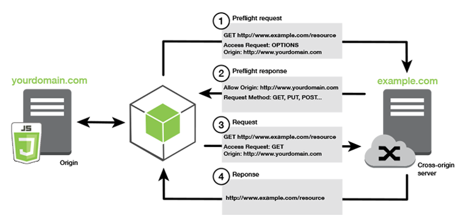

# Introduzione 
S3 ( Simple Storage Service ) è uno spazio di memorizzazione "infinito", in pratica è una memoria dimensionabile in maniera semplice ed automatica. Basata sul concetto di oggetto e ha nome univuoco a livello globale ma è una risorsa regionale (definita alla creazione). La convenzione per il nome prevede :
+ No lettere maiuscole
+ No underscore
+ dai 3 ai 64 caratteri
+ Non un IP
+ Deve iniziare con una lettera minuscola o un numero  

Quando instanziamo un file in un bucket esso viene identificato come un oggetto che possiede una chiave, identificata con il path completo del file a partire dalla cartella successiva a quella del bucket completo. la chiave può essere scomposta come il prefisso + nome del file. Un esempio è : `s3://mio-bucket/cartella1/cartella2/file.txt` in questo caso la chiave è : `cartella1/cartella2/file.txt` dove troviamo il prefisso : `cartella1/cartella2` e il nome del file `file.txt`. 
Questa dicitura lacia pensare che ci troviamo in una directory ma non è cosi, quanto scritto identifica solo elementi e non una gerarchia di file e cartelle.
Un oggetto del bucket è costituito da :
+ **L'object value** rappresenta il contenuto della path, il file più grande che S3 possa caricare è di 5TB ma non è posibile fare upload di file maggiori di 5GB quindi in un caso del genere bisognerebbe suddividere l'elemento ed effettuare un caricamento diviso di tutte le parti. 
+ **Metadati** per ogni oggetto del bucket, formati da una coppia chiave(testuale) valore che possono contenere dati di sistema, relativi ad utenti 
+ **Tags** come i metadati sono formati da una coppia chiave(unicode) valore, non se ne possono avere più di 10 per obj e vengono utilizzati per la sicurezza o per definire il ciclo vita dell'Obj. 
+ **Version ID** viene utilizzato per conoscere la versione del obj.

# Configurazione 
Andiamo nella sezione servizi e digitiamo s3. Una volta aperto il servizio vi verranno mostrati tutti i bucket a vostra disposizione. Anche se S3 è globale i singoli bucket sono regionali. Ricordiamo che il nome del bucket è globale quindi se qualcuno ha già utilizzato il nome che volete utilizzare non potrete più usarlo quindi un consiglio e scrivere come parte del nome il dominio che possedete. tra le opzioni troviamo : 
+ Controllo delle versioni : per salvare le versioni degli oggetti nello stesso bucket
+ Salvataggio di log di accesso
+ tag
+ Salvataggio e visualizzazione dell'accesso tramite API con CloudTrail
+ crittografia
+ Applicare cloudwatch
+ permessi di accesso a reti pubbliche 

Una volta creato possiamo caricare file dalla dashboard cliccando sullo specifico bucket.
le impostazioni di upload per singolo file o più file sono :
+ lista di utenti autorizzati per lettura e scrittura tramite l'IAM e per gli accessi pubblici
+ Tipologia di storage
+ tipologia di crittografia
+ metadati

Inoltre possiamo anche inserire configurazioni specifiche per path.

# Versioning
I file caricati possono essere sottoposti a versioning ma devono essere abilitati a livello di bucket. In pratica, se attiviamo il versioning, quando carichiamo una nuova versione del file il vecchio non verrà eliminato ma verrà salvato con un valore di versione cosi da poter essere recuperato. Tutti i file che non sono stati versionati non hanno una loro stato precedente e se si interrompe il versioning i cambiamenti non verranno salvati. l'eliminazione in s3 con il versioning prevede l'applicazione di un marker che se eliminato ripristinerà il file. L'elenco dei file con versione è visibile quando selezioniamo il versioning scegliendo l'opzione show, vedremo per ogni file l'elenco delle modifiche e in loro id.

# Encription
AWS mette a disposizione 4 metodi per criptare i propri dati e sono :
+ SSE-S3 : utilizza key hendler ed è gestita da AWS
+ SSE-KMS : sfrutta il servizio gestito da AWS per lagestione delle chiavi
+ SSE-C : gestione personale delle chiavi con cifratura in cloud
+ Client Side Incripted : cifratura da parte utente

## SSE-S3
(Server Side Encription) cioè la criptazione viene gestita server side. Lo standard utilizzato è AES-256 e viene mostrato come : "x-amz-server-side-encriptyon" : "AES256" nell'header.
In pratica quando effettuiamo l'upload di un file su s3 inseriamo nell'header la stringa precedente. S3 leggerà questa stringa nell header e provvederà a criptare il file con AES 256 e la chiave gestita da S3. 

## SSE-KMS
Come per SSE-S3 questo è un metodo di encription lato server. Si basa sullo scambio di chiavi generato da un identificazione di un utente e un servizio di traking delle operazioni (audit trail). Una volta arrivato al server verrà nuovamente crittografato. nell'header della richiesta bisogna inserire come parametro : "x-amz-server-side-encriptyon" : "aws:kms".

## SSE-C 
Sempre una criptazione lato server solo che le chiavi non sono gestite da AWS ma da un servizio esterno. In questo caso AWS non salva la chiave utilizzata per la criptazione e quindi una buona norma utilizzare un protocollo di comunicazione sicuro come HTTPS poiche verrà passato oltre al file anche la chiave con la quale verranno criptati i dati. Come per l'upload anche per il download dovremo rifornire le chiavi per poter ottenere nuovamente l'oggetto richiesto.


## Client Side Encription
Con questa modalità sarà il client che si occuperà della criptazione dei file prima di caricarli in S3 e AWS non è responsabile della loro gestione per quanto riguarda la crittografia.

**In generale nelle impostazioni abbiamo solo le opzioni S3 e KMS poiche le ultime due vengono implementate lato client e AWS non ha alcuna responsabilità**

## Encription in transit
S3 espone endpoint di tipo HTTP e HTTPS basati sui ceritficati SSL e TLS. In generale è una buona norma utilizzare HTTPS. 

# Sicurezza 
La sicurezza su S3 si basa sul IAM quindi su Users, sulle risorse. Tramite l'IAM dobbiamo indicare quali utenti/servizi possono aver accesso. Per le risorse abbiamo le **Bucket policies** che definiscono regole di accesso nella dashboard di S3, con queste regole possiamo utilizzare anche sistemi **cross account** (es credenziali di google), supporta anche un controllo a grana più fine tramite le **OACL** (Object Access Control List) e un ultima tipologia le **BACL** (Bucket Access Control List).
Tutte queste policie non sono mutuamente esclusive anzi se un utente ha le credenziali di IAM se le Bucket policies non lo consentono esso non riuscirà ad accedervi.

## Bucket Policies
Sono policie basate sullo standard JSON. Tramite queste policie possiamo :
+ applicare policie ai bucket o a singoli oggetti
+ definire quali API possono accedere
+ definire gli effetti dell'approvazione o della negazione all'accesso

Generalmente vengono utilizzate per garantire l'accesso a bucket pubblici o per rafforzare la cifratura degli upload per evitare brute force o per concedere dei permessi ai cross account.

Tramite le bucket policies possiamo rendere un bucket inaccessibile dall'esterno, durante la creazione del bucket vengono presentate alcune restrizioni per gli accessi quali : 
+ Blocco di accessi concessi tramite nuove ACL
+ Blocco di accessi concessi tramite qualsiasi lista ACL
+ Blocca gli accessi pubblici a bucket e oggetti concessi tramite qualsiasi policy pubblica del bucket o del punto di accesso
+ Blocca gli accessi pubblici a bucket e oggetti concessi tramite nuove policy pubblica del bucket o del punto di accesso

Questi blocchi sono stati implementati per evitare la perdita di dati aziendali

## Altri metodi 

Possiamo implementare la sicurezza tramite : 
+ Networking : 
    + VPC endpoint (per gli accessi esterni alla VPC di altri servizi AWS)
+ Login e Audit 
    + verifica di identità (Access log che può essere storicizzato in un altro bucket) e della correttezza dei dati 
    + Le richieste tramite API possono essere registrate tramite CloudTrail
+ User 
    + richiedere la MFA (Multi Factor Authentication ) che può essere richiesta nella sezione versioning per l'eliminazione di obj
    + Pre-signed URL sono degli URL con al loro interno le chiavi di autenticazione valide per un tempo limitato (utilizzabili per utenti che devono avere accesso alla risorsa per un tempo prestabilito).


Una volta creato il bucket possiamo cliccare su di esso e andare nella sezione autorizzazioni per poter modificare tutti i criteri di sicurezza definiti precedentemente. nella sezione Policie bucket possiamo inserire un codice JSON per definire in maniera specifica una policie di accesso come ad esempio la segunete :  
```json
{
  "Version":"2012-10-17",
  "Statement":[
    {
      "Sid":"AddCannedAcl",
      "Effect":"Allow",
    "Principal": {"AWS": ["arn:aws:iam::111122223333:root","arn:aws:iam::444455556666:root"]},
      "Action":["s3:PutObject","s3:PutObjectAcl"],
      "Resource":"arn:aws:s3:::awsexamplebucket1/*",
      "Condition":{"StringEquals":{"s3:x-amz-acl":["public-read"]}}
    }
  ]
}
```
Come potete vedere abbiamo innanzi tutto l'indicazione della versione e nello statement andiamo a deifinire la regola che dice : sid il nome della regola che ha un effetto di approvazione nel caso in cui i due utenti IAM relativi all'account "tanti numeri" ne richiedano l'accesso ed eseguono azzioni di upload di un oggetto o di una lista di controllo sulla risorsa definita dal nome del bucket *awsexamplebucket1* e a tutto il suo contenuto a condizione che la stringa inviata nell'header della richiesta alla voce di s3:x-amz-acl sia uguale a public-read.

Nel caso in cui non si voglia apprendere il linguaggio di definizione delle policie possiamo utilizzare [**AWS Policie Generator**](https://awspolicygen.s3.amazonaws.com/policygen.html).


# S3 Websites
I bucket possono essere utilizzati per la storicizzazione dei siti. Tali bucket sono raggiungibili tramite l'URL : `(nome-buket).s3-website.(AWS-region).amazonaws.com` o `(nome-buket).s3-website-(AWS-region).amazonaws.com` .  
Per poter rendere il buket un sito statico bisogna impostarlo, nelle proprietà, come static website hosting, inoltre abbiamo che il bucket di default viene impostato come privato quindi bisogna concedere l'accesso publico. Tutto ciò non è ancora sufficente a raggiungere il nostro sito dall'esterno poiché non abbiamo definito la bucket policy. 
Un esempio di policy è la seguente : 
```json
{
    "Version": "2012-10-17",
    "Id": "Policy1603382049413",
    "Statement": [
        {
            "Sid": "Stmt1603382045838",
            "Effect": "Allow",
            "Principal": "*",
            "Action": "s3:GetObject",
            "Resource": "arn:aws:s3:::prova-per-test/*"
        }
    ]
}
```

## CORS
Per comprendere al meglio il concetto del CORS (Cross Origin Resource Sharing) introduciamo il concetto di origin schema, L'origin non è altro che la terna formata da prototocollo, dominio e porta. Il CORS è un blocco che viene implementato lato browser e lato server per avere il controllo su collegamenti che non avvengono tra due enti specifici, ad esempio se un client comunica con un server all'indirizzo https://www.esempio.com e vine effettuata una richiesta che punta al sito https://www.altroesempio.com quest'ultima verrà bloccata. É possibile evadere questo meccanismo solo se il server abilità il CORS tramite un messaggio nell'header del pacchetto con la proprietà : Access-Controll-Allow-Origin 

  
L'immagini esprime al meglio il concetto sulle fasi di comunicazione.

Per S3 possiamo avere il caso in cui un sito rimandi un file o in generale una richiesta ad un bucket e quindi bisogna far in modo che il bucket risponda nella maniera più consona al caso.

Per poter impostare il controllo CORS sull'origine che sta richiedendo l'accesso bisogna andare nella segunete sezione :
  

Qui inserire il settaggio segunete : 
```xml
<CORSConfiguration>
 <CORSRule>
   <AllowedOrigin>http://www.example1.com</AllowedOrigin>

   <AllowedMethod>PUT</AllowedMethod>
   <AllowedMethod>POST</AllowedMethod>
   <AllowedMethod>DELETE</AllowedMethod>

   <AllowedHeader>*</AllowedHeader>
 </CORSRule>
 <CORSRule>
   <AllowedOrigin>http://www.example2.com</AllowedOrigin>

   <AllowedMethod>PUT</AllowedMethod>
   <AllowedMethod>POST</AllowedMethod>
   <AllowedMethod>DELETE</AllowedMethod>

   <AllowedHeader>*</AllowedHeader>
 </CORSRule>
 <CORSRule>
   <AllowedOrigin>*</AllowedOrigin>
   <AllowedMethod>GET</AllowedMethod>
 </CORSRule>
</CORSConfiguration>
```
In questo esempio vediamo come è possibile gestire il CORS per vari siti di origine.

# Modello di consistenza di S3
I bucket creano delle copie quando effettuiamo una PUT. Per evitare problemi di consistenza di dati S3 implementa alcuni metodi per garantire la coerenza.
+ Effettuando un PUT dobbiamo attendere la risposta dell caricamento prima di richiedere una GET altrimenti otterremo una risposta 404.
+ nel caso di un DELETE o UPDATE potremmo ottenere un elemento della versione precedente se esso non è ancora stato caricato completamente

Queste situazioni rientrano nel concetto di **Consistency Model**