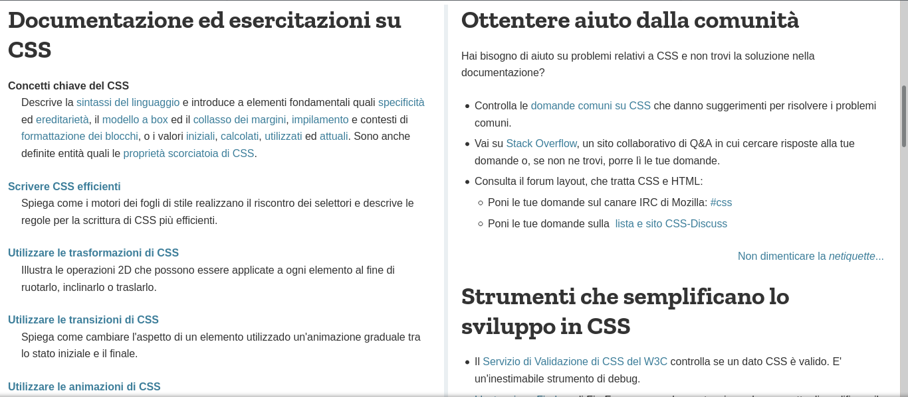

# Introduzione 

Con i nuovi standard del linguaggio sono state aggiunte ulteriori possibilita di personalizzare le nostre pagine.
Troveremo tutte le novità che sono supportate o che sono in fase di sviluppo al seguent [link](https://developer.mozilla.org/it/docs/Web/CSS) 

Su questo sito potrete vedere ogni singola proprietà, provarla tramite le pagine di demo, vedere la sintassi e la compatibilità con i browser qui di seguito inserisco delle immagini per far vede di cosa si sta parlando :

Questa è la pagina relativa alla documentazione, alla comunity e a come poter sviluppare nuove funzionalità per il CSS.

Andando su un link tra quelli della documentazione abbiamo la segunete pagina :

Questo è un esempio di una struttura della pagina di documento abbiamo inizialmente una panoramica della proprietà.

Sempre nella pagina possiamo trovare degli esempi che portano ad una pagina specifica per sotto proprietà :

Alla fine troviamo lo stato di sviliuppo della proprietà :

Nella pagina ci sono anche esempi e metodi di integrazione con HTML e JS.

Come detto prima una volta che si vede una sotto proprietà della proprietà è possibile anche provarla :

avere tutta una serie di esempi e di informazioni fini ad avere anche informazioni sulla compatibilità dei browser sia per descktop che per smartphone :

