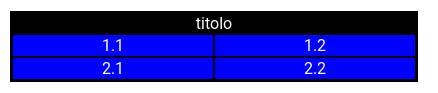

# Introduzione
Display viene utilizzato per dare indicazioni sullo spazio che gli elementi devono occupare nella pagina.

# Opzioni di Display

Tra le opzioni di display troviamo :
+ `block`, l'elemento occupa tutto lo spazio a sua disposizione sulla linea nella quale è stato definto
+ `inline`, affianca gli elementi sulla stessa linea finche c'è spazio **non accetta dimensioni**.
+ `none`, l'elemento non viene visualizzato e non viene nemmeno impostato lo spazio
+ `inline-block`, simile ad inline ma vengono inseriti degli spazi piccoli tra i blocchi **accetta le dimensioni dell'elemento**
+ `flex`, permette di applicare tutte le opzioni legate a flex nel contenitore dove lo si dichiara
+ `table`, permette di gestire una pagina come fosse una tabella

# table

Tramite il `display : table;` possiamo gestire una pagina come se fosse una tabella ma tutto nel css senza dover modificare l'HTML.

Si utilizzano dei blocchi div che simulano i componenti delle classiche tabelle HTML solo che al posto dei tag verranno usati delle regole css legate a display :
+ table-row-group,  Questo elemento ha lo stesso comportamento di  <tbody> HTML elements.
+ table-header-group,    Questo elemento ha lo stesso comportamento di  <thead> HTML elements.
+ table-footer-group,    Questo elemento ha lo stesso comportamento di  <tfoot> HTML elements.
+ table-row,    Questo elemento ha lo stesso comportamento di  <tr> HTML elements.
+ table-cell,    Questo elemento ha lo stesso comportamento di  <td> HTML elements.
+ table-column-group,    Questo elemento ha lo stesso comportamento di  <colgroup> HTML elements.
+ table-column,    Questo elemento ha lo stesso comportamento di  <col> HTML elements.
+ table-caption,    Questo elemento ha lo stesso comportamento di  <caption> HTML elements.

Un semplice esempio è il seguente :
```html
<div class="table">
    <div class="head">
        <div class="row">
            <div class="cell">
            1.1
            </div>
            <div class="cell">
            1.2
            </div>
        </div>
         <div class="row">
            <div class="cell">
            2.1
            </div>
            <div class="cell">
            2.2
            </div>
        </div>
    </div>
</div>
```

```css
.table {
  display: table;
  background-color: grey;
  border : 1px solid black;
}

.head {
  display:table-header;
  background-color: black;
  color: white;
  border : 1px solid black;
  text-align: center;
  }

.row {
  display:table-row;
  background-color: aqua;
  border : 1px solid black;
}

.cell {
  display:table-cell;
  background-color: blue;
  width: 200px;
  border : 1px solid black;
}
```

banalmente l'effetto finale è il segunente :



Tutte le opzioni table sono supportate da tutti i browser