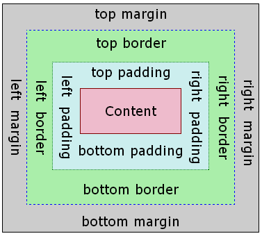
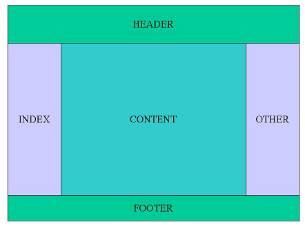
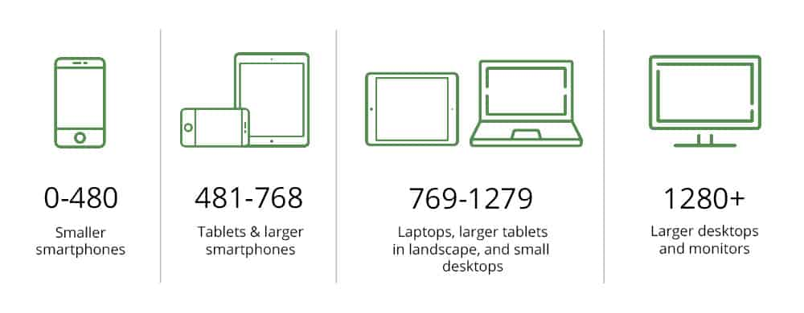

# Introduzione 
Con l'HTML andiamo a definire la struttura di una pagina mentre con il CSS vedremo come è possibie definire il layout di una pagina web.

Questa divisione permette una modifica più semplice della pagina e permette la divisione in documenti del progetto.

Permettendo anche un ottimizzazione del sito su dispositivi diversi rendendolo **Responsive**.

# Funzionamento e inclusione in un progetto
I file.css rappresentano un insime di regole che permettono di modificare il layout dei singoli componenti HTML.

Per identificare un componente HTML per applicare uno specifico stile utilizziamo come parametri :
+ nome del tag
+ id 
+ classe 

Oppure una combinazione di essi.

Le modifiche che generalemente si possono effettuare sono :
+ colore
+ font
+ sfondo 
+ posizione
+ margini 
+ ecc.

## Includere file CSS
Esistono 3 metodi per inportare un file CSS in una pagina HTML :
+ Importare il file nell'header della pagina :
    ```HTML
    <head>
        <!-->  tipologia di file
                                ulteriore 
                                specifica per 
                                il browser         
                                                path dove si trova il file 
                                                contenente il css               tipologia di dispositivo 
                                                                                alla quale va applicato 
                                                                                questo css
                                                                                <-->
        <link rel="stylesheet" type="text/css" href="percorsoRel/nomeFile.css" media="screen">
    </head>
    ```
+ importare tramite il tag `<style>` nell'header  
+ importare tramite il tag `<style>` nello specifico tag

Le ultime due opzioni sono deprecate poiché prevedono di inserire il codice CSS direttamente nell'HTML genrando eventuali problemi di modifiche future.

# Commenti
I commenti nel CSS sono come quelli classici di programmazione 
```css
/*
    ecco un commento
*/
```

# Sintassi

La sintassi per definire una regola è molto standard ed è rappresentata come segue :
```css
body {
    color-background: blue;
    font-size: 16px;
}
```
La regola inizia sempre con un **Selettore** che nel nostro caso è body, quindi tutte le regole applicate successivamente avranno effetto sul body e tutti i componenti ad esso sottostanti almeno di altre specifiche del singolo tag.
le regole interne vengono definite dichiarazioni e sono divise in proprietà valore ogniuna divisa dalle altre tramite il separatore **;** e tra di loro come simbolo di assegnazione inseriamo **:**.

# Selettori
Vengono utizzati per specificare a quale parte dell'HTML devono essere applicate le regole.

Esistono diversi selettori e sono :
+ universale 
    + *
+ Specifici
    + tag
    + classi 
    + identificatori
+ Complessi
    + basati sull'albero HTML
    + su condizioni speciali

## Universale
si applica con il simbolo **\*** e le sue regole vangono applicate a tutte le componenti dell'HTML su tutta la gerarchia :
```css
* {
    background : red;
}
```

## Tag
si applica scrivendo a quali tag bisogna applicare la regola separati da una virgola :
```css
div, h1, h2 {
    background-color: blue;
}
```

## Identificatore
Possiamo nel codice HTML inserire il tag id come nel seguente esempio :
```html
<div id="div_home">
...
</div>
```
Una volta che l'elemento HTML ha un identificativo possiamo applicare il codice CSS a quello specifico elelmento tramite il codice CSS :
```css
#div_home {
    color : brown;
}
```


## Classe
Possiamo applicare una classe al componente html che rappresenta un set di regole definite nel CSS :
```html
<div class="home">
...
</div>
```

E definiamo il CSS come segue :
```css
.home {
    color: blue;
}
```

Sembrerebbe molto simile al selettore id ma la differenza sta che la classe è applicabile a più elementi html mentre l'id deve essere univuoco e che quindi quelle regole devono valere esclusivamente per quell'elemento.
Le stesse regole possono essere nominate con il nome di due classi differenti :
```css
.calsse1 .classe2 {
    text-align : center;
}
```
Ad un elemento HTML è possibile applicare anche più classi contemporaneamente.

## Combinazioni di selettori

É possibile combinare tra loro più selettori per creare regole più complesse es id + tag oppure classe + tag alcuni esempi sono i seguenti:  
+ id + tag
    ```css
    div#home {
        align : right;
    }
    ```
Seleziona il tag di tipo div che ha come id home.  

+ tag + classe
    ```css
    div.home {
        margin : 10px;
    }
    ```

In questo caso la regola si applichera a tutti i div che hanno come classe home quindi se applichiamo la classe home ad un altro elemento esso non subirà le regole definite.

## Relazionali

Si basano sulle relazioni del DOM e sono :
+ discendenti
+ figlio
+ fratelli adiacenti
+ fratelli

Un esempio di DOM può essere il seguente :
```
     header ---- h1
    /                p ---- a
   /                /
DOM - nav ------ div 
   \                \
    \                a
     footer ---- a
           \
            \
             \
              \
               \ 
                 a
```

Questo tipo di selettori, sfruttando la struttura ad albero del DOM si basano sui tag e si possono costruire regole complesse e che prendano un insieme di elementi contemporaneamente.

### Discendenti
consiste nel andare ad identificare quella parte dell'albero che ha una relazione di discendenza come ad esempio la seguente :
```css
div a {
    color: brown;
}
```
Con questo selettore andiamo ad applicare la classe a tutti gli elementi che discendono da div di tipo a anche se non sono discendenti diretti nell'esempio precedente la classe verrà applicata ai due elementi di tipo a che sono discendenti di nav anche se uno dei due tag a è figli del tag p.

### Figli

Come per i discendenti ma solo con il primo grado di parentela :
```css
div > a {
    color: brown;
}
```
Questa regola verrà applicata solo al tag a diretto dicendente di div.

la regola essendo iterativa può contenere una serie di discendenze come ad esempio :
```css
nav > div > p > a {
    font-size: 20px;
}
```

### Fratelli

Sono quegli elementi che si trovano sullo stesso livello, nel nostro esempio avremo che sul livello 1 avremo :
header, nav, footer. Sul livello 2 avremo : h1, div, a, a. Sul livello 3 avremo : p, a. Sul livello 4 avremo solo a.

Questo tipo di selettori possono identificare o tutti i fratelli o solo quello adiacente :
+ a tutti i fratelli
    ```css
    div ~ a {
        color: white;
    }
    ```
    quindi questa regola verrà applicata ad entrambi i tag a del secondo livello
+ al fratello adiacente
    ```css
    div + a{
        font-size : 8px;
    }
    ```
    questa regola verrà applicata solo al tag a adiacente al tag div quindi solo al primo tag a di footer.

## Attributi

Questo selettore si applica a quei tag che posseggono uno specifico attributo con la possibilità di poterne specificare anche il valore :

```html
<h1 title="titolo"></h1>
```

```css
h1[title] {
    color: blue;
}
```
volendo possiamo specificare il valore tramite la dicitura : `h1[title="titolo"]` cosi da prendere solo gli h1 che hanno l'attributo title = "titolo".

Essistono anche alcune selezioni basate sugli attributi che permettono di specificare anche solo parte del valore dell'attributo, qui gli esempi :
+ selezione per solo parte del valore separato da spazi (utilizza la tilde)
    ```css
    h1[title ~="titolo"]
    ```
    ```html
    <h1 titolo="titolo principale"></h1>
    ```
+ selezione per solo parte del valore separato dal tratto (utilizza la barra verticale)
    ```css
    h1[title |="titolo"]
    ```
    ```html
    <h1 titolo="titolo-principale"></h1>
    ```
+   Seleziona quegli elementi che hanno l'inizio del valore dell'attibuto uguale (utilizza l'accento circonflesso) 
    ```css
    h1[title ^="tit"]
    ```
    ```html
    <h1 titolo="titolo"></h1>
    <h1 titolo="titolare"></h1>
    ```
+   Seleziona quegli elementi che hanno la fine del valore dell'attibuto uguale (utilizza il simbolo del dollaro) 
    ```css
    h1[title $="olo"]
    ```
    ```html
    <h1 titolo="titolo"></h1>
    <h1 titolo="tavolo"></h1>
    ```
+   Seleziona quegli elementi che hanno il valore dell'attibuto uguale in un qualsiasi punto indipendentemente dalla posizione  (utilizza l'asterisco) 
    ```css
    h1[title *="to"]
    ```
    ```html
    <h1 titolo="titolo"></h1>
    <h1 titolo="tolomeo"></h1>
    <h1 titolo="tatooo"></h1>
    ```
## PseudoClassi PseudoElementi
Vengono usate per definire un cambiamento in funzione di uno stato.
la struttura prevede : 
```css

selettore:pseudoClasse {

}
```
Le pseudoClassi sono definite nel linguaggio.
Alcuni esempi sono i seguneti :
| Selettore:PseudoClasse | Descrizione|
| - | - |
| a:link | quando un link non è stato ancora visitato |
| a:visited | quando il link è stato visitato|
| tag:hover | quando passiamo su il mouse (senza il clik) |
| tag:active | quando l'elemento è attivo es un link in una single page application del menu |
| tag:focus | qunado un elemento viene selezionato |

L'elenco completo potete trovarlo sul sito del [W3School](https://www.w3schools.com/css/css_pseudo_classes.asp)

Mentre gli **PseudoElementi** vengono utilizzati per inserire elementi tramite il css.
Si basano sul concetto che il CSS non inserisce realmente un elemento HTML ma che in realtà le regole che definiamo possono essere considerate esse stesse come elementi.

Gli PseudoElementi sono :
+ selettore:first-letter    modifica o sostituisce la prima lettera di un testo
+ selettore:first-line      modifica o sostituisce la prima riga di un testo
+ selettore:before          aggiunge un elemento prima dell'elemento individuato dal selettore
+ selettore:after           aggiunge un elemento dopo dell'elemento individuato dal selettore

Alcuni esempi sono i seguenti :
```css
p:before {
    content : "questo è";
    font-weight : bold;
}
```


```css
p:after {
    content : "un malinteso";
    font-weight : bold;
}
```

## Raggruppamento

Se metti una virgola nella parte dedicata al selettore ne puoi mettere più che fanno riferimento alle stesse regole :
```css
h1, .classe, div:after {
    color : white;
}
```

# Stili
Tramite gli stili possimo mofificare molti aspetti quali :
+ sfondo
+ testo 
+ liste
+ tabelle
+ gruppi e layout 
    + box model 
    + dimensioni
    + posizionamento

## Dimensioni
Gli elementi possono essere dimensionati secondo molte unità e sono :
+ %, percentuale rispetto alla dimensione dell'elemento che lo contiene
+ in, pollici
+ cm, centimetri
+ mm, millimetri
+ px, pollice
+ pt, 1pt=1/72in
+ em, è una proporzione rispetto al font corrente dell'utente che visita il sito dove 1 em è la dimensione di quel font

## Colore
I colori possono essere espressi come :
+ nome in inglese
+ base RGB con un valore che va da 0 a 256 per ogni colore
+ RGB esadecimale #000000 sono 6 cifre 2 per ogni colore e i valori vanno da 00 a FF 
+ RGB decimale (255,255,255)

É possibile gestire anche la trasparenza tramite :
+ attributo **opacity** con valori tra 0 trasparente e 1 senza trasparenza
+ dalla versione CSS3 si può definire come RGBA rgba(255,255,255,0.3)
+ altre opzioni supportate sono :
    + `inherit`, eredita il colore dall'elemento padre
    + `initial`, utilizza il colore di defaul del browser
    + `unset`, elimina ogni definizione di colore
    + `currentColor`, eredita il colore da un elemento fratello o padre non ancora supportato su smartphone 

## Background

La proprietà **background-color** viene usata per definire uno sfondo, un esempio può essere il seguente :
```css
body {
    background-color: rgba(100,100,100,0.2);
}
```

un opzione per il colore è **opacity** può assumere valori tra 0 e 1 e rappresenta l'ultimo valore di rgba.

Il colore va sempre ponderato in funzione del testo che va inserito.

La proprietà **background-image** viene usata per inserire un immagine di sfondo ad un componente, essa viene ripetuta sugli assi x ed y in funzione della sua dimensione.
Un esempio di utilizzo è il seguente :
```css
body {
    background-image : url('background-image.png'); /*inserisci immagine di sfondo*/
    background-repeat: repeat-x;/*ripeti solo sull'asse x repeat-y solo su y no-repeat non ripetere*/
    background-position : top; /*center bottom asse y e left center rigth asse x default center entrambi (center-center) oppure tramite le dimensioni proposte prima*/
    background-size : 100px 100px; /*definisce la dimensione del background per le immagini si può anche impostare auto */
    background-attachment : fixed ; /*lo sfondo è fisso e non scorre con l'immagine oppure con l'opzione di default scroll*/
    background-origin : border-box; /*classico padding nullo si posizione nel elemento in alto a sinistra content-box si centra nel box */

    background: #ffffff url("img_tree.png") no-repeat right top; /*versione semplificata con tutte le opzioni*/
}
```

## Testo 
Per il testo ci sono molti attributi e sono :
+ `color`, colore del testo
+ `text-align`, allineamento (left, right, center, justify)
+ `text-decoration`, (overline, line-through, underline)
+ `text-indent`, indentazione spazio tra il margine sinistro ed il testo espresso in valori presentati prima (px,pt ecc.)

+ Font opzioni
    + `serif`, caratteri con dei prolungamenti finali (con grazia i senza grazia | ) migliorano la lettura
    + `sans-serif`, senza le grazie
    + `monospace`, tutti i  caratteri sono della stessa larghezza
    + `cursive`, font come se scritto a mano 
    + `fantasy`, modo a se da interpretare
+ Font proprietà
    + `font-family: roboto-serif, Arial;`, come nell'esempio seleziona il font  
    **meglio definire una lista dei font che si vogliono utilizzare poiché non è detto che il browser li supporti** 
    + `font-style`, **normal** come dice il nome **italic** corsivo **oblique** simile al corsivo
    + `font-size`, dimensione in pt, px ecc
    + `font-weight`, **bold** grassetto **normal**   **bolder** più grassetto **ecc**

## Link
Si possono applicare tutte le regole per il testo ma ci sono in più :
+ le PseudoClassi
    + `a:link`, stato normale
    + `a:visited`, link visitati e presenti nella hystory
    + `a:hover`, quando il puntatore è sul link
    + `a:active`, quando è cliccato

## Lista e Tabelle

Le liste vengono definite nell'HTML come :
```html
<ul>
    <li> </li><!-->liste non ordinate<-->
    <ol> </ol><!-->liste ordinate<-->
</ul>
```

Per le liste abbiamo le seguenti proprietà :
+ `list-style-type`, **decimal** **lower-alpa** **lower-roman** **upper-alpa** **upper-roman** alpa lettere roman numeri romani per le liste ordinate
+ `list-style-type`, **none** nessun simbolo **circle** cerchio vuoto **disc** pallino default **square** quadrato per le liste non ordinate
+ `list-style-image : url(url-image.jpg)`, al posto del simbolo iniserisce un immagine
+ `list-style-position`, posizione del bullet rispetto al testo 


Le proprietà delle tabelle sono :
+ `border-collapse`, inserendo il valore **collapse** permette di far coincidere i bordi di due colonne adiacenti


# Box Model
Ogni elemento in HTML può essere considerato un rettangolo e nel CSS questo rettangolo è componsto come l'immagine seguente : 
 

Per definre le dimensioni di margin, border e padding possiamo controllare i songoli lati tramite le proprietà :
`margin-top : 10px;`, oppure possiamo scrivere `margin` e in funzione del numero di valori che passiamo andiamo a dare indicazioni come ad esempio : `margin : 10px` tutti  i lati hanno un margine di 10px, `margin: 25px 50px 75px 100px; ` top = 25, right = 50, bottom = 75 e left = 100.

L'unica eccezzione è il **content** di cui possiamo definire solo : `width` e `height`.

Un altra proprietà che si utilizza in combinazione con il padding e border è **box-sizing**, questa proprietà permette di integrare la dimensione di queste proprietà nel content dell'elemento. Le opzioni sono :
+ `content-box`, opzione di default, la dimensione totale vine calcolata come somma dei singoli elementi
+ `border-box`, la dimensione totale è data da width e height del content e padding e border sono interni a questi valori 

un ultimo parametro che non abbiamo nominato e **auto** che lascia al browser la scelta delle dimensioni, ad esempio supponiamo di voler centrare un elemento nella pagina possiamo scrivere il segunete codice :
```css
.center {
    margin-left : auto ;
    margin-right: auto;
}
```
Attenzione nell'utilizzo per i browser mobili.

L'altezza e la larghezza totale del componente è data dalla somma di tutte queste parti.

altre proprietà sono :
+ `border-style`, **dotted** puntini, **dashed** trattini, **solid** bordo unico, **double** due linee di bordo, **none** senza, **hidden** nascosto, ecc.

In generale esistono anche proprietà combinate formate ad esempio : `border-bottom-color : black;` in questo modo assegneremo solo al bordo inferiore il colore black

# Display
Rappresenta la proprietà che regola come un elemento viene visualizzato. 
le opzioni sono :
+ `block`, l'elemento prende tutto lo spazio disponibile e viene aggiunta un interruzione di riga prima e dopo di lui
+ `inline`, come prima ma senza interruzione di riga
+ `none`, nasconde l'elemento
+ `inline-block`, elemento inline ma si può regolare tramite le proprietà del box model

I valori di default associati alle opzioni sono collegati all'elemento HTML :
+ **block** h1...h6,p,div,ecc
+ **inline** a,span,em,strong,ecc

Tramite display è possibile suddividere la pagina come una tabella ma senza dover utilizzare il tag table di HTML.


tramite le proprietà `table`, `table-row` e `table-col`.

Per nascondere un elemento ci sono 2 possibilità : 
+ `visibility: hidden`, non mostra l'elemento ma lascia lo spazio 
+ `display : none`, nasconde l'elmento e lo spazio a lui dedicato


# vertical-align
Server per spostare un elemento sull'asse verticale. Il vertical-align si può usare solo nei blocchi : inline, inline-block e nelle celle delle tabelle definite nel css.

Le opzioni sono :
+ `10px`, inserire un qualsiasi valore dimensionale che se positivo alzera il blocco del numero dei px dalla linea base degli oggetti inline
+ `baseline`, allinea l'oggetto dalla linea base degli altri elementi inline, il suo funzionamento può differire in funzione del tag e da browser a browser
+ `sub`, si allinea con il pedice degli altri elementi inline
+ `super`, si allinea con l'apice degli altri elementi inline
+ `text-top`, si allinea con la parte alta del font
+ `text-bottom`, si allinea con la parte bassa del font
+ `middle`, si allinea con la metà dell'altezza deigli altri elementi inline
+ `top`, allinea la parte superiore con la parte superiore dell'intera linea
+ `bottom`, allinea la parte inferiore con la parte inferiore dell'intera linea

# Posizionamento

É possibile definre un posizionamento degli elelementi all'interno della pagina tramite la proprietà `position`.
Questa proprietà può assumere vari valori tra i quali :
+ `static`, gli elementi vengono posizionati seguendo il flusso normale dell'HTML (default)
+ `fixed`, rimane nella stessa posizione anche se scorriamo nella pagina
+ `relative`, relative agli altri compinenti e ha come input **top, bottom, left, right**
+ `absolute`, ha un posizionamento relativo rispetto al primo elemento che lo contiene che ha un valore diverso da static, nel caso ne ce ne siano sarà posizionato rispetto alla radice e cioè il tag <html>, come per relative ha la possibilità di poter essere posizionato con le opzioni **top, bottom, left, right**

Possiamo anche far in modo che due o più elementi siano sovrapposti per definire quale deve essere in primo piano rispetto ad un altro si utilizza la proprietà `z-index`, prende valori da 0 a 1 e se due blocchi hanno lo stesso valore allora si segue lo stesso flusso dell'HTML.
Una tecnica con la quale bisognerebbe avere un po di dimestichezza è la **tecnica del pittore** dove si dipingono prima gli oggetti più distanti per poi arrivare a quelli in primo piano.

## Float

Permette di spostare un elemento dal normale flusso del DOM e di posizionarlo a destra o a sinistra del contenitore che lo contiene e gli altri componenti lo circonderanno in funzione del suo posizionamento.
Le opzioni che prende questa proprietà sono :
+ right 
+ left 
+ none 

Il browser quindi posizionerà gli altri elementi nel restante spazio e poi andra a capo.
Per evitare questo addossamento possiamo usare la proprietà `clear` che può assumere i seguenti valori:
+ `right`, non si addossa a destra 
+ `left`, non si addossa a sinistra
+ `both`, non si addossa da entrambe le parti 
+ `none`, seguono il flusso


# Responsive

Tra i pattern più utilizzati per definire una pagina web abbiamo due modelli principali e sono :
+ Layout fluido, si adatta allo schermo che lo deve renderizzarlo
+ Layout fisso, si definiscono le dimensioni e per ogni elemento e su schermi differenti abbiamo che si mantengono le proporzioni

Ognuno di essi ha 3 varianti e sono :
+ due colonne con la barra di navigazione a sinistra
+ due colonne con la barra di navigazione a destra 
+ tre colonne



Tramite le **media query** è possibile definire il comportamento del browser in funzione dello schermo sulla quale il sito  deve essere renderizzato.



Questi vengono definiti **breackpoint** e vengono utilizzati per definire quali insiemi di regole devono essere applicate in funzione dello schermo, questi delle immagini sono solo dei punti di riferimento.

Per definire questi breackpoint si può far riferimento su 4 proprietà :
+ min width 
+ max width
+ min height
+ max height

Tramite queste proprietà possiamo modificare il layout in funzione dello schermo, ad esempio potremmo utilizzare un layout a 2 colonne per i pc fissi con schermi superiori a 1024 e il layout ad una sola colonna per quelli inferiori,
Oppure modificare il font, far collassare i link in un unico pulsante.

Un metodo è quello di suddividere la pagina in 12 colonne di dimensioni variabili in funzione dello schermo che dovrà mostrare il sito.

Per poter suddividere in maniera semplice ed intuitiva queste colonne e per gestire le dimensioni in maniera naturale possiamo utilizzare la proprietà `box-sizing : border-box;` cosi facendo possiamo andare a dimensionare le dimensioni di border, margin e padding sulla base della dimensione delle colonne.

Un esempio è il segunete :
```css
/*Addossamento a sinistra di tutte le colonne*/
[class*="col-"] {
    float : left;
}

/*dimensionamento di tutte le colonne*/
.col-1 {width : 8.33 %;}
.col-2 {width : 16.66 %;}
.col-3 {width : 25 %;}
.col-4 {width : 33.33 %;}
.col-5 {width : 41.66 %;}
.col-6 {width : 50 %;}
.col-7 {width : 58.33 %;}
.col-8 {width : 66.66 %;}
.col-9 {width : 75 %;}
.col-10 {width : 83.33 %;}
.col-11 {width : 91.66 %;}
.col-12 {width : 100 %;}
```
Per poter applicare questo tipo di regole bisogna :
+ fai in modo che ogni riga sia contenuta in un div largo 100%
+ il numero delle colonne per riga devono sempre essere uguali a 12 o al numero di colonne che si è scelto 
+ Anche se non si rispettano le regole proposte il codice css risulta comunque sintatticamente corretto

Un esempio di applicazione è il segunete :
```html
<!-->Definizione di una riga <-->
<div class="row">
    <div class="col-3"> Menu laterale </div> <!--> 25% <-->
    <div class="col-9"> Contenuto </div> <!--> 75% <-->
</div>
```

```css
/* CSS per la riga*/
.row::after {
    content : "";
    clear : both;
    display : table;
}
```

In generale per ogni scermo si vanno a sovrascrivere le classi delle colonne. Un esempio è il seguente :
```css
/*visualizzazione smartphone*/
[class*="col-"] {
    width : 100%;
}

/*visualizzazione tablet*/

@media only screen and (min-width : 600px) {
    .col-t-1 {width : 8.33 %;}
    .col-t-2 {width : 16.66 %;}
    .col-t-3 {width : 25 %;}
    .col-t-4 {width : 33.33 %;}
    .col-t-5 {width : 41.66 %;}
    .col-t-6 {width : 50 %;}
    .col-t-7 {width : 58.33 %;}
    .col-t-8 {width : 66.66 %;}
    .col-t-9 {width : 75 %;}
    .col-t-10 {width : 83.33 %;}
    .col-t-11 {width : 91.66 %;}
    .col-t-12 {width : 100 %;}
}

/*visualizzazione desktop*/

@media only screen and (min-width : 1024px) {
    .col-1 {width : 7.33 %;}
    .col-2 {width : 15.66 %;}
    .col-3 {width : 25 %;}
    .col-4 {width : 32.33 %;}
    .col-5 {width : 40.66 %;}
    .col-6 {width : 50 %;}
    .col-7 {width : 57.33 %;}
    .col-8 {width : 65.66 %;}
    .col-9 {width : 75 %;}
    .col-10 {width : 82.33 %;}
    .col-11 {width : 90.66 %;}
    .col-12 {width : 100 %;}
}

```

Quando andremo ad applicare i valori ai div andremo ad inserire tutte e due le classi colonna cosi in funzione della dimensione dello schermo il brower adattera gli elementi


# Ordine di applicazione delle regole

Le regole CSS hanno un ordine di applicazione ed in funzione del caso avremo che alcune di esse saranno più importanti di altre.

L'ordine con la quale le regole vengono applicate è il segunete :
+ Prima le regole con il valore `!important` che vengono sempre applicate
+ Seconde quelle che hanno un alta specificità 
+ terze quelle per ordine nel file (le ultime regole hanno più valore delle prime)

La prima e la terza sono semplici concentriamoci sulla seconda.

La **Specificità** si basa su di un sistema a punti che viene assegnato al selettore delle regole :
+ l'utilizzo del tag style inserito nell'HTML ha un valore di 1000
+ il selettore #id ha un valore di 100 
+ Per ogni : selettore di classe, selettore di attributo o pseudoClasse il valore di specificità viene incrementato di 10
+ per ogni tag o pseudoElementi il valore aumenta di 1


# cursor
Permette di modificare il puntatore all'interno della nostra finestra

ha tante possibili opzioni quindi rimando alla documentazione tutto l'elenco, ma vedremo quelli più utilizzati.
+ `pointer`, la classima manina che viene visualizzata sui bottoni
+ `auto`, puntatore di  default definito dal browser
+ `crosshair`, la croce
+ `not-allowed`, divieto di cliccare
+ `grab`, mano aperta
+ `url(cursore.cur), pointer`, prende un elemento .cur, .png, .svg, altri altrimenti utilizza pointer non supportato da tutti i browser, è possibile definire due valori numerici che rappresentano 