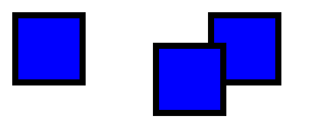
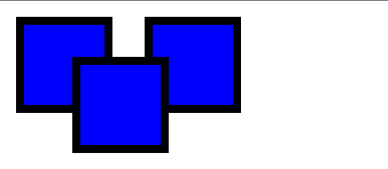
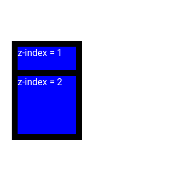

# Introduzione 
Position viene utilizzata per gestire il posiziomanento degli elementi all'interno della pagina.


Le possibili opzioni della proprietà position sono :
+ `static`, default elemento non posizionato
+ `relative`, partendo dalla posizione dell'elemento considerandolo come static è possibile modificare la sua posizione per, ad esempio, far sovrapporre due elementi e lascia comunque lo spazio dell'elemento:
    ```css
    .relativo {
        position : relative ;
        top: 50px;
        left : 70px;       
    }
    ```
    
+ `absolute`, come il relative solo che non lascia lo spazio dell'elemento :
     
    absolute può essere utilizzato anche all'interno di altri componenti ma prenderà come posizione di partenza il primo componente posizionato (un componente che non abbia position : static) che lo contiene
+ `fixed`, come gli absolute solo che rimangono fissi nella pagina come ad esempio i menu dei siti che ti seguono nello scorrere della pagina. non sempre supportato su mobile
+ `sticky`, è un relative con un fixed, in pratica rimane fisso in un elemento ma qunado esso passa anche l'elemento definito sticky passa con esso. non sempre supportato su mobile


# z-index

Permette di generare dei layer e quindi di dare un indicazione nella fase di rendering alla sovrapposizione di elementi.
```css
.box1 {
    background-color: blue;
    width: 100px;
    height: 100px;
    border: 10px solid black;
    margin : 20px;
    position : absolute;
    top : 50px;
    z-index : 1;
}
.box2 {
    background-color: blue;
    width: 100px;
    height: 100px;
    border: 10px solid black;
    margin : 20px;
    position : absolute;
    top : 100px;
    z-index: 2;
}

```



In pratica il valore di z-index più alto sarà più vicino all'utente rispetto ad uno con lo z-index più basso