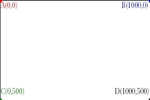
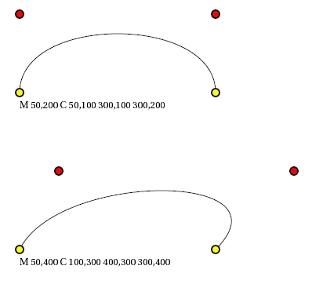
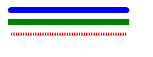
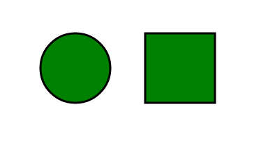
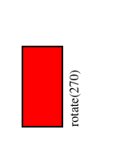

# SVG
SVG (Scalable Vector Graphics) è un linguaggio di grafica vettoriale bidimesionale basato su XML sviluppato dal consorzio W3C. Questo linguaggio testuale permette di generare immagini vettoriali utilizzabili per il Web data la loro leggerezza, essendo vettoriale mantiene la stessa nitidezza anche se estremamente ingrandito, non è un formato proprietario ed è liberamente consuiltabile sul sito del W3C, essendo basato sul XML è possibile utilizzare tool specifici per XML anche sullo standard SVG, tramite scripting è possibile rendere l'immagine interattiva tramite transizioni e animazioni. 
Il vantaggio principale di questo linguaggio è la sua integrazione nell'HTML e che quindi è manipolabile con la maggiorparte dei framework front end e tramite il javaScipt.

```xml
<?xml version="1.0" encoding="iso-8859-1" standalone="no"?>
<!DOCTYPE svg PUBLIC "-//W3C//Dtd SVG 1.1//EN" "http://www.w3.org/Graphics/SVG/1.1/Dtd/svg11.dtd">
<svg width="300" height="200"
     version="1.1" xmlns="http://www.w3.org/2000/svg">


	<text x="10" y="100"
	      style="fill:red;font-family:times;font-size:18">
	Primo esempio di SVG
	</text>
</svg>
```

Questo è un semplice esempio di applicazione di SVG, dove tramite il tag svg andiamo a definire le dimensioni, la versione e il namespace. L'elemento text interno all' svg indica che andremo ad inserire un testo in formato vettoriale e con gli attributi andiamo a definire la posizione rispetto al punto (0, 0) che rappresenta il punto in alto a sinistra del riquadro fornito dal tag svg, e lo stile di questo testo.

# Viewport e Viewbox
Anche se l'immagine vettoriale non viene costruita come una serie di pixel essa sarà comunque visualizzata su di uno schermo che è effettivamente fatto da pixel quindi per poter definire uno spazio sullo schermo bisogna obbligatoriamente andare a definire uno spazio e questo è rappresentato dal **viewport**. Qunado andiamo a definire **width="300" height="200"** come nell'esempio precedente noi andiamo a dimensionare il nostro riquadro, questo rappressenta il viewport. Per il dimensionamento di default è considerato in pixel ma nulla vieta di poter inserire un altra unità di misura come cm, em ecc.

Il **viewbox** invece rappresenta il nostro sistema di coordinate. Normalmente quando dichiariamo l'svg il sistema di riferimento è il seguente : 


Con la proprietà **viewBox** possiamo andare a cambiare questo riferimento : 
```html
<svg width="300" height="200" viewBox="0 0 1000 500">
```
Ottenendo il seguente risultato :  


# Ridimensionamento
Per poter controllare il dimensionamento possiamo utilizzare la proprietà **preserveAspectratio**.
Le opzioni supportate sono : 
+ none : non forza una scala uniforme
+ meet : (predefinita) ridimensiona ma in modo che le proporzioni vengano rispettate, il viewbox è completamente visibile nel viewport
+ slice : come meet solo che il viewport vine completamente riempito a discapito del viewbox che potrebbe non rientrare completamente
+ xMinYMin : allinea il valore minimo dell'x di viewport con il valore minimo di x del viewbox uguale per la y (In questo modo l’estremo superiore sinistro della nostra immagine coinciderà sempre con l’estremo superiore sinistro dello spazio di visualizzazione.)
+ xMinYMid : allinea i valori medi del viewport con quelli del viewbox
+ xMaxYMax : allinea i valori massimi del viewport con quelli del viewbox
+ valgono anche tutti gli eventuali mix

```xml
<svg width="300" height="200" viewBox="0 0 300 200" preserveAspectratio="xMinYMin">
```

# Figure geometriche
Tramite l'svg possiamo andare ad utilizzare degli elementi semplici per definire la nostra immagine vettoriale complessa. 

## Linea
```xml
 <line x1=”10″ y1=”10″ x2=”100″ y2=”100″ style=”stroke:red”/> 
```
x1 e y1 sono le coordinate di partenza, mentre x2 e y2 quelle di arrivo, la proprietà style definisce le  caratteristiche 

## Polilinea

```xml
 <polyline points=”10,10 50,50 90,10″ style=”stroke:red;fill:none”/> 
```
Come la linea ma definisce una spezzata con i valori definite dalle coppie separate da uno spazio e dal punto dove x e y sono separate da una virgola.

## Cerchio 
```xml
 <circle cx=”100″ cy=”100″ r=”50″ style=”stroke:red;fill:red”/> 
```

cx e cy rappresentano il centro del cerchio e r il suo raggio 

## Poligono 

```xml
 <polygon points=”250,250 297,284 279,340 220,340 202,284″ style=”stroke:red;fill:red”/> 
```

Una qualsiasi figura che può essere rappresentata da una linea spezzata e chiusa dove andiamo a definire anche il contorno stroke e il suo riempimento fill.

## Rettangolo 

```xml
 <rect x="10" y="10" rx="2" ry="2" width="100" height="50" style="fill:red"/>  
```

x e y rappresentano il posizionamento del rettangolo partendo dal punto in alto a sinistra, width ed height sono rispettivamente larghezza ed altezza, mentre rx ed ry permettono di creare un rettangolo con i bordi stondati per valori maggiori di zero.

## Ellisse

```xml
 <ellipse cx="100" cy="100" rx="70" ry="50" style="fill:red"/> 
```
come per il cerchio, cx e cy sono il centro dell'ellisse mentre rx ed ry rappresentano i raggi lungo x e lungo y 

# Figure geometriche irregolari

Oltre le figure geometriche classiche possiamo definire anche figure che siano composte da linee e curve tramite il comando path (percorso).

```xml
 <path d="M100,150 L150,100 L200,150 Z" style="fill:red"/> 
```
Questo è un esempio semplice dell'utilizzo di path, il suo risultato è un trinagolo rosso. Queste sono solo alcune delle opzini che path supporta :
+ moveTo M(x,y) : indica il punto di origine della figura geometrica irregolare
+ lineTo L(x,y) : a partire dal punto precedente traccia una linea retta fino al punto indicato dopo la L
+ close path Z : dall'ultimo punto congiunge il tratto fino al punto iniziale 
+ horizontal lineTo H(x) : prende la quota di y e traccia una linea orizzontale fino al valore di x
+ vertical lineTo V(y) : come H solo che tiene fisso x e traccia una linea verticale fino al valore di y
+ curveTo C(x1,y2 x2,y2 x,y) : Disegna una curva cubica di Bezier dal punto corrente fino al punto di coordinate x,y usando i punti x1,y1 e x2, y2 come punti di controllo rispettivamente all’inizio e alla fine della curva.
+ Smooth Curveto (S x2,y2 x,y): disegna una curva cubica di Bezier che unisce il punto corrente con il punto di coordiante x,y. Il punto x2,y2 rappresenta il secondo punto di controllo mentre il primo punto di controllo è espresso dal simmetrico del secondo punto di controllo del comando precedente, relativo al punto corrente
+ Quadratic Bezier Curveto (Q x1,y1 x,y): disegna una curva quadratica di Bezier che unisce il punto corrente con il punto di coordinate x,y, usando il punto x1,y1 come punto di controllo.
+ Smooth Quadratic Bezier Curveto (T x,y): disegna una curva quadratica di Bezier congiungente il punto corrente con il punto di coordinate x,y. Il punto di controllo è il simmetrico del punto di controllo del comando precedente, relativo al punto corrente.

Un esempio di curva è la seguente :  


# Testo
Come visto in precedenza possiamo anche definire dei testi in svg tramite il tag text come nel seguente esempio :  
```xml
 <text x="10" y="20">Scritta</text>
```

Con le proprietà x e y possimo posizionare il testo all'interno del svg ma possiamo anche posizionarlo in funzione di un testo precedente tramite il tag tspan come nel seguente esempio : 
```xml
<text x="20" y="10">Prima riga
<tspan x="20" dy="20">Seconda riga</tspan>
<tspan dx="10" dy="20">Terza Riga</tspan>
</text>
```
Dove Dx rappresenta il differenziale tra la posizione precedente e quella successiva. I tspan vanno inseriti all'interno del tag text.  
Oltre alle opzione di posizione abbiamo tutta una serie di opzioni qui di seguito :  
+ font-family: permette di specificare il tipo di font della scritta (Times, arial,….);
+ font-size: indica la dimensione dei caratteri che compongono la scritta;
+ font-style: ci consente di stabilire lo stile del testo (normal, italic, oblique);
+ font-weight: indica la grandezza dei caratteri del testo (normal, bold, bolder, lighter,….);
+ text-decoration: permette di definire l’aspetto del testo (normal, underline, line-through, overline);
+ fill: indica la colorazione della scritta (red, black,……);
+ stroke: indica la colorazione del bordo della scritta (red, black,….);
+ text-anchor: stabilisce l’allineamento del testo (start, middle, end);
+ baseline-shift: permette di creare scritte posizionate come apici superiori o apici inferiori (super,sub);
+ letter-spacing: stabilisce la distanza tra i caratteri della scritta;
+ word-spacing: stabilisce la distanza tra le parole che compongono la scritta;

Con questo tag andiamo quindi ad inserire del testo e posizionarlo in funzione di altre scritte. Nel caso si volesse posizionare del testo in funzione di una figura geometrica o di un path possiamo utilizzare il tag **textpath**.

# Style
Quando si vuole inserire dello stile ai nosti elementi svg possiamo richiamare gli attributi dei singoli elementi o in alternativa possiamo utilizzare una proprietà unica chiamata **style**, con essa possiamo definire una stringa di attributi con un unica proprietà.
Le opzioni supportate sono : 
+ font-family : tipologia di scrittura 
+ font-size : dimensione del scrittura 
+ fill: permette di indicare il colore di riempimento dell’elemento. I colori possono essere espressi indicandone il nome o la loro codifica in formato rgb;
+ opacity: indica il livello di opacità dell’elemento. Il valore 1 indica l’opacità massima mentre il valore 0 indica che l’elemento è trasparente.
+ fill-rule: determina il modo in cui verrà riempita l’area dell’elemento. Questo attributo è molto utile nel caso di presenza di path complessi all’interno dell’immagine, in quanto stabilisce come verranno riempite le eventuali aree di intersezione. I possibili valori sono nonzero ed evenodd dove, il primo colora tutta l'area esterna ed interna della path mentre il secondo colora solo l'area esterna
+ stroke: permette di specificare il colore della linea che costituisce il bordo dell’elemento;
+ stroke-width: indica la misura dello spessore della linea;
+ stroke-dasharray: permette di specificare lo stile della linea, ad esempio normale o tratteggiata;
+ stroke-linecap: definisce come saranno disegnati gli estremi della linea ed i possibili valori sono butt,round,square;
+ stroke-linejoin: definisce il modo in cui sarà disegnata l’intersezione tra due linee e i possibili valori sono miter, round, bevel;
+ display: permette di controllare la visibilità di un elemento. Assegnandogli il valore none l’elemento non verrà visualizzato mentre con il valore inline l’elemento sarà visualizzato.

Un esempio è la seguente linea di codice :  
```xml
<svg width=500 height=100 >
	<line x1="10" y1="10" x2="200" y2="10" style="stroke-width:10;stroke:blue;stroke-linecap:round"/>
	<line x1="10" y1="30" x2="200" y2="30" style="stroke-width:10;stroke:green;stroke-linecap:square"/> 
	<line x1="10" y1="50" x2="200" y2="50" style="stroke-width:5;stroke:red;stroke-dasharray:2"/>
</svg>
```

dove il risultato è il segunete :  



Lo stile può essere definito o come nel caso precedente quindi direttamente nell'elemento o in alternativa tramite un foglio di stile css 

# Grouping
Con questa operazione possiamo raggruppare più elementi svg in un insieme che condivide uno specifico stile.
Per definire un gruppo basta utilizzare il tag **g** come nell'esempio :  
```xml
<g style="fill:green;stroke:black;stroke-width:3">
   <circle cx="100" cy="100" r="50"/>
   <rect x="200" y="50" width="100" height="100"/>
</g>
```
Ottenendo la seguente immagine :  


Questa suddivisione in gruppi è reiterabile se si vogliono creare dei sottogruppi in altri gruppi.

# Trasformazioni 
Oltre alla definizione dello stile è possibile integrare anche operazioni di trasformazioni all'interno dell'elemento tramite l'attributo **trasform**.  
Le operazioni consentite sono :  
+ translate(tx,ty): permette di traslare la posizione dell’elemento grafico di tx unità lungo l’asse X e di ty unità lungo l’asse Y;
+ scale(sx,sy): effettua un’operazione di scaling con un fattore indicato da sx, lungo l’asse X, e da sy, lungo l’asse Y;
+ rotate(ra,cx,cy): permette di ruotare l’elemento grafico di un angolo pari a ra. Gli attributi cx e cy (che sono opzionali) indicano le coordinate del punto attorno al quale effettuare la rotazione;
+ skewX(sa): applica una trasformazione che inclina l’asse X di un angolo pari al valore indicato da sa;
+ skeyY(sa): applica una trasformazione che inclina l’asse Y di un angolo pari al valore indicato da sa;
+ matrix(a,b,c,d,e,f): applica all’elemento grafico la matrice di trasformazione (3×3) indicata da [[a c e] [b d f] [0 0 1]].

Tutte queste operazioni hanno la loro controparte css quindi rimando al manuale trasform di css per la definizione specifica delle trasformazioni.  
Un esempio banale di trasformazione è la seguente :  
```xml
<g transform="translate(10,250) rotate(270)">
   <rect x="10" y="10" width="100" height="50" style="fill:red;stroke:black;stroke-width:2"/>
   <text x="10" y="80" style="font-family:times;font-size:12;fill:black">
      rotate(270)
   </text>
</g>
```

Dove il risultato è il seguente :  
