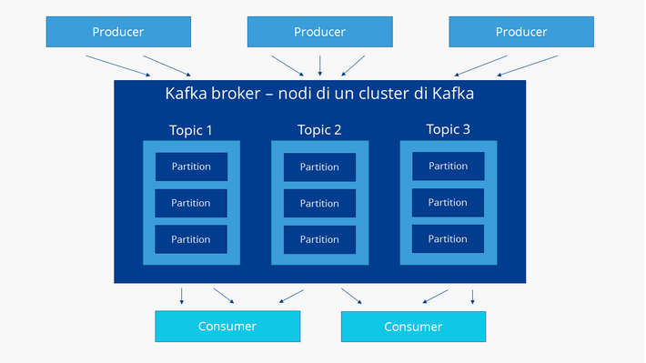

# Introduzione 
Kafka è un sistema di streaming di dati basato sul paradigra publisher subsciber per il trasferimento di dati per analisi di BigData. Kafka affronta anche problematiche di tipo mancanza di connessione temporanea dovuta ad esempio nei dispositivi mobili e gestione di carico di trasferimeto tra il publisher ed il subscriber. Inoltre è un sistema tollerante agli errori, ad alta scalabilità e con orrientamento alla distribuzione di dati multicanale.

# Struttura 

L'architettura di kafka è basata sul concetto di nodi e di cluster dandone una connotazione di sistema distribuito e supportabile in container.
I cluster è formato da più nodi definiti **broker**, questi si occupano di categorizare e salvare i flussi in entrata definiti **topic**.
I flussi consi suddivisi vengono partizionati, replicati e distribuiti nel cluster e contrassegnati con una marca temporale.
Quando scrivi o leggi dati in kafka lo fai tramite il concetto di evento, questo ha come attributi una chiave, un valore, una data ed eventuali intestazioni di metadati opzionali.
Un semplice eveto è il seguente :
+ Chiave dell'evento: "Alice"
+ Valore dell'evento: "Ha effettuato un pagamento di 200 dollari a Bob".
+ Timestamp dell'evento: "25 giugno 2020 alle 14:06"

I topic di kafka sono suddivisi in due tipologie e sono : **normal topic** e **compacted topic**, la prima definisce un flusso dati che deve essere elaborato e dopo un certo periodo di tempo deve essere eliminato mentre il secondo vene utilizzato per quei flussi che devono essere salvati per lunghi periodi. 

Kafka prevede 

Kafka si basa su 5 interfacce chiave e sono :
+ **Kafka Producer**: interfaccia per l'invio di dati al sistema da parte dei produttori
+ **Kafka Consumer**: interfacci per la ricezione dei topic elabotati da kafka
+ **kafka Stream**: interfaccia di comunicazione per i programmi che devono elaborare lo stream 
+ **kafka Connect**: interfacci per impostare le connessioni tra producer e consumer attraverso i topic esistenti
+ **kafka AdminClient**: interfaccia di amministrazione e controllo dei cluster kafka

