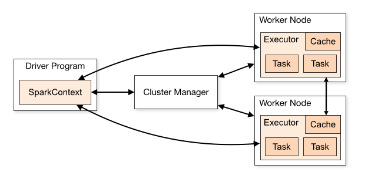
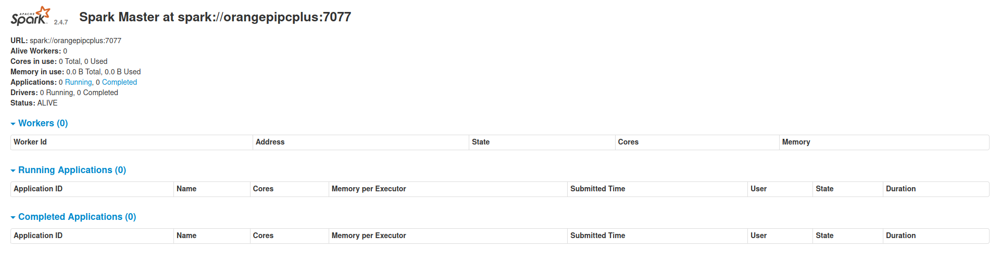

# Introduzione 
Apache spark è uno dei sistemi più utilizzati per il calcolo distribuito.
Non si occupa della gestione dati per questo che genralmente viene distribuita con hadoop per la gestione dell'archiviazione.

# Struttura
AS si basa sul paradigma master slave. questo paradigma si realizza tramite il driver che istruisce gli executer su i processi che devono eseguire. Il coordinatore degli executer è il componente **SparkContext** nel driver, che per potersi connettere ai vari cluster (serie di pc collegati definiti nodi) utilizza il **Cluster Manager** che alloca risorse tra le applicazioni.

Una volta connesso, spark acquisisce gli esecutori sui nodi del cluster che sono processi che eseguono i calcoli ed archiviano i dati e successivamente invia il codice dell'applicazione (file JAR o Python) agli executer.
Gli executer xono responsabili dell'esecuzione effettiva. Quindi gli executer sono responsabili solo del calcolo assegnato e della risposta al nodo driver.
Questa modalità è definita **cluster mode**


Spark può lavorare anche nella modalità **client mode** cioè SparkContext e il driver lavorano sullo stesso nodo. 
 


# Installazione

Per poter utilizzare AS bisogna innanzi tutto installare java 8 o superiore 

## Installazione su Orange Pi

Per un mio diletto sto provando a far funzionare AS su di una rete farmata da 3 Orange pi dove ci saranno un master e due slave.

Attualmente su questi OPP abbiamo come versione del kernel 5-10-12-sunxi e come SO armbian 21-02-01.

+ installare java 8+ `sudo apt install default-jdk` 
+ scaricare e installare apache spark
    + scaricare `curl -O https://downloads.apache.org/spark/spark-2.4.7/spark-2.4.7-bin-hadoop2.7.tgz`
    + estrarre `tar xvf spark-2.4.5-bin-hadoop2.7.tgz`
    + spostare la ditectory `sudo mv spark-2.4.7-bin-hadoop2.7/ /opt/spark `
    + impostare le variabili di ambiente con spark 
        + `sudo nano ~/.bashrc`
        + aggiungi le righe : 
        ```bash
        export SPARK_HOME=/opt/spark
        export PATH=$PATH:$SPARK_HOME/bin:$SPARK_HOME/sbin
        ```
        + rendiamo effettivi i cambiamenti `source ~/.bashrc`
+ lanciamo il master
    + `start-master.sh`
    + controlliamo lo stato `ss -tunelp | grep 8080`
+ lanciamo lo slave
    + ` ` collegandolo al master

come ultima conferma dopo aver lanciato il master digitiamo sul browser `IP_DISPOSITIVO(192.168.1.200):8080` e vedremo questa immagine  