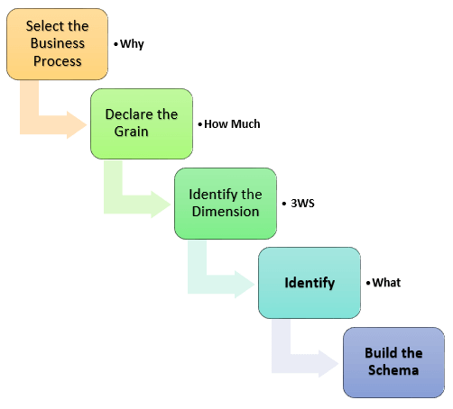

# Introduzione 
Modello dimensinale è formalismo grafico ideato per supportare la fase di modellazione concettuale di un progetto di datawhere house.

# Elementi del modello

## Fact
Rappresentano un qualcosa di reale come: un operazione aziendale, i componenti della linea di produzione. Essi vengono definite attraverso una metrica/misura legata al processo. es:
+ Per un processo commerciale di vendita, una misura potrebbe essere il numero di vendite trimestrali (esempio del testo)
+ Su di una linea di produzione (fatto) sappiamo solo il numero di componenti per ora, in questo caso il fatto e la metrica si uniscono
+ Su di una  liena di produzione (fatto) abbiamo più metriche ad esempio il valore dei sensori ecc

## Dimension 
Fornisce le info di contesto del fatto. Queste info possono rispondere alle domande : chi, dove, cosa. Alcuni esempi potrebbero essere : 
+ Nel processo di business Sales, per il fatto numero di vendite trimestrali, le dimensioni sarebbero (esempio del testo)
    + Chi - Nomi dei clienti
    + Dove - Località
    + Cosa - Nome del prodotto

+ su di una linea di produzione potremmo avere come dimensioni :
    + Chi - nome della linea, sensori
    + Dove - luogo dell'impianto
    + Cosa - Cosa produce

In altre parole, una dimensione è una finestra per visualizzare le informazioni nei fatti.

## Attributes
Rappresentano le caratteristiche delle dimensioni, ad esempio:
+ nella vendita la dimensione località avra come attributi :
    + stato
    + paese
    + codice postale

Gli attributi sono usati per cercare, filtrare o classificare i fatti. 

## Fact table
Una tabella dei fatti è una tabella primaria nella modellazione delle dimensioni.

Una tabella dei fatti contiene:
+ Misure/fatti
+ Chiave esterna alla tabella delle dimensioni

## Dimension table
Una tabella di dimensione contiene le dimensioni di un fatto.

+ Sono unite alla tabella dei fatti tramite una chiave esterna.
+ Le tabelle di dimensione sono tabelle de-normalizzate (tabelle ottimizzate per la lettura, possono avere ridondanze).
+ Gli attributi di dimensione sono le varie colonne di una tabella di dimensione
+ Le dimensioni offrono caratteristiche descrittive dei fatti con l'aiuto dei loro attributi
+ Nessun limite fissato per il numero di dimensioni
+ La dimensione può anche contenere una o più relazioni gerarchiche

# Tipi di dimensionalità
Le dimensionalità possono essere di vari tipi:
+ Conformed Dimension: sono dimensioni che servono come collante tra altre dimensioni
    + Shared dimension: sono quelle dimension che sono caratterizzate allo stesso modo tra diversi fatti in un altra stella o data mart
    + Rollup dimension: sono delle sotto dimensioni caratteristiche come ad esempio può essere la dimensione mese nella dimensione data. 
+ Outrigger Dimension: rappresenta una relazione tra diverse tabelle di dimensioni
+ Shrunken Dimension: Una Dimensione Striminzita è un sottoinsieme perfetto di un'entità di dati più generale. In questa Dimensione, gli attributi che sono comuni sia al sottoinsieme che all'insieme generale sono rappresentati nello stesso modo. 
+ Role-playing Dimension: Una dimensione di ruolo è un tipo di tabella che ha più relazioni valide tra se stessa e varie altre tabelle. Esempi comuni di Role-Playing Dimensions sono il tempo e i clienti. Possono essere utilizzate in aree in cui alcuni fatti non condividono gli stessi concett
+ Dimension to Dimension Table: Questo tipo di tabella è una tabella nello Star Schema di un Data Warehouse. In uno schema a stella, una tabella di fatti è circondata da più tabelle di dimensione. Ogni dimensione corrisponde a una singola tabella di dimensione.
+ Junk Dimension (spazzatura): Una Junk Dimension è un tipo di dimensione che viene utilizzata per combinare 2 o più fatti correlati a bassa cardinalità in una dimensione. Si usa anche per ridurre le dimensioni delle tabelle di dimensione e le colonne delle tabelle di fatto.
+ Degenerate Dimension: Una Dimensione Degenerata è anche conosciuta come una Dimensione Fatti. Sono dimensioni standard che sono costruite dalle colonne degli attributi delle tabelle di fatto. A volte i dati sono memorizzati in Tabelle Fatti per evitare la duplicazione.
+ Swappable Dimension: Una Dimensione Scambiabile è un tipo di Dimensione che ha più versioni simili di se stessa che possono essere scambiate al momento della query. La struttura di questa dimensione è anche diversa e ha meno dati rispetto alla dimensione originale. Anche l'input e l'output sono diversi per questa dimensione.
+ Step Dimension: Questo è un tipo di Dimensione che spiega dove un particolare passo si inserisce nel processo. Ad ogni passo viene assegnato un numero di passo e quanti passi sono richiesti da quel passo per completare il processo. (immaginiamola come la descrizione degli stati in cui si può trovare un fatto)

# Passaggi del modello dimensionale
L'accuratezza nella creazione della tua modellazione dimensionale determina il successo della tua implementazione del data warehouse. Ecco i passi per creare il modello dimensionale

+ Identificare il processo di business
+ Identificare la grana (livello di dettaglio)
+ Identificare le dimensioni
+ Identificare i fatti
+ Costruire la stella

Il modello dovrebbe descrivere il perché, il quanto, il quando/dove/chi e il cosa del tuo processo di business

# Passo 1) Identificare il processo di business
Identificare l'effettivo processo di business che un datarehouse dovrebbe coprire. Questo potrebbe essere Marketing, Vendite, Risorse Umane, ecc. secondo le necessità di analisi dei dati dell'organizzazione. La selezione del processo di business dipende anche dalla qualità dei dati disponibili per quel processo. È il passo più importante del processo di Data Modelling, e un fallimento qui avrebbe difetti a cascata e irreparabili.

Per descrivere il processo di business, si può usare il testo semplice o usare il Business Process Modelling Notation (BPMN) o l'Unified Modelling Language (UML) di base.

# Passo 2) Identificare la grana

La grana descrive il livello di dettaglio del problema/soluzione di business. È il processo di identificazione del livello più basso di informazione per qualsiasi tabella nel tuo data warehouse. Se una tabella contiene dati di vendita per ogni giorno, allora dovrebbe avere una granularità giornaliera. Se una tabella contiene dati di vendita totali per ogni mese, allora ha granularità mensile.

Durante questa fase, si risponde a domande come

    Abbiamo bisogno di memorizzare tutti i prodotti disponibili o solo alcuni tipi di prodotti? Questa decisione si basa sui processi aziendali selezionati per il Datawarehouse
    Dobbiamo memorizzare le informazioni di vendita dei prodotti su base mensile, settimanale, giornaliera o oraria? Questa decisione dipende dalla natura dei rapporti richiesti dai dirigenti
    Come influiscono le due scelte di cui sopra sulla dimensione del database?

Esempio di grano:

Il CEO di una MNC vuole trovare le vendite di prodotti specifici in diverse località su base giornaliera.

Quindi, il grano è "informazioni sulla vendita di prodotti per località in base al giorno".

# Passo 3) Identificare le dimensioni

Le dimensioni sono sostantivi come data, negozio, inventario, ecc. Queste dimensioni sono dove tutti i dati dovrebbero essere memorizzati. Per esempio, la dimensione data può contenere dati come anno, mese e giorno della settimana.

Esempio di dimensioni:

Il CEO di una MNC vuole trovare le vendite di prodotti specifici in diverse località su base giornaliera.

Dimensioni: Prodotto, Luogo e Tempo

Attributi: Per il prodotto: Chiave prodotto (Foreign Key), Nome, Tipo, Specifiche

Gerarchie: Per Location: Paese, Stato, Città, Indirizzo, Nome

# Passo 4) Identificare il fatto

Questo passo è co-associato con gli utenti commerciali del sistema perché è qui che ottengono l'accesso ai dati immagazzinati nel data warehouse. La maggior parte delle righe della tabella dei fatti sono valori numerici come il prezzo o il costo per unità, ecc.

Esempio di fatti:

L'amministratore delegato di una multinazionale vuole trovare le vendite di prodotti specifici in diverse località su base giornaliera.

Il fatto qui è Somma delle vendite per prodotto per località per ora.

# Passo 5) Costruire lo schema

In questo passo, si implementa il modello di dimensione. Uno schema non è altro che la struttura del database (disposizione delle tabelle). Ci sono due schemi popolari

## Schema a stella

L'architettura dello schema a stella è facile da progettare. Si chiama schema a stella perché lo schema assomiglia a una stella, con punti che si irradiano da un centro. Il centro della stella consiste nella tabella dei fatti, e i punti della stella sono tabelle di dimensione.

Le tabelle dei fatti in uno schema a stella che è la terza forma normale, mentre le tabelle dimensionali sono de-normalizzate.

## Schema a fiocco di neve

Lo schema a fiocco di neve è un'estensione dello schema a stella. In uno schema snowflake, ogni dimensione è normalizzata e collegata a più tabelle di dimensione.

# Regole per la modellazione dimensionale

Seguono le regole e i principi della modellazione dimensionale:

+ Caricare dati atomici in strutture dimensionali. 
+ Costruire modelli dimensionali intorno ai processi di business.
+ Necessità di assicurare che ogni tabella di fatti abbia una tabella dimensionale associata alla data.
+ Assicurarsi che tutti i fatti in una singola tabella di fatti siano alla stessa grana o livello di dettaglio.
+ È essenziale memorizzare le etichette dei report e i valori del dominio dei filtri nelle tabelle di dimensione.
+ Necessità di assicurare che le tabelle di dimensione usino una chiave surrogata
+ Bilanciare continuamente i requisiti e le realtà per fornire una soluzione di business che supporti il loro processo decisionale

# Vantaggi della modellazione dimensionale

La standardizzazione delle dimensioni permette un facile reporting tra le aree del business.
+ Le tabelle di dimensione memorizzano la storia delle informazioni dimensionali.
+ Permette di introdurre completamente nuove dimensioni senza grandi interruzioni nella tabella dei fatti.
+ Le dimensioni permettono anche di memorizzare i dati in modo tale che sia più facile recuperare le informazioni dai dati una volta che i dati sono memorizzati nel database.
+ Rispetto al modello normalizzato le tabelle dimensionali sono più facili da capire.
+ Le informazioni sono raggruppate in categorie aziendali chiare e semplici.
+ Il modello dimensionale è molto comprensibile per il business. Questo modello è basato su termini di business, in modo che il business sappia cosa significa ogni fatto, dimensione o attributo.
+ I modelli dimensionali sono deformalizzati e ottimizzati per una veloce interrogazione dei dati. Molte piattaforme di database relazionali riconoscono questo modello e ottimizzano i piani di esecuzione delle query per aiutare le prestazioni.
+ La modellazione dimensionale nel data warehouse crea uno schema che è ottimizzato per alte prestazioni. Significa un minor numero di join e aiuta a minimizzare la ridondanza dei dati.
Il modello dimensionale aiuta anche ad aumentare le prestazioni delle query. È più denormalizzato quindi è ottimizzato per l'interrogazione.
+ I modelli dimensionali possono ospitare comodamente i cambiamenti. Le tabelle dimensionali possono avere più colonne aggiunte a loro senza influenzare le applicazioni di business intelligence esistenti che usano queste tabelle.

Overview underperformance:
+ Produzione totale
+ media di potenza migliorabile (%)
+ tasso di rendimento
+ motivazioni del abbassamento del tasso di rendimento (lista:generatore RPM, Nacelle direction, direzione del vento metereologico, temperature del gear bearing, temperature gear oil %)
+ info sul vento

turbina underperformance:
+ tasso di rendimento per turbina
+ motivazioni del abbassamento del tasso di rendimento (lista %)
+ tasso di rendimento per turbina nel tempo (finestra 3 anni)

overview Healt:
+ healt indicator per turbina
+ tempo downtime in ore e in percentuale
+ allarmi annea (data, turbina, HI, raccomandazione(operazioni da eseguire per risolvere l'allarme))
+ allarmi scada
+ operazioni di manutenzione (data, turbina, modello, componente, downtime)

Dettaglio turbina healt:
+ HI
+ predicted healt index (%)
+ grafico energia prodotta in percentuale dalla turbina

dettaglio singolo componente:
+ HI (effettivo? predetto, range di accuratezza)
+ allarmi: annea, scada e generici(HI, componente, raccoomandazioni)