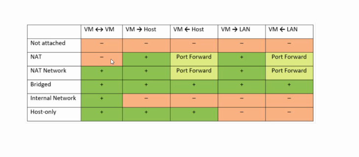

# Introduzione 
In questo documento vengono riportati le metodologie e i tool di comune utilizzo per effettuare un analisi sulla sicurezza di un sistema informatico.

# Ambiente di test
Per testare la propria architetura software si possono creare ambienti di test dove questa viene eseguita e eventuali azioni di attacco non creano problemi alla versione in produzione.
Per creare questo ambiente si possono usare delle macchine virtuali, settate come la macchina di produzione, che possiamo utilizzare per testare l'architettura.

Tra i tools di gestione di macchine virtuali troviamo sicuramente virtual box.
Questi gestori di macchine virtuali permettono anche la gestione della rete.

Questa tabella indica il settaggio di rete nella VirtualBox.

Oltre alla VB abbiamo bisogno dell'immagine del sistema operativo che andremo ad utilizzare per la nostra architettura e di altre due immagini cioè quella di kali linux e di Merasploitable.
Kali linux è un sistema operativo utilizzato per il testing di applicazioni, questo sistema ha tutta una serie di tools per il penetration testing.
Metasploitable è un altro sistema che semplifica il testing attraverso una serie di exploit già fatti e di operazioni automatiche, inoltre viene utilizzato anche per lo sviluppo di sistemi di rilevamento.

# Raccolta informazioni 
Prima di testare un sistema è bene fare delle indagini a tutto tondo, (anche se abbiamo le informazioni che ci servono per testare la nostra architettura è sempre bene sapere quali informazioni sono disponibili sul web e che eventuali malintenzionati possono utilizzare)
queste operazioni sono dette **Footprinting**.
Con questo termine si intende la raccolta di tutte le informazioni pubblicamente disponibili relative ad un certo bersaglio.

Per effettuare questa operazioni è bene appuntarsi tutte le informazioni utili, un metodo è quello dell'utilizzo delle mappe mentali.

Uno strumento molto utile alla creazione di mappe mentali è Xmind, questo strumento è disponibile in una versione free e una a pagamento.

Per effettuare il footprinting possiamo utilizzare la seguente scaletta:
1. Informazioni tramite motori di ricerca
1. Informazioni legate alla posizione fisica
1. Informazioni legate alle persone all' interno di uno specifico contesto
1. Informazioni legate agli annunci di lavoro
1. Informazioni legate a blog/forum/social media
1. Informazioni legate all'analisi di un sito web
1. Informazioni legate all'analisi delle mail
1. Informazioni legate all'utilizzo di WHOIS
1. Informazioni legate all'utilizzo dei DNS
1. Informazioni estratte tramite l'analisi della rete bersaglio

Questo elenco è di solo supporto, una volta che si ha un po di dimestichezza questo elenco può essere arricchito o in alternativa si possono prende solo alcuni elementi per l'analisi.

## Informazioni tramite motori di ricerca

Tra i motori di ricerca più utilizzati abbiamo Bing e Google.
Innanzi tutto bisogna raccogliere le informazioni pubbliche sull'obiettivo dell'attacco.
Qualsiasi info può tornare utile quindi conoscere l'obiettivo è molto importante.

É bene utilizzare quanti più motori di ricerca poiché possono dare info differenti.

Un altra considerazione da fare è l'utilizzo approfondito di questi strumenti come ad esempio le parole chiave da utilizzare nella ricerca come ad esempio :
+ site: 
+ inurl:
+ allinurl:
+ intitle:
+ allintitle:
+ link:
+ cache:
+ related:
+ ecc...

Queste opzioni di ricerca vengono utilizzate per semplificare la ricerca, un elenco esaustivo è reperibile al seguete [link](https://kinsta.com/it/blog/operatori-ricerca-google/).

Google mette a disposizione vari servizi come [google advance search](https://www.google.it/advanced_search), [google hacking database](https://www.exploit-db.com/google-hacking-database) e [google hacking diggity project](https://resources.bishopfox.com/resources/tools/google-hacking-diggity/).

Tra questi una mensione sul servizio **Shodan**, motore di ricerca basato invece che sui siti sui device.

## Informazioni legate alla posizione fisica
Banalmente basta utilizzare maps. Tramite questo servizio possiamo raccogliere immagini ed informazioni sulla struttura.

## Informazioni legate alle persone all' interno di uno specifico contesto

Importante è reperire informazioni sulle persone che lavorano o hanno accesso al sistema obiettivo.

Tra i tools utilizzati per questo scopo troviamo : [webmii](https://webmii.com/) e [maltego](https://www.maltego.com/)

## Informazioni legate agli annunci di lavoro
Queste informazioni posso essere molto utili per capire quali tecnologie vengono utilizzate per lo sviluppo delle applicazioni dall'azienda che ha sviluppato il sistema obiettivo.

Tra i siti più utili troviamo linkedin, infojob, monster, indeed e jobrapido

Cercando tra gli annunci di lavoro possiamo trovare info utili alle tecnologie utilizzate.

##  Informazioni legate a blog/forum/social media
In questi siti è possibile trovare informazioni utili all'attacco. Tali informaizoni potrebbero essere scritte involontariamente da dipendenti oppure info per la risoluzione di un problema che lasci intendere delle specifiche dell'architetura.

## Informazioni legate all'analisi di un sito web

Analisi più o meno approfondite sul sito web della socetà.

Tra le ricerche che si possono fare sono : 
+ info sul sito : [netcraft](https://www.netcraft.com/) info sul sito (web server, vari domini, SO, ecc), [web site informer](https://website.informer.com/)(compagnia di hosting, dns, WHOIS, ecc), [firebug](https://getfirebug.com/)(scansione del codice html e css), [shodan](https://www.shodan.io/) (vulnerabilità, indirizzo ip , ecc)

+ Codice del sito: [web data exstractor](http://www.webextractor.com/) (indirizzi mail, siti terzo livello, file , ecc), [httrack](https://www.httrack.com/)(copia sito in locale)

+ versioni precedenti del sito : [wayback machine](http://archive.org/)(codice del sito in una certa data per la ricerca di dati sensibili), [website watcher](https://www.aignes.com/) (visualizzazioni di modifiche del sito)

+ estrarre dati da immagini: [foca](https://github.com/ElevenPaths/FOCA) (analisi di metadata e info nascoste)per installare il programma bisogna andare a vedere le dipendenze del software ed installarle.

## Informazioni legate all'analisi delle mail
Attraverso le mail possiamo ottenere info molto importanti.
Un software molto utile è [emailTrackerPro](http://www.emailtrackerpro.com/)(analisi della mail e i passaggi effettuati dalla mail) informazioni sui servizi di posta utilizzati

## Informazioni legate all'utilizzo di WHOIS
Info sul web server e sul proprietario del sito

possiamo ottenere info attraverso i siti : [whois](https://www.whois.com) e [whois.domaintools](https://www.whois.domaintools.com)

mentre il programma : [smartWhois](https://www.tamos.com/download/main/)

Per l'entrata in vigore del GDPR le info ottenibili sono molto limitate in europa

## Informazioni legate all'utilizzo dei DNS

I dns traducono i siti dal formato letterale a quello numerico ip.

I DNS hanno una serie di record che ne descrivono il comportamento e le caratteristiche, per un elenco si rimanda alla [pagina](https://it.wikipedia.org/wiki/Tipi_di_record_DNS).

Ci sono vari software di analisi dei DNS, molti a riga di comando ma se si vuole un interfaccia grafica possiamo andare su [Central ops](https://centralops.net/co/)

## Informazioni estratte tramite l'analisi della rete bersaglio

Analisi della rete bersaglio.
le operazioni che ci permettono di avere una visione sono :
+ ping: utile a comprendere se una pagina è raggiungibile e i tempo di latenza tra la richiesta e la risposta
+ nslookup: interroga i server DNS attraverso delle query
+ tracert: serve per ottenere gli ip di ogni router tra noi e l'obiettivo.
+ visual route: software grafico [link](http://www.visualroute.it/)