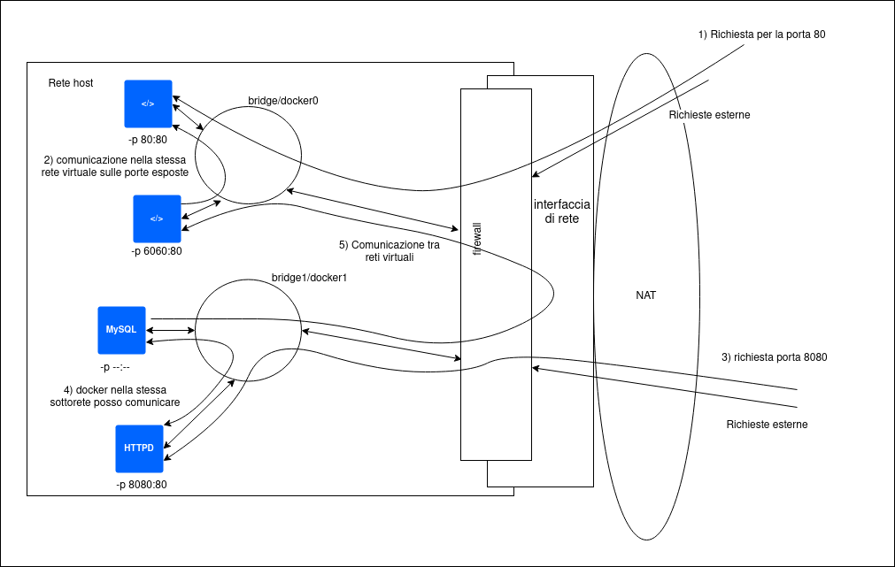

# Images vs Containers
Le immagini sono i binari e le librerie dalla quale vengono avviate le istanze che alla fine sono i veri e propri containers.
Quindi si possono avviare più container a partire dalla stessa immagine.


# Avvio del primo container
Lanciando il comando :  
`sudo docker container run --publish 80:80 nginx`  

Avvieremo un istanza docker sulla porta 80:80 di nginx (web server).

Ora andando nel browser e digitando `localhost` comparirà la scritta welcome to nigix, questo sta ad indicare che il container pubblicato sulla porta 80 del localhost sta funzionando.

In linea di massima digitando il comando precedete, docker ha ricercato un immagine di nginx dal repository docker hub, l'ha scaricata e ha lanciato un container con questa immagine pubblicandola sulla porta 80.
Dal terminala sulla quale abbiamo lanciato il comando possiamo vedere le interazioni che vengono effettuate come ad esempio; se ricarichiamo la pagina possiamo vedere sul termianle che comparirà un log con una richiesta get e con alcuni dati relativi al browser.

Se vogliamo avere l'ID univuoco del container possiamo lanciare il comando : 
`sudo docker container --run --publish 80:80 --detach nginx`

Questo comando avvierà il container restituendo il suo id univuoco senza però mostrare i dati di log a vedeo.

Per avere una lista dei container avviati in questo momento possiamo digitare il comando :  
`sudo docker container ls`

Questo mostrerà la lista di container attualemente attivi dando informazionei quali: nome dell'immagine, porta, container id, ecc.

Per terminare il container avviato con l'opzione --detach basta digitare :  
`sudo docker container stop <prime cifre del valore id Container>`


Il comando `sudo docker container ls` mostra solo la lista di quelli attivi, mentre se vogliamo avere una lista anche di quelli avviati precedentemente, basta aggiungere l'opzione `-a`.

generando questa lista noteremo che come ultimo parametro avremo il nome e anche se abbiamo avviato sempre la stessa immagine i nomi sono diversi, questo perché i nomi dei container devono essere univuoci e se non specificati il sistema assegnerà dei nomi casuali.
Tali nomi vengono presi da una lista opensource che contiene nomi di haker noti o di scenziati.


Per specificare il nome del container basta lanciarlo agigungendo l'opzione : `--name <nomeContainer>`

Con l'opzione `--detach` non abbiamo più accesso al terminale del container ma per vedere i log basta lanciare il comando :  
`sudo docker container logs <nomeContainer>`

Un altro comando molto importante per vedere i processi attivi nel container è top che viene eseguito in questo modo :  
`sudo docker container top <nomeContainer>`  
Questo comando genera un output simile al comando top del terminale, mostrando i processi attivi nel container con i relativi pid ed altre info utili.

Quando lanciamo il comando `sudo docker container ls -a` abbiamo una lista di container avviati e terminati.


Per rimuovere i container utilizziamo il comando :  
`sudo docker container rm <idContainer, idContainer, ...>`

Con questo comando possiamo eliminare le istanze che sono state terminate, mentre se vogliamo terminare e allo stesso tempo eliminare un container possiamo aggiungere l'opzione `-f` per forzarne l'eliminazione.


Un ultima osservazione sul comando run, il comando run crea una nuova istanza del immagine mentre possiamo utilizzare il comando start per avviare un istanza che è stata terminata. Cosi facendo possiamo far ripartire un container che aveva già un lavoro in corso con eventualmente dei settaggi.

## approfondimento sul comando run 

Quando lanciamo il comando run con il nome di un immagine, questo cercherà in locale se è presente tale immagine e se non lo è la scaricherà dal docker hub (repository predefinito).
una vota ottenuta l'immagine (che se non specificata la versione scaricherà l'ultima disponibile nginx:latest), creerà un nuovo container basato sull'immagine e preparerà lo start del container.
Questo container non duplicherà l'immagine ma creerà un layer di modifica dell'immagine di base.
Dopo di che creerà un ip virtuale e genererà una rete privata virtuale nel docker engine.
Se non si utilizza l'opzione `--publish` quest'ultimo non aprirà nessuna porta, mentre se specifichiamo l'opzione senza una porta, di defaurt verrà posto alla porta 80 ( quando indichiamo 80:80 sta a specificare che il servizio è raggiungibile dalla porta 80 dell'host alla porta 80 del container).


Un esempio esaustivo a trattare gli argomenti del paragrafo precedente è il seguente :  
```bash
sudo docker container run --publish 8080:80 --name webhost -d nginx:1.11 nginx -T
```  
Questo comando sta ad indicare : 
+ avvia un docker che è in ascolto sulla porta 80 e passagli tutte le richieste che riceve l'host sulla porta 8080
+ dai il nome al container webhost
+ -d indica il --detach 
+ l'immagine da caricare è nginx versione 1.11 
+ nginx -T definisce l'utilizzo del comando run o del comando start


# Container vs VM
Spesso vengono paragonati e i container vengono presentati come dei mini VM, ma in realtà i container sono solo dei processi (molto particolari poichè per sicurezza devono essere chiusi e comunicare solo attraverso la rete e non con altri processi di sistema).


# Interagire con un container

Normalmente una volta lanciato un container con il comando run, quest ultimo esegue il comando che ha settato di default. Quando il comando termina anche il container termina.  

Al comando run si possono affiancare due operaizioni che sono -t: avvia uno pseudo terminale in ssh e -i: tieni attivo un buffer per i comandi (tiene attiva una sessione per ricevere input dal terminale).

Oltre al comando run, che avvia un nuovo container, è possibile utilizzare il comando exec se il container è gia stato lanciato in precedenza. l'opzione -it rimane valida anche con exec.  

Dopo la selezione dell'immagine, è possibile inserire quale comando vogliamo lanciare all'avvio del container. Un esempio è il seguente : `sudo docker container run -it --name proxy nginx bash`
In pratica stiamo dicendo di avviare un docker di nome proxy con un immagine di nginx che all'avvio caricherà il programma bash. 

Una volta lanciato il container, sarà possibile interagire con la console bash ed effettuare le operazioni permesse dal sistema. Un esempio si potrebbero modificare paramentri o installare pacchetti dai repository se l'immagine ha un gestore dei pacchetti.

Possiamo avviare un immagine che è già stata avviata attraverso il comano start. Se vogliamo lanciare un nuovo processo possiamo utilizzare il comando exec.

Un SO molto utile per i docker è Alpine, questo SO è molto minimale, ha una dimensione di appena 3MB e quindi si presta per le esecuzioni dei contianer.
É talmente piccolo come SO che non ha nemmeno il comando bash, ma in compenso ha il comando sh, quindi è possibile accedere attraverso il comando: `sudo docker container run -it alpine sh`
Il suo gestore di pacchetti è apk.

# Network

Fino a questo punto non ci siamo mai preoccupati della rete. Se proviamo ad aggiornare un pacchetto su di un immagine docker o se proviamo ad installare un applicazione noteremo che questa viene scaricata dal repository in rete ed installata nel container. Questo indica che il docker è connesso in rete e può scambaire in formazioni di default.
Infatti il settaggio di base quando avvio un docker è il bridge, cioè che ogni container comunica con gli altri in ingresso ed in uscita e che può inviare e ricevere informazioni dal web.
Inoltre attraverso l'opzione -p possiamo indicare su quale porta il servizio è in ascolto. In realtà è possibile non esporre i container sulla rete privata ma associare i servizi in modo che comunichino tra di loro. questo permette, ad esempio, che un server apache aperto alla porta 80 comunichi con un container con un instanza di MySQL senza che quest'ultima abbia una porta aperta.

Questi comportamenti appena descritti sono tranquillamente modificabili. 
Un esempio banale è la creazione di più reti virtuali. Un container può essere collegato a più reti o a nessuna. Puoi impostare che la rete più esterna sia configurata sulla base di quella dell'host ottenendo il suo ip (in alcuni casi è obbligatoria) (--net=host).
Esistono tutta una serie di driver di rete aggiungibili all'ecosistema e sviluppati da terze parti.




Un accortezza, **in un host non ci possono essere più servizi che comunicano sulla stessa porta**.

Un primo comando per vedere le reti esistenti è `docker network ls`.

Una volta avviato, in funzione del SO si vedranno 3 reti e sono :
+ bridge: rete collegata alla rete dell'host che permette la connessione verso il NAT
+ host : rete speciale che collega direttamente i docker sulla rete dell'host, semplifica lo sviluppo ma sacrifica la sicurezza, permette una performance migliore della rete.
+ null: è una rete non connessa a nulla e non configurata.

Alla creazione di un nuovo container nella rete gli verrà assegnato un ip direttamente dal sistema.

Per creare una nuova rete basta lanciare il comando: `docker network create nome_rete`.

Di default verrà assegnato come driver bridge.

**NIC Network Interface Card**

Se si vuole connettere ad un rete virtuale un container è possibile utilizzare il comando `docker network connect id_rete id_container` in questo modo si connette il container alla nuova rete e se lanciamo il comando `docker contianer inspect id_container` possiamo vedere come questo sia conesso a due sottoreti e per ogniuna ha un ip diverso.

Come per la connessione possiamo eseguire il comando `docker network disconnect id_rete id_container` per rimuovere l'accesso alla rete del container.

Connect e disconnect non fanno altro che creare e rimuovere un NIC.

## Osservazio sulla sicurezza
+ Evitare di inserire il frontend ed il backend sulla stessa sottorete
+ le comunicazioni interne non dovrebbero lasciare l'host
+ chiudere le porte esterne di default
+ esporre solo le porte che servono con il comando **-p --publish** 

## DNS
Domain Name System, sono il modo per interconnettere i container. Considerando il paragrafi precedenti possiamo pensare che il modo in cui possiamo interconnettere i container sia tramite il loro ip. Questa pratica è considerata sbagliata e un anti-pattern, ciò dovuto al fatto che gli ip possono variare minuto per minuto, un container potrebbe andare off e quindi il sistema potrebbe ricaricarlo con un altro ip, ecc.  
Per i docker si utilizza il **Docker daemon** che possiede una funzione build-in di DNS server che viene utilizzata di default.
Con questo sistema è possibili far comunicare due container in diverse sottoreti. Di default i nomi DNS sono i nomi dei container ma è possibile utilizzare un alias. 

Un test per comprendere se due sottoreti sono in grado di comunicare è il segunete:  
+ creare due sottoreti con il comando `docker network create rete1` e `docker network create rete2`
+ avviare su ognuna delle due reti un istanza di nginx con i comandi: `docker container run -d --name web_rete1 --network rete1 nginx` e `docker container run -d --name web_rete2 --network rete2 nginx`
+ lanciare il comando `docker container exec -it web_rete1 ping web_rete2` 
+ lanciare il comando `docker container exec -it web_rete2 ping web_rete1`

Lanciando i comandi vedremo che i pacchetti vengono inviati e ricevuti, questa è una dimostrazione del collegamento delle due reti.


**NB: la rete bridge di default non ha il servizio DNS. Per poter collegare un container su quella rete dobbiamo utilizzare l'opzione --link**

Questi settaggi rimangono validi, utilizzando compose in futuro queste impostazioni verranno semplificate.
