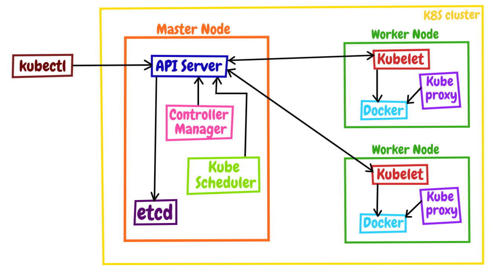

# Introduzione
Kubernetis è un orchestratore che si affianca a docker per la gestione di questi ultimi.
É composto da una serie di API per il controllo dei container. Inoltre ha sia API che CLI per il controllo multiserver. É supportato da tutti i maggiori provider cloud. 

Un orchestratore fa la differenza quando abbiamo bisogno: autoscaling, loadBalancing o più in generale quando abbiamo più server da gestire e il carico di lavoro è variabile, in questi casi un orchestratore fa al caso nostro. Più si avanza in questo mondo più un orchestratore come k8 diventa fondamentale.

L'utilizzo di k8s si basa principalmente sul dove vogliamo far girare la nostra soluzione, più nello specifico abbiamo le versioni custom basate su k8s ma modificate dal gestore o la versione pura presente su github. Le soluzioni custom in genere presentano una serie di altri servizi inclusi come l'autenticazione, l'amministrazione web e la gestione delle reti custom.

In generale utilizzare k8s puro va bene per l'apprendimento ma poi per la messa in produzione vanno valutate le versioni custom dei fornitori di servizi.

# k8s vs swarm
Sono entrambi orchestratori che risolvono grossomodo gli stessi problemi.
In generale se chiediamo la differenza ci risponderanno che swarm è semplice da sviluppare e da mantenere ma non risolve tutti i casi d'uso possibili, mentre k8s ha molte più funzionalità ed è molto flessibile.

Con swarm risolvi in media l'80% dei casi d'uso comuni con una ventina di feature, inoltre gira su vari sistemi (cloud, local, datacenter) e su più piattaforme (ARM, windows, x86), ha come base la sicurezza di default con db criptati.

k8s è ampiamente supportato da fornitori di servizi e ha una grande comunity. Flessibile, ha un ampio set di casi d'uso, si integra perfettamente con servizi di cicd come jenkins. Molto spesso viene richiesto o cmq è un po abusato come notorietà.

# terminologia
In generale kubernetis ha vari acrnomi e sono K8s, k-eights o kube.

+ **Kubectl**: cli di configurazione e gestione dell'app (kube control) 
+ **Node**: server singolo in un cluster k8s
+ **kubelet**: Agente k8s in funzione nel nodo che permette la comunicazione al nodo master dai vari docker (non essendo build in docker ha bisogno di un intermediario)
+ **control plane**: set di contianer che gestiscono il cluster (il master, l'equivalente del manager in swarm dei nodi) Questi container seguono il concetto di linux dividi tutto e fai una cosa ma falla bene. Al loro interno abbiamo tutta una serie di elementi come: API server, scheduler, gestore di controllo, etcd, ecc. 

Questo modello rappresenta gli elementi di k8s.

# installazione
