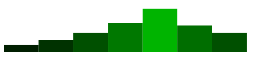

# Intro
D3js è una libreria JS che permette di graficare delle informazioni più o meno complesse, si basa su SVG, Canvas e HTML. Questa libreria sfrutta i tag svg i selettori css di livello 1 e le transition quindi se dovete sviluppare un applicazione per un browser datato non potete utilizzare questa libreria.

D3js non ha una serie di grafici configurabili ma tutta una serie di piccoli elementi componibili che 

# Istallazione
Se si utilizza NodeJs basta eseguire il comando :  
`npm install d3`  

In alternativa è possibile caricare gli script direttamente dal sito :  

Per la versione completa della libreria  
`<script src="https://d3js.org/d3.v5.js"></script>`  

Per la versione minificata  
`<script src="https://d3js.org/d3.v5.min.js"></script>`  

Oppure se vogliamo un componente specifico, ad esempio d3-selection, possiamo utilizzare  
`<script src="https://d3js.org/d3-selection.v1.min.js"></script>`  

# utilizzo base

Questa libreria di base modifica il DOM al fine di inserire HTML, CSS o più in generale elementi grafici.  
Si basa sul **Method chaining** cioè richiamare a catena una serie di funzioni.

Un esempio di queste caratteristiche è il seguente :  
```html
<script>
    d3.select("body")//seleziona il primo elemento passato come oggetto
        .append("p")//inserisci un tag p e ne restituisce un riferimento
        .text("Nuovo paragrafo"); //inserisce nel riferimento il valore di testo passato come argomento
</script>
```
Banalmente il risultato è un inserimento di un paragrafo nel body.

Con il codice successivo andiamo a vedere alcune delle caratteristiche della libreria : 

```html
 <script>

    let dataset = [3, 5, 8, 12, 18, 11, 8];//info da graficare

    d3.select("body")//seleziona il primo elemento passato come oggetto
        .selectAll("p")//seleziona tutti gli elementi p presenti nel body ma in questo caso non ce ne sono 
        .data(dataset)//equivale ad un ciclo for effettuato sul dataset utilizzando il suoi indice 
                        //ed esegue il codice succesivo un numero pari alla dimensione dell'array
                        //permette anche l'accesso ai dati contenuti (simile a map js)
        .enter()//crea un palceholder al posto dei paragrafi p inesistenti 
        .append("p")
        .text(function(d) {
            return d;
        });
        .style("color", function(d){
                    if(d>10){
                        return "red";
                    }else{
                        return "blue";
                    }
                });//modifica il css dell'elemento HTML

 </script>
```

Questo è un altro esempio di come è possibile utilizzare questa libreria per poter modificare il DOM in maniera dinamica in funzione a dati passati dai server, per esempio.

Ma come possiamo effettivamente utilizzare questa libreria per disegnare dei grafici?  

Il prossimo esempio sarà un istogramma basato sul dataset presentato precedentemente
```html
<script>

    let dataset = [3, 5, 8, 12, 18, 11, 8];//info da graficare

    d3.select("body")
        .selectAll("div")
        .data(dataset)
        .enter()
        .append("div")//inserisce un elemento div
        .attr("class", "bar")//aggiunge all'elemento l'attributo class con valore bar presente nel file style.css
        .style("height", function(d){
            var barHeight = d*5;    //moltiplica il valore nel dataset moltiplicandolo per 5 per rendere visibile 
                                    //il valore sarà proporzionato alla dimensione che si vuole ottenere del grafico

            return barHeight + "px";//restuituisce il valore con l'aggiunta della dimensione px
        })
</script>
```

Con il seguente codice css:  
```css
div.bar {
    display: inline-block;
    width: 20px;
    background-color: darkcyan;
    margin-right: 2px;
}
```
Come risultato abbiamo quindi :  


Questo è il funzionamento di base della libreria D3.js  

Con questa libreria è possibile utilizzare gli elementi svg per implementare i grafici utilizzando dei semplici elementi vettoriali come nel seguente esempio :
```html
<svg width="500" height="100">
    <circle cx="200" cy="25" r="20" />
</svg>
```

A partire da questo esempio mostriamo come implementare un istogramma con D3js : 
```html
 <script>
    let dataset = [3, 5, 8, 12, 18, 11, 8];//info da graficare

    let w = 500;    //larghezza dell'svg
    let h = 100;    //altezza dell'svg

    let svg = d3.select("body").append("svg");//definiamo un riferimento all'elemento svg creato con questo comando

    svg.attr("width", w).attr("height", h); //aggiungiamo gli attributi width e height

    svg.selectAll("rect")//Selezioniamo tutti gli elementi rect (anche se inesistenti)
        .data(dataset)//per ogni elemento del dataset
        .enter()//avviamo la sequenza di operazioni anche se gli elementi rect non esistono
        .append("rect")//creiamo una rect
        .attr("x", function(d, i){
            return i * (w / dataset.length) //diamo come posizione su x il valore dell'indice per la dimensione 
                                            //massima per la quale ogni barra entri nello spazio di svg
        })
        .attr("y", function(d){ //definiamo il posizionamento verticale come h - l'altezza definita nell'attirbuto
            return h -d*5       //height
        })
        .attr("width", w / dataset.length) //definiamo la larghezza di ogni rettangolo
        .attr("height", function(d){       //definiamo l'altezza di ogni elemento con una scala  
            return d * 5
        })
        .attr("fill", function(d){ //facciamo una variazione cromatica in funzione del peso nel vettore
            return "rgb( 0, " + (d *10) + ", 0)"
        })
</script>
```
Il risultato ottenuto è il seguente :  



# D3 in React

La libreria D3 copre alcune delle funzioni della libreria React come per esempio la renderizzazione dinamica del DOM (creazione, aggiornamento, ed eliminazione) e l'elaborazione dati.
L'utilizzo di queste due librerie, anche se molto simili, permette di implementare soluzioni che da sole non potrebbero. React permette una gestione semplice di componenti mentre D3 ha un ottima gestione dei dati e delle implementazioni per la parte grafica.

Esistono 3 metodi per l'implementazione di D3 in React e sono :
+ D3 gestisce tutto il componente fornito tramite React compreso la renderizzazione, l'aggiornamento e l'eliminazione
+ React gestisce il grafico e D3 è solo una libreria di implementazione 
+ React gestisce la renderizzazione l'aggiornamento e l'eliminazione mentre D3 gestisce gli attributi

## Approccio con D3
Questo approccio ha come passaggi i seguneti:  
+ Creare un elemento React come contenitore
+ Integrare il codice D3 per creare ed aggiornare il grafico in componentDidMount() e componentDidUpdate()

Iniziamo implementando un componente React che continene l'svg : 
```js
class Chart extends React.Component {
  constructor(props) { //le props in ingresso sono width e height
    super(props)

    this.state = {
      data: getData() //funzione di supporto che genera o prende i dati
    }
  }

  render() {
    return <div>    {/* elemento contenitore del svg*/}
             <svg
               {/*settaggio della dimensione del svg*/}
               width={this.props.width}
               height={this.props.height}
               {/*settaggio del riferimento tramite callback*/}
               ref={el => this.svgEl = el} > 
             </svg>
           </div>
  }
}
/*
ReactDOM.render(
  <Chart width={800} height={600} />,
  document.getElementById('app')
)
*/
```

**getData()** è una funzione che genera array random, ma nulla vieta che sia una funzione che prende un json da un server, e che, nel nostro esempi, ha il seguente codice :  
```js
function getData() {
    /**
     * Math.floor arrotonda per difetto un numero facendolo diventare un intero
     * Math.random genera un numero pseudocasuale tra 0 e 1 dove 1 non è compreso
     */
    let numItems =  20 + Math.floor(100 * Math.random())//numero randomico di elementi da renderizzare
    let data = [] //variabile che contiene i dati
    for(let i=0; i<numItems; i++) { //for per caricamento dati nell'array
      data.push({ //funzione di inserimento dati con oggetto formato dal valore del centro, 
                  //dal raggio di ogni cerchio e  dal colore che sarà una propozione per ottenere 5 
                  //differenti colori definit nella variabile colours
        x: Math.random(), 
        y: Math.random(),
        r: Math.random(),
        colour: i % 5
      })
    }
    return data
  }
```

**Ora dobbiamo aggiungere una funzione che permette l'aggiornamento del grafico che nel nostro caso è la seguente :**  
```js

 updateChart = ( )=>{
     //GENERIAMO UN RIFERIMENTO AL COMPONENTE CHE D3 UTILIZZERÀ COME PLACEHOLDER PER IL CARICAMENTO DEL GRAFICO
     const svgElement = d3.select(ref.current)
     //SELEZIONA TUTTI GLI ELEMENTI CIRCLE ESISSTENTI SUL DOM
     svgElement.selectAll("circle")
     //PRENDI I DATI (NEL NOSTRO CASO LA FUNZIONE CHE LI GENERA RANDOMICAMENTE)
      .data(getData(), d => d)
      //LA FUNZIONE JOIN HA COME OBBIETTIVO RIUNURE GENERARE IL COMPONENTE E NEL CASO CE NE SIA UNO PREESISTENTE DI AGGIORNARLO
      .join(
          //GENERAZIONE DI UN NUOVO COMPONENTE
        enter => (
            //AGGIUNGIAMO UN CERCHIO PER ONGNI ELEMENTO DATA
          enter.append("circle")
          //AGGIUNGIAMO LE CARATTERISTICHE DELL'ELEMENTO CIRCLE TRIAMTE IL METODO ATTR
              .attr("cx", d => d * 15 + 10)
              .attr("cy", 10)
              .attr("r", 0)
              .attr("fill", "cornflowerblue")
              
       
      )

 }
```

La parte di codice più importante che lega D3 e React è la seguente :  
```js
let u = d3.select(this.svgEL)
```
In questa riga abbiamo il collegamento tra il riferimento React e la modifica del DOM da parte di D3

Il tutto ora deve essere inserito nel lifecycle di react tramite le seguenti regole :  
```js
componentDidMount() {
      this.updateChart()
    }
  
componentDidUpdate() {
  this.updateChart()
}
```
Come possiamo vedere il codice di aggirnamento è quello della libreria D3 solo che integrato in React quindi alla luce di questo esempio abbiamo che React mette a disposizione l'elemento svg, il suo riferimento e i contenitori del lifecycle ma D3 è il fautore di tutto il grafico dalla struttura, la creazione fino all'aggiornamento.

## Approccio React

Con questo approccio D3 diventa una libreria di supporto e non il codice principale. 
Lo stesso grafico può essere realizzato con il segunete codice :
```js
class Circles extends React.Component {
    constructor(props) {
    super(props)
    
    this.state = {
        data: getData() //è la stessa funzione definita in precedenza
    }
    
    this.handleClick = this.handleClick.bind(this)
    }
    
    handleClick() {
    this.setState({
        data: getData()
    })
    }
    
 render() {
    /**
     * questo blocco di codice è stato inserito nel metodo render e viene richiamato ad ogni aggiornamento 
     * dei dati 
     */
    let maxRadius = 40
    let xScale = d3.scaleLinear().domain([0, 1]).range([0, this.props.width])
    let yScale = d3.scaleLinear().domain([0, 1]).range([0, this.props.height])
    let rScale = d3.scaleLinear().domain([0, 1]).range([0, maxRadius])

    //funzione che mappa i nuovi dati con gli elementi circle 
    let points = this.state.data.map(d => <circle cx={xScale(d.x)} cy={yScale(d.y)} r={rScale(d.r)} fill={colours[d.colour]} />)
    
    return <div>
                <svg width={this.props.width} height={this.props.height}>{points}</svg>
                <div><button onClick={this.handleClick}>Update</button></div>
            </div>
    }
}

export default Circles;
```

Con questo esempio notiamo che il grosso del codice è implementato nel metodo render e che come detto in precedenza l'apporto di D3 è limitato al solo dimensionamento dei cerchi e il loro posizionamento. Inoltre è il metodo map fa corrispondere i dati contenuti nello state i veri elementi circle.
Un ultimo appunto, con questo codice perdiamo le transizioni definite con l'aggiornamento di D3.

## Approccio ibrido 

Questo approccio unisce la semplicità di React con la dinamicità di D3.
Con questo metodo React si occupa di creare gli elementi, allocarli e deallocarli, mentre D3 si occupa dello style e delle transizioni, se non necessitiamo delle transizioni questo approccio sarebbe quello React oriented.
Il codice cosi sviluppato è il seguente :  
```js
class Circles extends React.Component {
    constructor(props) {
      super(props)
      
      this.state = {
        data: getData()
      }
      
      this.handleClick = this.handleClick.bind(this)
      this.updateStyleAndAttrs = this.updateStyleAndAttrs.bind(this)
    }
    
    handleClick() {
      this.setState({
        data: getData()
      })
    }
    
    componentDidMount() {
      this.updateStyleAndAttrs()
    }
  
    componentDidUpdate() {
      this.updateStyleAndAttrs()
    }
    
    updateStyleAndAttrs() {
      let maxRadius = 40
      let xScale = d3.scaleLinear().domain([0, 1]).range([0, this.props.width])
      let yScale = d3.scaleLinear().domain([0, 1]).range([0, this.props.height])
      let rScale = d3.scaleLinear().domain([0, 1]).range([0, maxRadius])
  
       d3.select(this.svgEl)
        .selectAll('circle')
        .data(this.state.data)
        .transition()
        .duration(1000)
        .attr('cx', d => xScale(d.x))
        .attr('cy', d => yScale(d.y))
        .attr('r', d => rScale(d.r))
        .style('fill', d => colours[d.colour])
    }
    
    render() {
      let points = this.state.data.map(d => <circle cx={0.5 * this.props.width} cy={0.5 * this.props.height} style={{fill: 'white'}} />)
      
      return <div>
               <svg width={this.props.width} height={this.props.height} ref={el => this.svgEl = el}>{points}</svg>
               <div><button onClick={this.handleClick}>Update</button></div>
             </div>
    }
  }
```
Come possiamo notare **updateStyleAndAttrs** si occupa solo del posizionamento e delle transizioni non si preoccupa più di allocare o deallocare gli elementi (tramite i metodi enter(), exit().remove()), a questo ci pensa react con la funzione map contenuta nel render, inoltre updateStyleAndAttrs esegue solo il posizionamento, le transizioni e definisce lo style. 


# Funzioni in D3

D3 è una libreria che oltre a fornire la possibilità di creare grafici da anche utili funzioni per la gestione dei dati. In questa parte vedremo le funzioni di supporto che D3 propone.

## d3.min(values), d3.median(values), d3.max(values)
Come da titolo queste sono le funzioni che dato un array restituiscono il minimo, la mediana (valore differente dalla media) e il massimo dell'array.


## FileAttachment ed elaborazione file
viene utilizzato per il caricamento di un file quali ad esempio csv, con la seguente sintassi :  
`FileAttachment("temperature.csv")`  
Questa funzione restituisce un hendler che permette di avere differenti letture applicando la tipologia di dato che esso deve restituire, ad esempio :  
`FileAttachment("temperature.csv").text()`
In questo caso il file verrà restituito sotto forma di stringa.
Altri tipi di dato sono il BLOB, file dati binario di grandi dimensioni che può essere interpretato o come file binario puro o altrimenti come testo. file buffer tramite la dicitura ArrayBuffer che rappresenta un arry binario o semplicemente del testo come con il primo esempio.

Supponiamo che il file temperature.csv sia un file di testo con questa struttura :  
```
`date,temperature
2011-10-01,62.7
2011-10-02,59.9
2011-10-03,59.1
2011-10-04,58.8
2011-10-05,58.7
2011-10-06,57.0
...
```
Come possiamo notare, ogni lettura è strutturata con una data e un valore quindi possiamo strutturare un oggetto JS che rappresenti questa struttura. In questo caso possimo utilizzare la funzione **d3.cvsParse()** che ci permette di destrutturare il csv.
```js
d3.csvParse(await FileAttachment("temperature.csv").text())

  0: Object {date: "2011-10-01", temperature: "62.7"}
  1: Object {date: "2011-10-02", temperature: "59.9"}
  2: Object {date: "2011-10-03", temperature: "59.1"}
  3: Object {date: "2011-10-04", temperature: "58.8"}
  4: Object {date: "2011-10-05", temperature: "58.7"}
  5: Object {date: "2011-10-06", temperature: "57.0"}
  ...
```
Questo metodo ha degli inconvenienti, essendo date e temperature delle stringhe nel caso in cui fossero inserite due temperature esse verrebbero concatenate.
Per ottenere al posto di stringhe dei valori numerici possiamo passare una funzione come secondo argomento di csvParse, questa funzione viene chiamata ad ogni riga per effettuare delle operazioni sulla stessa. Una funzione di libreria è **d3.autoType** che automaticamente imposta il tipo di ogni singola variabile nell'oggetto :  
```js
d3.csvParse(await FileAttachment("temperature.csv").text(), d3.autoType)

0: Object {date: 2011-10-01, temperature: 62.7}
1: Object {date: 2011-10-02, temperature: 59.9}
2: Object {date: 2011-10-03, temperature: 59.1}
3: Object {date: 2011-10-04, temperature: 58.8}
4: Object {date: 2011-10-05, temperature: 58.7}
5: Object {date: 2011-10-06, temperature: 57}
...
```
Tramite l'output possiamo valutare la bontà della traduzione dei dati, ma nel caso in cui la traduzione non sia andata a buon fine, ad esempio per incompatibilità con autoType come ad esempio l'assenza di un riferimento, possiamo andare a scrivere un codice che ne permetta la traduzione.  Un esempio è il segunete :  
```js
data = {
  //trasforma in stringa tutto il csv
  const text = await FileAttachment("temperature.csv").text();
  /*
  * definisce una funzione di supporto per la traduzione della data 
  */
  const parseDate = d3.utcParse("%Y-%m-%d");
  /*
  * ritorna l'oggetto restituito da csvParse che prende in ingresso il file di testo e una funzione che : 
  * prende in ingresso due variabili date e temperatura e per ogni riga del csv fa un parse della data definito 
  * precedentemente e fa un casting da stringa a numero del valore della temperatura.
  */
  return d3.csvParse(text, ({date, temperature}) => ({
    date: parseDate(date),
    temperature: +temperature
  }));
}
```
Con i dati cosi tradotti possiamo iniziare ad effettuare operazoni quali ad esempio : calcolare l'estensione delle date e delle temperature.
Ciò è possibile tramite la funzione extent che restituisce un array di due valori con l'estensione delle variabili :  
```js
d3.extent(data, d => d.date)

[ 2011-10-01, 2011-10-06 ]

d3.extent(data, d => d.temperature)

[ 57, 62.7 ]
```

Per poter elaborare un grafico potremmo voler estrarre un array delle singole varibili con il seguente codice :  
```js
let temperature = data.map(d => d.temperature)
```

Una buona norma è la definizione delle variabili in modo che si possa far riferimeto a loro e non la posizione che esse hanno nella struttura dati, questo consiglio è dovuto al fatto che se ci sono relazioni tra variabili, ed esse non sono referenziate, le operazioni che  necessitano della relazione potrebbero essere eseguite prima delle operazioni sulle variabili principali.
Un esempio per comprendere lo sciogli lingua potrebbe essere il seguente : se una variabile definisce un array e una funzione lo modifica , altre funzioni possono vedere l'array prima o dopo la mutazione. Per evitare questo non determinismo, rendere esplicita la dipendenza assegnando un nome alla variabile e copiando l'array utilizzando  array.map.

## extent
Questa funzione restituisce l'intervallo di valori in un array di oggetti : 
```js
/*
let funzione = [
            {x : 0, y : 0},
            {x : 1, y : 3},
            {x : 2, y : 6},
            {x : 3, y : 9},
            {x : 4, y : 12},
            {x : 5, y : 15},
            {x : 6, y : 18},
            {x : 7, y : 21},
            {x : 8, y : 24},
            {x : 9, y : 27},
          ]
*/
d3.extent(funzione, d => d.x)
/*
restituisce un array [0,9]
*/
```
prende in ingresso un dato strutturato ed esegue una funzione map passando il singolo elemento e quello sulla quale vogliamo fare inferenza


# line

Per costruire uun grafico formato dall'unione di più punti possiamo utilizzare la funzione line che prende in ingresso i dati e restituisce il percorso dell'elemento path, un esempio è il seguente :  
```js
let funzione = [
            {x : 0, y : 0},
            {x : 1, y : 3},
            {x : 2, y : 6},
            {x : 3, y : 9},
            {x : 4, y : 12},
            {x : 5, y : 15},
            {x : 6, y : 18},
            {x : 7, y : 21},
            {x : 8, y : 24},
            {x : 9, y : 27},
          ]

let graf =d3.line()
      .x(d => xScale(d.x))
      .y(d => yScale(d.y))

let grafico = <path d={graf(funzione)} style={style} ></path> 
```

Con questa funzione sarà molto più semplice definire i grafici lienari 

# Scale
Tra le funzioni principali di D3 troviamo la funzione scale. Questa funzione permette di scalare gli elementi affiche entrino nello spazio definito dall'svg.  
Un esempio semplice di questa applicazione è il segunete :  
```html
<script>
    //elenco di frutti con ipotetico valore 
    let fruits = [
        {name: "🍊", count: 21},
        {name: "🍇", count: 13},
        {name: "🍏", count: 8},
        {name: "🍌", count: 5},
        {name: "🍐", count: 3}
        ]

    //restituisce i simboli degli alimenti
    console.log(fruits.map(d => d.name))
    //restituisce i valori per ogni alimento
    console.log(fruits.map(d => d.count))

    /*
        Definizione delle scale, supponiamo di voler creare un istogramma orizzontale, avremo uno scale per i 
        valori numerici che sarà quindi lineare mentre uno su y che rappresenterà una fascia per ogni elemento
    */
    let x = f(n)
    //richiamiamo la scala lineare per i valori di count 
    x = d3.scaleLinear()
            //definiamo il dominio che sarà appunto da 0 al maggior valore tra i count disponibili
            .domain([0, d3.max(fruits, d => d.count)])
            /*
            definiamo il range di visualizzazione calcolato tra il margine sinistro e l'ampiezza dell'svg 
            meno il margine destro
            */
            .range([margin.left, width - margin.right])

            .interpolate(d3.interpolateRound)


    let y = f(i)
    /*
    questo scale non avendo valori numerici ipoteticamente continui ma solo valori discreti quali i frutti 
    utilizziamo lo scaleBand
    */
    y = d3.scaleBand()
            /*
            definiamo il dominio solo che questa volta è solo sul nome e non essendo un dominio numerico non 
            andiamo a definire il valore minimo
            */
            .domain(fruits.map(d => d.name))
            //come per x andiamo a definire lo spazio 
            .range([margin.top, height - margin.bottom])
            //definisce un padding tra le barre
            .padding(0.1)
            //definsce il padding anche con la scala e non solo tra le barre
            .round(true)
        
</script>
```

Le varie funzioni associate a scale possono essere utilizzate singolarmente per poter ottere informazioni utili ad un analisi del dato anche finalizzato al grafico
Per convenzione D3 lascia dei margini per l'inserimento degli assi, qundi x(0) generalemente non è 0. Un motivo per utilizzare la funzione scale è che essa mette in automatico gli assi graduati con i valori di scala (opzione che non sono riuscito ad implementare).

Le funzioni scale cosi defite vengono poi utilizzate per sigola coordinata in modo da inserire il punto di ancoraggio ottimizzato per i valori che dobbiamo inserire. Un esempio potrebbe essere una funzione definita su x e y che abbia i seguenti valori :
```js
let funzione = [
  {x : 0, y : 0},
  {x : 1, y : 3},
  {x : 2, y : 6},
  {x : 3, y : 9},
  {x : 4, y : 12},
  {x : 5, y : 15},
  {x : 6, y : 18},
  {x : 7, y : 21},
  {x : 8, y : 24},
  {x : 9, y : 27},
]
```
Questa funzione è y=3x, una retta passante per l'origine con un coefficente angolare di 3. 
Una funzione del genere potrebbe essere graficata su due assi lineari ottenendo i rapporti seguneti :  
```js
let ValoriX = funzione.map((punto) =>{
  return punto.x
})

let ValoriY = funzione.map((punto) =>{
  return punto.y
})

let xScale = d3.scaleLinear()
                .domain([0,d3.max(this.state.ValoriX)])
                .range([this.state.width,0])
                
    let yScale = d3.scaleLinear()
                .domain([0,d3.max(this.state.ValoriY)])
                .range([this.state.height,0])
```
Una volta create queste funzioni possiamo andare a calcolare la posizione di ogni singolo punto. Un esempio potrebbe essere inserire dei cerchi nei punti definiti dalla funzione : 
```js
import React from 'react';
import * as d3 from 'd3';

export default class Punti extends React.Component {
  constructor(props){
    super(props)
    this.state = {
      width : this.props.larghezzaGrafico,
      height : this.props.altezzaGrafico,
      
      ValoriX : this.props.funzione.map((punto) =>{
        return punto.x
      }),
      
      ValoriY : this.props.funzione.map((punto) =>{
        return punto.y
      })
      
    }
  }
  
  render() {


    let xScale = d3.scaleLinear()
                .domain([0,d3.max(this.state.ValoriX)])
                .range([this.state.width,0])
                
    let yScale = d3.scaleLinear()
                .domain([0,d3.max(this.state.ValoriY)])
                .range([this.state.height,0])

    let style = {
      fill : "black"
    }
    
    console.log(xScale(4))
    let punti = []

    //<circle cx=”100″ cy=”100″ r=”50″ style=”stroke:red;fill:red”/>
    punti = this.props.funzione.map((punto , index) => {
      return(
        <circle
            key={index}
            cx={xScale(punto.x)}
            cy={this.state.height -yScale(punto.y)}
            r={2}
            style = {style}
          ></circle>
      )
    })

    
    return(
        <svg width={this.state.width} height={this.state.height}>
          
          { punti }
        </svg>
    )
  }

}
```

Come visto in precedenza ci sono più scale possibili. D3 ha molti modi di definire delle scale e di seguito vediamo quali sono le più utilizzate.

## ScaleBand 
Questa scala viene utilizzata per valori discreti. 
La sua implementazione è la segunete : 
```js
let xScale = d3.scaleBand()
                /*
                Elenco degli elementi discreti sotto forma di array, restituisce la proporzione sulla scala unitaria del * * valore esempio se passo alla funzione cosi definita il valore "primo" esso mi restituirà 0 mentre se passo il valore * "quattro" mi restituisce 0.75. in sequenza i valori restituiti sono 0, 0.25, 0.5, 0.75 per tutti gli altri valori è undefine 
                */
              .domain(["primo","secondo","terzo","quarto"])
              /*
              Dimensione dello spazio nella quale devono essere visualizati, restituisce il punto in rapporto allo spazio disponibile 
              */
              .range([0,width])
```
Alla funzione cosi definita possiamo passare uno degli elementi presenti nel dominio per sapere dove esso deve essere posizionato come nel seguente esempio :  
```js
xScale("primo")
/*
restituendomi il valore 0
*/
```
A questa funzione possiamo utilizzare funzioni accessorie quali :
+ xScale.bandwidth() : restituisce la dimensione delle barre
+ .paddingInner(0.5) : definisce il padding interno e accetta valori tra 0 e 1 restituendo di seguito i valori della posizione in funzione di questo nuovo parametro
+ .paddingOuter(0.5) : come per il precedente solo che definisce quello esterno 
+ .align(0.5) :  align: 0 allineato a sinistra, 0.5 centro, 1 destra.
+ .rangeRound([]), .round() : il primo lo si sostituisce a range mentre il secondo va in aggiunta, restituisce un valore intero della posizione rispetto ad un valore frazionario, può generare degli spazi vuoti nel grafico

## scaleLinear
Scala lineare definisce il rapporto come una classica retta degli assi cartesiani. A differenza di Band essa viene utilizzata per valori continui numerici.
La sua definiaione è la segunete :  
```js
let xScale = d3.scaleLinear(
                .domain([0,59])
                .range([0,1000])
)
```
Piccola osservazione sul range, rispetto ai classici grafici dove abbiamo che l'asse y ha valori positivi verso l'alto, nella rappresentazione tramite svg abbiamo che l'asse y ha valori positivi verso il basso, quindi per ovviare a questa difficolta di rappresentazione possiamo invertire i valori del range solo per l'asse y scrivendo ad esempio `range([1000,0])` cosi facendo avremo che i valori positivi sull'asse y partiranno dal basso a salire in funzione del valore maggiore e non a scendere all'aumentrare del valore.

ScaleLinear può esssere usato oltre che per valori continui numerici anche per altre operazioni come ad esempio scale cromatiche, date, ecc.

A questa scala possiamo integrare ulteriori funzioni quali :  
+ .nice() : genera un leggero ampliamento del grafico che permette una visione maggiore degli elementi tipo punto sui bordi dell'svg (solo asse verticale)
+ .clamp(true) : controllo per il fuori scala nel caso ci sia un valore che esce fuori dal range lo rende 0
+ .unknown(3) : ogni volta che viene inserito un valore che darebbe come risultato NaN o unknow restituisce il valore in ingresso ad unknow


## scaleLog
Scala logaritmica 

# Grafici

# Istogramma 

Questo può essere migliorato calcolando e non imponendo una dimensione del bottom
Calcolo automatico della dimensione degli istogrammi che attualmente è fisso quindi per dimensioni minori abbiamo un accavallamento delle barre

```jsx
import React from 'react'
import * as d3 from 'd3'


//crea solo una retta che comporrà l'istogramma
class Bar extends React.Component {

    constructor(props) {
      super(props)
    }
  
    render() {
        //colore della retta 
      let style = {
        fill: "steelblue"
      }
  
      return(
        <g>
            <rect class="bar" style={style} x={this.props.x} y={this.props.y + 5} width={this.props.width} height={this.props.height} />
        </g>
      )
    }
  
  }
  
  /**
   * definisce la classe dell'asse y  <YAxis posAxYdiX={40} labels={y.ticks().reverse()} start={15} end={height} />
   * posAxYdiX rappresenta il posizionamento della linea del grafico dell'asse y, start 
   * rappresenta di quanto si deve distaccare dal margin-top cioè, end è l'altezza totale quindi il punto 
   * più basso del nostro spazio svg
   */
  class YAxis extends React.Component {
  
    constructor(props) {
      super(props)
    }
  
    render() {
    
      let style = {
        stroke: "steelblue",
        strokeWidth: "1px"
      }
      
      let textStyle = {
        fontSize: "0.8em",
        fill: "steelblue",
        textAnchor: "end"
      }
      
     
      /**
       * estra un array di posizioni prendendo il punto minimo cioè 0 e il punto più alto cioe end 
       * che rappresenta l'altezza totale dello spazio svg, la terza variavile rappresenta l'intervallo 
       * di rappresentazioni e cioè gli elementi che devono esse rappresentati per lo spazio a disposizione
       */
      let ticks = d3.range(0, this.props.end, (this.props.end / this.props.labels.length))
      //formatta i valori che verranno passati dalla classe principale come percentuali
      let percentage = d3.format(".0%")
      //definisco le linee orizzontali che indicheranno le unità sull'asse 
      let lines = []
      /*
      * LINEE CHE INDICANO IL VALORE DELLE ETICHETTE
      * per ogni elemento di ticks crea un tratto che parte dal valore del tick per y con x fissato e arriva 
      * al valore di tick sempre per y e per il valore di x diminuito di 10 pixel.
      * Questa operazione può essere fatta anche con il metodo map 
      */
     ticks.forEach((tick, index) => {
        lines.push(<line 
                        style={style} 
                        y1={tick} 
                        x1={this.props.posAxYdiX} 
                        y2={tick} 
                        x2={this.props.posAxYdiX -10}  />)
      })
      

      /**
       * lable dell'asse y 
       */
      let columnLables = []
      /**
       * ARRAY DI TAG DELLE ETICHETTE
       * per ogni elemento dell'array ticks definito il singolo elemento tick e il suo indice 
       * definisco un testo che è elevato dal tratto di 6px e che inizia 12px prima rispetto alla 
       * linea che definisce l'asse verticale
       */
      ticks.forEach((tick, index) => {
        columnLables.push(<text 
                            style={ textStyle } 
                            y={tick + 6} 
                            x={this.props.posAxYdiX - 12} 
                            font-family="Verdana" >
                                {   /**
                                 * funzione che formatta le varie etichette come percentuale i valri contenuti in 
                                 * label sono del tipo 0.04, 0.5, ...
                                 */
                                    percentage(this.props.labels[index])
                                }
                            </text>)

      })
      
    
      return(
        <g>
            {/**
             * gruppo che definisce la linea verticale che forma l'asse
             * viene definito uno spostamento dell'intero gruppo che serve a posizionare tutto l'asse 
             * senza dover andare a modificare il singolo elemento
             */}
            <g 
            
                className="y_labels" 
                transform={`translate(${-5},${17})`}>
            <line 
                x1={this.props.posAxYdiX} 
                y1={this.props.start} 
                y2={this.props.end} 
                x2={this.props.posAxYdiX} 
                style={ style } />

            </g>
            {/**
             * il gruppo che ha il tratto orizzontale e l'etichetta
             * viene definito uno spostamento dell'intero gruppo che serve a posizionare tutto l'asse 
             * senza dover andare a modificare il singolo elemento
             */}
            <g 
                className="y_labels" 
                transform={`translate(${-5},${51})`}>
                    { columnLables }
                    { lines }
            </g>
        </g>
      )
    }
  
  }
  /**
   *  <XAxis posAxXdiY={ bottom } labels={letters} start={0} end={width} />
   * posAxXdiY rappresenta il valore alla quale va posizionata la linea del grafico sull'asse x rispetto all'asse y
   * in pratica quanto si deve alzare dal fondo dello spazio definito dal svg, 
    */ 
  class XAxis extends React.Component {
  
    constructor(props) {
      super(props)
    }
  
    render() {
      let style = {
        stroke: "steelblue",
        strokeWidth: "1px"
      }
      
      /**
       * operazione per suddividere lo spazio a disposizione 
       */
      let step = (this.props.start + this.props.end / this.props.labels.length)
      
      /**
       * Elaborazione uguale all'asse precedente per poter suddividere in parti uguali lo spazio a disposizione
       * solo sull'asse orizzontale
       */   
      let ticks = d3.range(this.props.start, this.props.end, step)
      /**
       * genera i trattini solo che sono verticali quindi varia y
       */
      let lines = []
      ticks.forEach((tick, index) => {
        lines.push(<line 
                    style={style} 
                    x1={tick + 10 } 
                    y1={this.props.posAxXdiY} 
                    x2={tick + 10} 
                    y2={this.props.posAxXdiY + 4}  />)
      })
      
      /**
       * posizionamento del testo 
       */
      let columnLables = []
      ticks.forEach((tick, index) => {
        columnLables.push(<text 
                            style={{fill: "steelblue"}} 
                            x={tick + 5} 
                            y={this.props.posAxXdiY + 20} 
                            font-family="Verdana" 
                            font-size="15">
                                {this.props.labels[index]}
                            </text>)
      })
      
    
      return(
        <g>
            {/**
             * defiizione della linea orizzontale
             */}
            <line 
                x1={this.props.start} 
                y1={this.props.posAxXdiY } 
                x2={this.props.end} 
                y2={this.props.posAxXdiY} 
                style={ style } />
            {/**
             * etichette e liniette verticali
             */}
            { columnLables }
            { lines }
        </g>
      )
    }
  
  }
  
export default class ReactChart extends React.Component {
  
    /**
     * raccolta dei dati e settaggio di margin
     */
    constructor(props){
        super(props);
        this.state = {
            data: this.props.data,
            margin : {top: 20, right: 20, bottom: 30, left: 60},
            width : 0,
            height : 0
        }
    }
    /**
     * definizione delle deminesioni di width e height in funzione dei margini e delle dimensioni dell'
     * svg
     */
    componentDidMount(){
        this.setState((state, props) =>{
            return({
                width : props.width - state.margin.left - state.margin.right,
                height : props.height - state.margin.top - state.margin.bottom
            })
            
        })
    }

    render() {          
    
        /**
         * mappuamo le lettere che in questo caso rappresentano il dominio degli elementi dell'istogramma
         */
        let letters = this.state.data.map((d) => d.letter)
    
        /**
         * definiamo lo spazio che deve avere in funzione degli elementi ch evogliamo graficare
         */    
        let ticks = d3.range(0, this.state.width, (this.state.width / this.state.data.length))

        /**
         * definiamo la scala che nel nostro caso è un Ordinal poiché stiamo lavorando su elementi discreti
         * basata sul dominio degli elementi discreti e sull'array di valori definiti in ticks
         * Questa funzione ci ritorna la posizione su x di dove deve essere posizionato l'elemento
         */
        let x = d3.scaleOrdinal()
            .domain(letters)
            .range(ticks)

        /**
         * scala lineare di valori che nel nostro caso sono le frequenze di occorrenza della lettera
         * Questa funzione ci ritorna il punto di y che la funzione deve assumere in funzione del valore 
         * dell'occorrenza della lettera
         */
        let y = d3.scaleLinear()
            /**
             * il dominio è tra 0 e il massimo valore che può assumere la frequenza
             */
            .domain([0, d3.max(this.state.data, (d) => d.frequency)])
            /**
             * in rapporto al massimo valore assunto che va inserito nel grafico in funzione della massima
             * altezza disponibile
             */
            .range([this.state.height, 0])
        /**
         * array di elementi barre dell'istogramma
         */
        let bars = []
        /**
         * posizione di partenza del solo istogramma calcolato in funzione dell'altezza della barra delle ascisse 
         */
        let bottom = 450
        
        /**
         * partendo dai dati di (etichetta : valore) andiamo a definire le barre dell'istogramma dove x è il valore 
         * dove posizionare la barra, y è la posione di partenza che viene calcolata come il punto di partenza 
         * del solo grafico meno l'altezza calcolata in funzione dei margini meno il valore calcolato dalla funzione y in proporzione 
         * alla frequenza meno un fattore correttivo.
         * Width rappresenta la larghezza della barra che ha valre 20 per averla sempre centrata sul tratto verticale 
         * nel caso si voglia cambiare la larghezza va rimodellato anche l'asse orizzontale
         * height è l'altezza della barra che viene calcolato come l'altezza disponibile meno l'altezza della barra 
         * proporzionata in funzione del valore
         */
        this.state.data.forEach((datum, index) => {
            bars.push(<Bar 
                        key={index} 
                        x={x(datum.letter)} 
                        y={bottom - 6 - (this.state.height - y(datum.frequency))} 
                        width={20} 
                        height={this.state.height - y(datum.frequency)} />)
        })
    
        return (
            <svg 
                width={this.props.width} 
                height={this.props.height}>
                    <YAxis 
                        posAxYdiX={60} 
                        labels={y.ticks().reverse()} 
                        start={0} 
                        end={this.state.height} />
                
                    <g 
                        className="chart" 
                        transform={`translate(${this.state.margin.left},${this.state.margin.top})`}>
                        { bars }
                        <XAxis 
                            posAxXdiY={ bottom } 
                            labels={letters} 
                            start={0} 
                            end={this.state.width} />
                    </g>
            </svg>
        );
    }
    }
```
