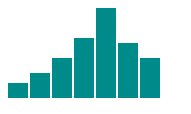

# Intro
D3js è una libreria JS che permette di graficare delle informazioni più o meno complesse, si basa su SVG, Canvas e HTML. Questa libreria sfrutta i tag <svg>, i selettori css di livello 1 e le transition quindi se dovete sviluppare un applicazione per un browser datato non potete utilizzare questa libreria.

D3js non ha una serie di grafici configurabili ma tutta una serie di piccoli elementi componibili che 

# Istallazione
Se si utilizza NodeJs basta eseguire il comando :  
`npm install d3`  

In alternativa è possibile caricare gli script direttamente dal sito :  

Per la versione completa della libreria  
`<script src="https://d3js.org/d3.v5.js"></script>`  

Per la versione minificata  
`<script src="https://d3js.org/d3.v5.min.js"></script>`  

Oppure se vogliamo un componente specifico, ad esempio d3-selection, possiamo utilizzare  
`<script src="https://d3js.org/d3-selection.v1.min.js"></script>`  

# utilizzo base

Questa libreria di base modifica il DOM al fine di inserire HTML, CSS o più in generale elementi grafici.  
Si basa sul **Method chaining** cioè richiamare a catena una serie di funzioni.

Un esempio di queste caratteristiche è il seguente :  
```html
<script>
    d3.select("body")//seleziona il primo elemento passato come oggetto
        .append("p")//inserisci un tag p e ne restituisce un riferimento
        .text("Nuovo paragrafo"); //inserisce nel riferimento il valore di testo passato come argomento
</script>
```
Banalmente il risultato è un inserimento di un paragrafo nel body.

Con il codice successivo andiamo a vedere alcune delle caratteristiche della libreria : 

```html
 <script>

    let dataset = [3, 5, 8, 12, 18, 11, 8];//info da graficare

    d3.select("body")//seleziona il primo elemento passato come oggetto
        .selectAll("p")//seleziona tutti gli elementi p presenti nel body ma in questo caso non ce ne sono 
        .data(dataset)//equivale ad un ciclo for effettuato sul dataset utilizzando il suoi indice 
                        //ed esegue il codice succesivo un numero pari alla dimensione dell'array
                        //permette anche l'accesso ai dati contenuti (simile a map js)
        .enter()//crea un palceholder al posto dei paragrafi p inesistenti 
        .append("p")
        .text(function(d) {
            return d;
        });
        .style("color", function(d){
                    if(d>10){
                        return "red";
                    }else{
                        return "blue";
                    }
                });//modifica il css dell'elemento HTML

 </script>
```

Questo è un altro esempio di come è possibile utilizzare questa libreria per poter modificare il DOM in maniera dinamica in funzione a dati passati dai server, per esempio.

Ma come possiamo effettivamente utilizzare questa libreria per disegnare dei grafici?  

Il prossimo esempio sarà un istogramma basato sul dataset presentato precedentemente
```html
<script>

    let dataset = [3, 5, 8, 12, 18, 11, 8];//info da graficare

    d3.select("body")
        .selectAll("div")
        .data(dataset)
        .enter()
        .append("div")//inserisce un elemento div
        .attr("class", "bar")//aggiunge all'elemento l'attributo class con valore bar presente nel file style.css
        .style("height", function(d){
            var barHeight = d*5;    //moltiplica il valore nel dataset moltiplicandolo per 5 per rendere visibile 
                                    //il valore sarà proporzionato alla dimensione che si vuole ottenere del grafico

            return barHeight + "px";//restuituisce il valore con l'aggiunta della dimensione px
        })
</script>
```

Con il seguente codice css:  
```css
div.bar {
    display: inline-block;
    width: 20px;
    background-color: darkcyan;
    margin-right: 2px;
}
```
Come risultato abbiamo quindi :  



Questo è il funzionamento di base della libreria D3.js  

