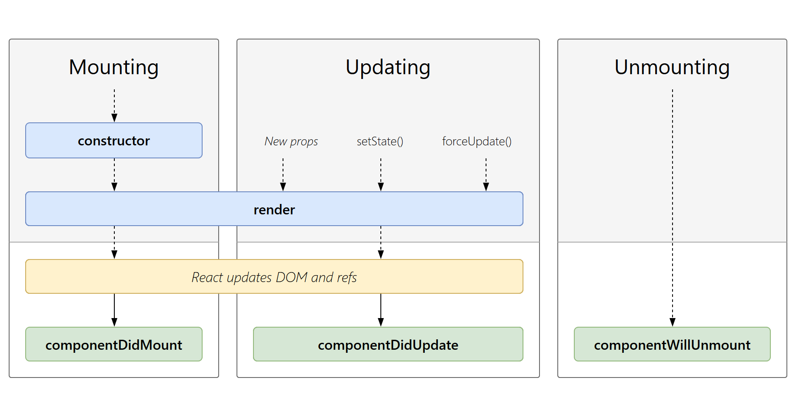

# React JS
React JS è una libreria JavaScript che semplifica e permette il riuso dei blocchi di codice che vengono definiti componenti.
Tali componenti possono essere considerati come blocchi di codice riutilizzabili ed indipendenti.

## JSX
Tramite questa libreria è possibile sfruttare un linguaggio descrittivo composto da altri componenti definito JavaScript eXtension. Questo linguaggio sfrutta un interprete di nome Babel che trasforma questo linguaggio descrittivo in linguaggio JS interpretabile da un browser.
La potenza di quasto linguaggio sta nel utilizzo dei classici costrutti HTML solo che non vengono interpretati come semplici tag ma come veri e propri componenti React.
un semplice esempio di JSX è il segunete:
```JSX
<div className="header">
            <h1 >Lista dei desideri</h1>
            <ul className="menu">
                <li><NavLink to="/lista_desideri">Tutti i desideri</NavLink></li>
                <li><NavLink to="/lista_categorie">Categorie</NavLink></li>
                {/*<li><NavLink to="/lista_categorie/:idCategoria([0-9]+)/lista_desideri">Desideri</NavLink></li>*/}
                <li></li>
                <li><NavLink to="/">Login</NavLink></li>
                <li><NavLink to="/">Singin</NavLink></li>
            </ul>
</div>
```

Come dall'esempio possiamo notare che tale linguaggio permette di utilizzare i classici costrutti dell'HTML come il tag div o il tag h1 ma allo stesso tempo permette di integare altri componenti come ad esempio il componente NavLink che vedremo in seguito o altri componenti creati dall'utente.
Il blocco JSX va inserito in una funzione o in una classe ma nello specifico nella funzione return.

### Caratteristiche dell' JSX 
A parte i tag dell'HTML il JSX ha una sua espressione per l'utilizzo di CSS o di altri costrutti.
Un primo esempio delle differenze che si può notare nell'esempio è l'utilizzo dell'attributo **className** invece del classico **class** utilizzato nell'HTML classico. Questa differenza nasce dal fatto che class in JS è una parola riservata quindi si utilizza la scrittura camelCase per identificare i costrutti quali class o altri attrubuti del CSS. (per una trattazione più approfondita si rimanda alla documentazione di React)
Un altra sostanziale differenza si può notare nell'inserimento di porzioni di JS tramite l'inserimenti delle **{}**, ciò permette di inserire variabili e funzioni all'interno del codice senza dover richiamare un file .js ed inoltre permette una modifica molto più dinamica orientata ai risultati del codice.
Un esempio di questa caratteristica la vediamo nel commento dove abbiamo utilizato la sintassi JS nelle parentisi {}.

Un ultimo vantaggio di JSX è la possibilità, in maniera semplice, di integrare porzioni di JS nel codice senza dover ricorrere ai classici costrutti del HTML e rendendo la scrittura del'UI più smart tramite la gestione degli eventi, il cambiamento dello stato nel tempo e la preparazione dei dati per la visualizzazione tutto con un unica sintassi.

**NB i nomi dei componenti devono sempre iniziare con la lettera maiuscola**

## Componenti
Uno dei punti forti di React è proprio nello sviluppare UI come composizione di componenti, cioè parti indipendenti, riutilizzabili e sviluppabili in modo isolato.
I componenti di react possiamo pensarli come delle funzioni di JS, che prendo in ingresso delle varibili e restituiscono un codice JSX che viene interpretato da Babel che lo trasforma in HTML. Inoltre un altro vantaggio è che tramite react è possibile renderizzare solo la parte del DOM che è effettivamente stata modificata e non renderizzarlo nuovamente tutto.

Un esempio di componente può essere il seguente :
```JavaScript
function ciao(props){
    return <h1>Ciao, {props.nome}</h1>
}
```
Questo è un componente react valido poichè prende delle variabili in ingresso e restituisce un codice HTML in maniera dinamica.

Un altro esempio utilizzando la sintassi class di ES6 è il seguente
```javascript
class Ciao extends React.component{
    constructor(props){
        super(props)
    }
    render(){
        return <h1>Ciao, {this.props.nome}</h1>
    }
}
```

I due esempio sono equivalenti.

Un passaggio importante quando si definisce un componente tramite il costrutto class è quello di definre un construttore, senza di ciò la classe non può accedere alle variabili che le vengono passate. Inoltre bisogna far riferimento a tali variabili tramite il costrutto **this** altrimenti le variabili non sono raggiungibili.

**NB vorrei definire la differenza tra componente ed elemento. In react queste entita sono al quanto intercambiabili ma ci riferiamo al componente quando lo definiamo mentre all'elemento qunado lo utilizziamo, per prendere in esempio il codice precedente il tag `<h1>` rappresenta un elemento mentre la classe Ciao rappresenta il componente ma quando richiameremo il componente Ciao in un altro componente esso sarà considerato come un elemento**

tramite i costrutti di react è possibile quindi nidificare componenti e renderli riutilizzabili.

Cosa molto importante, quando definiamo un componente alla fine va inserita la dicitura **export default NomeComponente** altrimenti il codice non sarà visibile ad altri componenti.
possiamo anche utilizzare la dicitura **export NomeComponente**, in questo modo possiamo definire più componenti in uno stesso file ma andranno importati con la dicitura :  
`import {NomeComponete} from 'file.js'`  
Inoltre con il primo metodo possiamo importate i componenti e rinominarli tramite alias mentre nel secondo caso il nome dovrà corrispondere con il nome definito nel componente.

### Richiamare i componenti 
Quando vogliamo utilizzare un componente in un altro basta importarlo e poi inserirlo nel costrutto in JSX ne segunete modo :
```js
import React from 'react';
import Comp from './file';

export default function App(){

    return (
        <div>
            <Comp propComponente = "2" />
        </div>
    )
}
```
In questo modo richiamiamo il componente e gli passiamo come props propComponente.
Questa variabile viene definita nel componente quando utilizziamo il costrutto **constructor(props)** ed è raggiungibile tramite la sintassi **props.propComponente** se utilizziamo il costrutto class oppure se utilizziamo una funzione basta definire la variabile nel componente come nel seguente esempio :
```js
export default function comp({propComponente}){
    return (
        <div>
            <h1>{propComponete}</h1>
        <div>
    )
}
```
in questo modo stiamo **destrutturando** la variabile generica props prendendo solo delle specifiche porzioni, altrimenti basterebbe definire la funzione come segue :
```js
export default function comp(props){
    return (
        <div>
            <h1>{props.propComponete}</h1>
        <div>
    )
}
```

Tutto quello che passiamo ad un componente è read only quindi non possiamo modificare le variabili di un altro componete almeno che non passiamo anche una funzione del componente alla quale appartiene la variabile in questione.

### filosofia dei componenti 
Un componente di react deve funzionare come una funzione pura cioè, una funzione che non modifica le variabili che le vengono passete in input.
Porto due esempi :
```javascript
function somma(a,b){
    return <p>{a+b}</p>
}
```
```javascript
fuction totale(somma, a, b){
    somma = a+b;
    return <p>{somma}</p>
}
```

Come potete vedere React accetta la prima come definizione e non la seconda. In react è possibili creare componenti dinamici senza dover infrangere questa regola tramite la variabile state e i life cycle.

## State
l'oggetto state viene definito all'interno del componente e viene utilizzato per definire le proprie variabili.
Un esempio è il seguente: 
```javascript
class Clock extends React.Component{
    constructor(props){
        super(props)
        this.state = {
            date : new Date(),
            
        }
        render(){
            return (
                <div>
                    <h1>nel tuo paese</h1>
                    <h2>sono le ore {this.state.date.toLocalTimeString()}</h2>
                </div>
            )
        }
    }
}
```
come possiamo vedere dall'esempio il componente clock prende da solo l'orario direttamente tramite l'oggetto Date e non dall'esterno tramite le props.

Un passaggio molto importate, quando utilizziamo il costrutto class, è la definizione del costruttore per utilizzare le variabili che vengono passata alla classe definito nel esempio precedente.

### Come interagire con lo stato
Lo stato definito nel costruttore con `this.state = {}` non va mai modificato direttamente ma sempre attraverso delle funzioni specifiche, ciò per permettere a react di potersi accorgere delle modifiche e di poter ri-renderizzare il componente.
Ogni modifica ad una variabile di state va effettuata tramite il metodo **this.setState({nomeVariabile : "valore"})**.

Una informazione molto importante per poter sfruttare al meglio il funzionamento di React è che gli **aggiornamenti dello stato potrebbero essere asincroni**, react potrebbe accorpare più modifiche allo stato in un unica chiamata per migliorare le performance. Per poter risolvere questo problema basta utilizzare setState e come parametro passargli una funzione come negli esempi seguenti :  
```js
this.setState(function(state, props) {
  return {
    counter: state.counter + props.increment
  };
});
```
```js
this.setState((state, props) => ({
  counter: state.counter + props.increment
}));
```
I due esempi sono equivalenti.

Un altra considerazione da sapere è che utilizzando setState non si va a modificare l'intero stato ma solo la porzione che viene richiamata nella funzione esempio :  
```js
class Prova extends React.Component {
    constructor(props){
        super(props);
        this.state = {
            id : 1,
            stato : true
        }
    }

    this.setState({
        id : 2
    })
}
```
dopo questa operazione avremo che lo stato sarà : 
```js
this.state = {
    id : 2,
    stato : true
}
```

da notare che se fosse stato un oggetto invece di una variabile l'operazione avrebbe completamente distrutto l'oggetto precedente trasformandolo in una variabile.

In React i flussi di dati sono solo "Top-Down" quindi i componenti sullo stesso livello sono isolati tra loro e se devono condividere dati questi devono essere in possesso del componente padre.

### Come convertire una funzione in un componente

1. creare una classe con lo stesso nome che estende React.Component
1. aggiungere il metodo render(){}
1. sposta il return della funzione nella funzione render
1. sostituisci tutti i richiamo a props con this.props
1. se ci sono delle variabili che sono utilizzate solo dal componente è bene integrarle nello state e non doverle sempre prendere dall'esterno

## Life Cycle
Nelle applicazioni che sono molto grandi è una buona norma quella di prevedere il mouniting e l'unmounting del componente per evitare che essi occupino risorse inutilmente.

Per poter utilizzare questi servizi ci vengono in aiuto gli stati di un componente.



I primi che prendiamo in considerazione sono **componentDidMount(){}** e **componentWillUnmount(){}**.  

**componentDidMount()** viene invocato dopo la funzione render() del componente, in quel momento react controlla e ci sono funzioni di stato e avvia la funzione contenuta nel metodo componentDidMount.

**componentWillUnmount()** quando il componente viene rimosso dal DOM react lancerà la funzione che dovrà interrompere il funzionamento della funzione lanciata nel metodo componentDidMount()


## Eventi
Gli eventi in React si dichiarano in maniera molto simile al classico metodo usato nel costrutto DOM con le seguenti differenze :
+ gli eventi vengono scritti tramite il metodo camelCase
+ in JSX l'event handler viene passato come funzione e non come stringa

```js
<button onclick="attivaLasers()">
  Attiva Lasers
</button>
```

```js
<button onClick={attivaLasers}>  
    Attiva Lasers
</button>
```

Un altra differenza e che nel DOM per poter evitare il comportamento predefinito basta porre return false mentre in react bisogna usare il metodo preventDefault esplicitamente : 
```js
function handleClick(e) {    
    e.preventDefault();    
    console.log('Hai cliccato sul link.');  }


    return (
        <a href="#" onClick={handleClick}>      Clicca qui
        </a>
    );
```
La variabile **e** rappresenta l'evento sisntetico (synthetic event) basato sullo standard W3C quindi supportati da tutti i browser.

Buona norma prevede di effettuare un binding della funzione handler prima di richiamarla nel componente per evitare problemi di scope, questo problema si può riscontrare quando viene richiamata la funzione senza le ().
Tra i metodi proposti vediamo :
1. L'utilizzo della classica sintassi js con l'utilizzo del metodo bind:
    ```js
    class Interruttore extends React.Component {
        constructor(props) {
            super(props);
            this.state = {acceso: true};

            // Necessario per accedere al corretto valore di `this` all'interno della callback    
            this.handleClick = this.handleClick.bind(this);  
        }

        handleClick() {    
            this.setState(state => ({      
                acceso: !state.acceso    
            }));  
        }
        render() {
            return (
            <button onClick={this.handleClick}>        
                {this.state.acceso ? 'Acceso' : 'Spento'}
            </button>
            );
        }
    }
    ```
1. Definire la funzione handler tramite le arrow function che eseguono un binding automatico sfruttando la sintassi delle proprietà pubbliche
    ```js
      handleClick = () => {
        console.log('Il valore di `this` è: ', this);  
    }
    ```
1. Utilizzare l'arrow function direttamente nella call back
    ```js
    class LoggingButton extends React.Component {
        handleClick() {
            console.log('Il valore di `this` è: ', this);
        }

        render() {
            // Questa sintassi garantisce che `this` sia associato correttamente all'interno di handleClick  
            return (
                <button 
                    onClick={
                        () => this.handleClick()
                    }>  
                    
                    Clicca qui
                
                </button>
            );
        }
}
    ```

L'ultimo metodo è sconsigliato poiché viene generata una funzione ogni volta che viene renderizzato il componente e si possono creare problemi di performance

In generale quando dobbiamo richiamare un handler se si utilizzano le arrow function bisogna esplicitare l'oggetto evento mentre con il binding ciò non è necesssario.

## ErrorBoundaries
Da React 16 è possibile gestire una serie di errori che si possono riscontrare durante l'utilizzo della web app.
Tramite la classe Error boundaries è possibile intercettare alcuni errori e renderizzare un componente nel caso essi si verifichino e far in modo di gestire queste situazioni.

Questo componente ha dei limiti e non riconosce gli errori dovuti a :
+ Event heandler 
+ Codice asincrono 
+ Elaborazioni lato server
+ Riconosce errori specifici per uno specifico componente ma non per i suoi figli

Questo componente è un Wrapper cioè un componente che ne avvolge un altro e che quindi fa da layer intermedio.

La classe ErrorBoundary è un normale componente di react che al suo interno ha due funzioni speciali e sono :
+  static getDerivedStateFromError() : genera il render di un componente che indica l'errore
+  componentDidCatch() : permette di salvare il log dell'errore

```js
class ErrorBoundary extends React.Component {
    constructor(props) {
        super(props);
        this.state = { 
            hasError: false 
            errorMessage : ""
            };
    }

    static getDerivedStateFromError(error) {    
        // Update state so the next render will show the fallback UI.    
        return { 
            hasError: true,
            errorMessage : error
            };  
    }
    
    componentDidCatch(error, errorInfo) {    
        // You can also log the error to an error reporting service    
        logErrorToMyService(error, errorInfo);  
    }
    
    render() {
        if (this.state.hasError) {      
            // You can render any custom fallback UI      
            return <h1>Something went wrong.</h1>;    
        }
        
        return this.props.children; 
    }
}
```
Questo componente essendo un wrapper va implementato nel seguente modo :
```js
<ErrorBoundary>
  <MyWidget />
</ErrorBoundary>
```

Queste funzioni si basano sul blocco *catch*, ma definito sul componente.
la differenza tra  static getDerivedStateFromError() e componentDidCatch() sta principalmente nella tempistica di lancio, il primo viene lanciato prima del rendering del componente mentre il secondo dopo.

Quando avvolgiamo il componente che vogliamo monitorare con il wrapper di ErrorBoundary questo passa tra le props le avriabili contenute nello state, quindi inserendo un controllo all'interno del componente che vogliamo monitorare possiamo lanciare il componente ErrorBoundary.

Il codice da inserire è il segunete :
```js
import React from 'react';

export default function myWidget(props){
    
    //parte da aggiungere
    if(props.hasError){
        throw new Error(props.errorMessage)
    }
    //fine parte

    return (
        <div>
            ...
        </div>
    )

}
```
ipoteticamente potremmo gestire stesso all'interno del componente il render di un nuovo componente per la gestione dell'errore.


## Routing

Per introdurre il routing dobbiamo parlare prima di tutto della definizione di location hash e location pathname.
l'oggetto location, figlio dell'oggetto window, gestice le informazioni nell'URL.
Quando parliamo dell'oggetto location.hash parliamo della parte dell'url seguita dal simbolo **#**, questa parte viene definita *ancora* e viene utilizzata per la gestione della web app lato client, ad esempio per il passaggio di informazioni da un componente ad un altro.
Mentre l'oggetto location.pathname rappresenta l'indirizzo dopo l'host.

Nel HTML 5 sono state sviluppate delle API che permettono la navigazione nello storico delle pagine visitate senza dover ricaricare la pagina, tramite le funzioni `history.pushState()`, `history.replaceState()` e altre.
React sfrutta questo metodo per utilizzare le path non per richiedere informazioni al server, come tutti i normali siti fanno, ma per gestire l'applicazione lato client. Questo metodo di navigazione dipende dai settaggi del server.

In React il routing viene gestito tramite dei componenti e con la composizione di questi è possibile gestire in maniera dinamica l'indirizzamento ai componenti.

Per poter utilizzare questi componenti bisona vedere se la libreria `react-router-dom` è installata, (in genere viene installata di default se si usa il comando `npx create-react-app nome_app`), nel caso la si installa con il comando `npm install --save react-router-dom`.  

I componenti di react-router-dom sono i seguneti :  
+ BrowserRouter : un wrapper che gestirà le rotte
+ HashRouter : come BrowserRouter solo basato sulle hash
+ Route : definisce una rotta collegandola ad un componente
+ Link : crea un link basilare per la navigazione sfruttando i metodi di HTML 5 presentati prima
+ NavLink : come link ma con più impostazioni 
+ Switch : renderizza la prima Route che corrisponde con la ricerca delle rotte


**Argomenti non trattati ma presenti nella libreria**
+ Redirect : non lo approfdisco 
    + parametro strict 
    + parametro render
    + parametro children


### BrowserRouter
Viene utilizzato come wrapper come nel seguente esempio :  
```js
<BrowserRouter>
    <App />
</BrowserRouter>
```

### Route
Il componente Route viene utilizzato per definire il la rotta ed il collegamento al componente nel segunete modo :
```js
<BrowserRouter>
    <Route path="/" component={App} />
    <Route path="/test" component={Test} />
</BrowserRouter>
```

Le rotte vengono valutate in funzione di un criterio di ricerca della path, prendendo il caso precedente se noi scriviamo sul nostro host la path : `http://host.bu/` automaticamente verrà renderizzato il componente App mentre se noi scriviamo : `http://host.bu/test` verra renderizzato sia il componente App che il componente Test.
Per evitare ciò basta inserire il paramentro **exact**.


Una volta che si è definito un componente e possibile inserire ulteriori rotte al suo interno ad esempio :
```js
const Test = () => {
    return(
        <div>
            <Route path="test/2" component={Test2}>
            <h1>questo è il componente test</h1>
        </div>
    )
}
```
```js
const Test2 = () => {<h1>questo è il componente test2 </h1>}
```
A questo punto supponendo di scrivere nell'url `http://host.bu/test/2` vedremo comparire entrambe le scritte definite nei due componenti.

Quando renderizziamo un componente tramite la libreria react-router-dom, il componente riceve come parametri in ingresso gli obj **history, location e match** che tramite il codice seguente è possibile visionare :
```js
const Test2 = ({match}) => {
    console.log(match);
    return <h1>questo è il componente test2</h1>
}
```
l'output di console.log è il seguente : 
```JSON
isExact : false,
params : {},
path : /test/2,
url : /test/2,
```

Questo obj permette di creare delle rotte paramentriche sfruttando la string interpulation di JS.
La string interpulation viene implemetata tramite i backtick **`** e con l'utilizzo della struttura **${}** un esempio è il seguente :
```js
const Test = ({match}) => {
    return(
        <div>
            <Route path={`${match.path}/2`} component={Test2}>
            <h1>questo è il componente test</h1>
        </div>
    )
}
```
Un altra operazione che possiamo fare è inserire un *placeholder* per indicare un parametro che può essere utilizzato per identificare uno specifico componente :
```js
const Test = ({match}) => {
    return(
        <div>
            <Route path={`${match.path}/:id`} component={Test2}>
            <h1>questo è il componente test</h1>
        </div>
    )
}
```
In questo modo l'Obj match viene arricchito con un parametro ottenibile tramite `match.params.id`, questo ci permette di indentificare uno specifico riferimento di un componente. Questa operazione può essere reiterata in funzione di quanti parametri abbiamo bisogno per identificare una risorsa.
Se il parametro fosse opzionale possiamo inserire dopo il placeholder un **?** come nel seguente esempio :
```js
<Route path={`${match.path}/:id?`} component={Test2}/>
```
Questa opzione può essere utilile poichè se non viene passato un id come nell'esempio di default react non renderizza nulla quindi il componente Test2 non verrebbe renderizzato.
Un ulteriore aggiunta che si può fare è l'inserimento di un *espressione regolare* per definire quali valori possono passare nel placeholder : 
```js
<Route path={`${match.path}/:id([0-9]+)?`} component={Test2}/>
```


Possiamo inserire nella path anche espressioni logiche come ad esempio :
```js
<Route path="(/|/test)" component={Test}/>
```
In questo caso caricherà il componente Test sia se l'url è **/** sia nel caso di **/test**

### Link e NavLink 

Una volta definite le rotte per creare un meno o comunque dei link che possano essere utilizzati per navigare nella web app utilizziamo questi due componenti.

```js
<Link to="/">Home</Link>
<NavLink to="/" activeClassName="active">Home</NavLink>
```
La differenza tra Link e NavLink sta nell'aggiunta di due funzionalità per la loro resa grafica.

L'attributi **to** può prendere in ingresso vari parametri e sono : 
```js
to={{
    pathname: '/',
    search: '?query=aaa',
    hash: '#hash-value',
    state: { 
            fromTeam: "informazioni passate al componente Home"
            + "attraverso l'oggetto location" 
            }
}}
```
Questi possono essere utilizzati per passare infomrazioni ma il link in generale utilizza come selettore pathname che attiverà la route definita in precedenza.

Come per Route è possibile utilizzare l'attributo **exact** per ad esempio far in modo che il link risulti attivo solo se la path in qustione è proprio identica alla path del link.

Il componente NavLink ha due attributi in più rispetto a Link e sono :
+ activeClassName="NomeClassCSS" : permette di applicare un CSS quando il link è attivo
+ activeStyle={{color: 'green'}} : permette di applicare del CSS in line

### Switch

Tramite questo componente è possibile renderizzare una ed una sola delle rotte presenti, nello specifico la prima il cui path combacia con il link inserito.
Switch è un wrapper che deve avvolgere le Route ma non il BrowserRouter :
```js
<BrowserRouter>
    <Switch>
        <Route  />
    </Switch>
</BrowserRouter>
```


## Context

I context vengono utilizzati per condividere dei dati globalmente senza dover utilizzare il classico passaggio top down da componenti padri a componenti figli.

il loro utilizzo è molto semplice :
```js
/*
definiamo un Componente che rappresenta il context e i suoi valori di default tramite la funzione createContext()
*/

const TemaContext = React.createContext('light');

/*
In questo modo abbiamo definito un Context relativo al tema dell'app 
*/

class App extends React.Component {

    render(){
        return(
            /*
            Utilizziamo il componente definiamo il wrapper Provider dove possiamo riassegnare il valore che avevamo di default
            */
            <TemaContext.Provider value='dark' >
                <Componente1 />
            </UserIDContext.Provider>
        )
    }
}

/*
 Una volta definito una serie di sotto componenti del Componente1 andiamo a vedere come richiamare la variabile che definisce il tema in uno dei sotto componenti.
*/

//un primo metodo è 

class ComponenteN extends React.Component {

    /*
    Utilizzando le parole chiavi andiamo a richiamare il context
    */
    static contextType = TemaContext;


    render(){
        /*
        Per leggere il valore della variabile basta utilizzare la forma this.context
        */
        return <button className={this.context}>
    }
}


```


## Hooks

Gli hooks sono un nuovo metodo per implementare gli stati di un componente utilizzando le funzioni invece delle classi e sono disponibili dalla versione di React 16.8.

Normalmente in react se bisogna sviluppare un componente che al suo interno deve contenere delle variabili proprie e che debbano essere utilizzare per il ri-rendering dello stesso l'unica soluzione è quella di definirlo come una classe che estende React.Component. Con gli hooks superiamo questo presupposto per poter estendere le stesse funzionalità dei componenti definiti tramite il costrutto class ai componenti che sono sviluppati tramite le funzioni.

Gli hooks non nascono solo per rendere interscambiabile il concetto di classe e di funzione nella deinizione di un componente ma, per risolvere una serie di problematiche tra cui la definizione dei this di JS che ha un comportamento atipico rispetto alle altre definizioni di classe di altri linguaggi, per la gestione dello stato di un componente per renderlo riutilizzabile senza dover ogni  volta andare a valutare tutte le logiche di un componente prima di poterlo riutilizzare e altri fattori.

Hooks, come il nome propone, sono delle "ancore" cioè funzioni che legano uno stato ad un componente definito tramite una funzione.

Di hooks ce ne sono alcuni qui l'elenco :

+ Basic Hooks
    + useState
    + useEffect
    + useContext

+ Additional Hooks
    + useReducer
    + useCallback
    + useMemo
    + useRef
    + useImperativeHandle
    + useLayoutEffect
    + useDebugValue

In questa trattazione vedremo solo quelli che utilizzerò nei progetti.

### useState

Come nel caso dei componenti definiti con le classi questo hook rappresenta la parte di codice :
```js
this.state = {
    ...
}
```

**useState** viene richiamato come segue : 
```js
import React, {useState} from 'react';

function foto(){
    const [immagini, setImmagini] = useState([]);
}
```
questo hook ha come argomento la tipologia di variabile vera e propria e ritorna un array con un riferimeto alla variabile di stato e una funzione per il settaggio.

tramite questo hook andiamo quandi a creare uno stato della funzione e per poterlo utilizzare basta richiamare l'array immagini :
```js
import React, {useState} from 'react';

function foto(){
    const [immagini, setImmagini] = useState([]);


    return(
        <div>
            <ul>
                {
                    immagini.map(immagine =>{ 
                        return(<li key={immagine.id}>
                                    
                               </li>)
                        }
                    )
                }
            </ul>
        </div>
    )
}
```

In questo momento lo stato raggiungibile tramite la variabile immagini è un array vuoto, per poter inserire un array di immagini che contengano questi valori bosogna effettuare un caricamento e supponiamo che esso viene fatto a mezzo di API da un sito, per poter gestire questa situazione utilizziamo un alto hook che emula il comportamento del lifecycle definto nei componenti basati sulle classi, questo è useEffect.


### useEffect

Questo hook ha lo stesso utilizzo di componentDidMount, componentDidUpdate e componentoWillUnmount e viene utilizzato nel seguente modo :
```js
import React, {useState, useEffect} from 'react';

function foto(){
    const [immagini, setImmagini] = useState([]);

    useEffect( () => {
        /*
        tutto ciò che inseriamo in questa parte della funzione verrà eseguito con lo stesso criterio di 
        componentDidMount e componentDidUpdate
        */
        return () => {
            /*
            tutto ciò che viene inserito qui viene eseguito con gli stessi criteri di componentWillUnmount
            */
        };
    },
    /*
        questo array rappresenta le variabili che useEffect utilizza per decidere quale parte del suo codice deve lanciare, se non ci sono varibili allora verrà lanciato solo al mount del componente
    */ 
    [input]
    )
} 
```

Un esempio pratico può essere il seguente :
```js
import React, {useState, useEffect} from 'react';

function foto(){
    const [immagini, setImmagini] = useState([]);

    const immaginiURL = "http://miosito.bu/immagini"

    useEffect( () => {

        /*
        con la chiamata fatch andiamo a scaricare il file contenuto nell'url, con il primo then
        andiamo a trasformare il contenuto scaricato in un json
        con l'ultimo then andiamo ad inserire il contenuto del json nella variabile di stato immagini 
        attraverso la funzione che è stata ritornata da useState
        */
        fatch(immaginiURL).
        then(res => res.json()).
        then(immagini => {
            setImmagini(immagini.slice(0,20))//per ritornare solo una parte delle immagini 
        });
        
        return () => {
           
        };
    }, []) //inserendo le parentesi quadre vuote andiamo ad indicare che useEffect si deve comportare come componentDidMount se avesimo omesso le parentesi quadre si sarebbe avviato un ciclo infinito di chiamate dovute all'equivalente di componentDidUpdate che sarebbe stato richiamato poiché c'è stato un aggiornamento delle variabili.
} 
```

useEffect per sua natura non supporta callback asincrone ma nel corpo della callback è possibile utilizzarle.

In una stessa funzione si possono gestire più state e più effetti e anche renderli dipendenti tra loro.

### useContext

É possibie utilizzare useContext per poter prendere i dati dal context provider in un sotto componente contenuto in questo wrapper.

Questo metodo prevede una prima fase di definizione standard presentata nel capitolo sul Context e la funzione useContext verrà utilizzata solo nel componente per ottenere il volare :
```js
 const tema = useContext(TemaContext);  
```
al posto della dicitura :
```js
static contextType = TemaContext;
```


# Refs 

I riferimenti di React sono un modo per accedere in maniera agile ai vari componenti generati nel metodo rendering.
Nel classico flusso di interazione tra componenti le props giocano un ruolo fondamentale per passare informazioni da padre a figlio. Ma in alcuni casi bisogna modificare espressamente un unico elemento, in questi casi ci vengono in aiuto le ref.

Ci sono alcuni casi specifici per la quale questa modalità gioca un ruolo importante, ad esempio :
+ Gestione dello stato attivo, della sezione di testo o della riproduzione multimediale.
+ Attivazione di animazioni .
+ Integrazione con librerie DOM di terze parti.

Bisognerebbe evitare l'utilizzo di ref per ogni operazione di tipo dichiarativo.
Un esempio potrebbe essere il passaggio di una funzione quale ad esempio open() che potrebbe essere tranquillamente passata tramite le props. Sembre bene non esagerare con le ref.

I riferimenti vengono creati tramite  **React.createRef()** e applicati tramite l'attibuto **ref** nel jsx, cosi da poter essere utilizzati in tutto il componente.
Un esempio è il seguente:
```js
class MyComponent extends React.Component {
  constructor(props) {
    super(props);
    this.myRef = React.createRef();  
    }

  render() {
    return <div ref={this.myRef} />;  
    }
}
```

## Accesso al ref

Per poter accedere e quindi utilizzare il riferimento bisogna ritornare il suo riferimento al nodo del DOM tramite la variabile :
```js
const node = this.myRef.current;
```

Il valore del riferimento varia in base al nodo : 
+ Se il riferimento è un elemento del DOM il nodo rappresenta quell'elemento
+ Se il ref è relativo ad un componente esso restituirà un istanza di classe
+ Non si può utilizzare ref sulle funzioni poiche in js esse non hanno istanze

Gli aggiornamenti del ref vengono effettuati prime delle fasi del lifecyrcle e restituiranno l'elemento nel componentDidMount e nel componentDidUpdate e null quando viene smontato.

Un esempio dell'utilizzo del riferimento è il seguente :
```js
class CustomTextInput extends React.Component {
  constructor(props) {
    super(props);
    // create a ref to store the textInput DOM element
    this.textInput = React.createRef();    
    this.focusTextInput = this.focusTextInput.bind(this);
  }

  focusTextInput() {
    // Explicitly focus the text input using the raw DOM API
    // Note: we're accessing "current" to get the DOM node
    this.textInput.current.focus();  }

  render() {
    // tell React that we want to associate the <input> ref
    // with the `textInput` that we created in the constructor
    return (
      <div>
        <input
          type="text"
          ref={this.textInput} />   

        <input
          type="button"
          value="Focus the text input"
          onClick={this.focusTextInput}
        />
      </div>
    );
  }
}
```


## Callback ref

React supporta un altro metodo per definire dei riferimenti cioè tramite una callback o nel costruttore o direttamente nel jsx del componente.
```js
class CustomTextInput extends React.Component {
  constructor(props) {
    super(props);

    this.textInput = null;
    /*
    *Con questa arrow function restituiamo un riferimento all'elemento 
    */
    this.setTextInputRef = element => {
        this.textInput = element;    
        };

    this.focusTextInput = () => {      
        // Focus the text input using the raw DOM API      
        if (this.textInput) this.textInput.focus();    };  
        }

  componentDidMount() {
    // autofocus the input on mount
    this.focusTextInput();  }

  render() {
    // Use the `ref` callback to store a reference to the text input DOM
    // element in an instance field (for example, this.textInput).
    return (
      <div>
        <input
          type="text"
          ref={this.setTextInputRef}        />
        <input
          type="button"
          value="Focus the text input"
          onClick={this.focusTextInput}        />
      </div>
    );
  }
}
```

React chiamarà la callback quando l'elemento viene montato mantenedo sempre la precedenza del ref rispetto alle funzioni di lifecycle. Puoi passare i riferimenti cosi creati anche da un componente ad un altro come nel seguente esempio :
```js
function CustomTextInput(props) {
  return (
    <div>
      <input ref={props.inputRef} />    </div>
  );
}

class Parent extends React.Component {
  render() {
    return (
      <CustomTextInput
        inputRef={el => this.inputElement = el}      />
    );
  }
}
```


