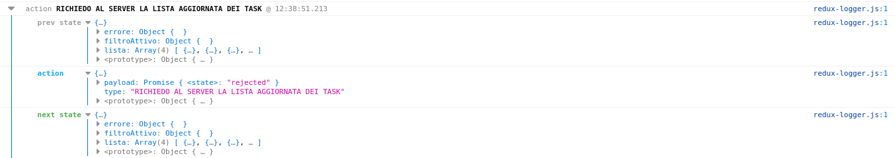

# Redux
Libreria JS per la gestione dello stato dei componenti.

Redux si basa sui concetti di : Store, Reducer e Action, lo store è il contenitore delle variabili che definiscono lo stato, il reducer è la funzione che ad un determianto evento modifica lo store e la action rappresenta le azioni che generano eventi letti dal reducer.


# installazione
Per installare Redux basta lancire il comando `npm install --save redux` dalla cartella principale della nostra applicazione.

# Operazioni di base

Queste operazioni che presento di seguito rappresentano il comportamento base della libreria Redux

## Creazione dello store

La store è il contenitore nella quale andremo ad inserire i dati ottenuti dal backend e che utilizzeremo per passare le varie informazioni ai vari componenti di react in pratica lo stato della nostra applicazione. 

Innanzitutto dobbiamo inizializzare una Store, andiamo nel componente radice della nostra applicazione ( con react sarà App) e importiamo la funzione **createStore** :
```js
import {createStore} from 'redux';
```

Una volta richiamata la funzione possiamo andare a sfruttare il ciclo vita del componente App per creare uno store ogni volta che carichiamo il componente App: 

```js
componentDidMount(){
    const store = createStore( (state = {}, action ) => {
        return {...state}; 
    } )
}
```
Questo store definito in questo modo non effettua nessun azione, ma ci serve come definizione. Quando creiamo questo oggetto store, noi utilizziamo la funzione createStore che inizializza la nostra banca dati con la variabile state che rappresentano il contenuto e con delle action che rappresentano le operazioni da eseguire per ottenere i dati. tutta l'arrow function viene definita come Reducer cioè la funzione che modifica lo stato della nostra applicazione. 

Il concetto di Reducer è comune in JS e rappresenta una funzione che dato uno stato iniziale esegue delle operazioni che effettuano il passaggio di stato un esempio è il seguente :
```js
[1,2,3,4].reduce((n,p) => n*p)
// il risultato è 24
```
Questa operazione non fa altro che prendere i valori dell'array e moltiplicare il valore attuale per lo stato precedente affinche si ottenga lo stato successivo quindi abbiamo che nella prima iterazione lo stato è nullo * il valore 1 ottenendo lo stato 1, nella seconda iterazione abbiamo lo stato attuale che 2 e lo moltiplichiamo con lo stato precedente che è 1 ottenendo lo stato successivo 2, iterando queste operazioni abbiamo 2*3 = 6 e 6*4= 24.

Per semplificare la trattazione riscrivero il codice di App : 
```js
import React from 'react';
import { createStore } from 'redux';

function storeReducer( state = {}, action) {
    return {...state};
}

class App extends React.Component {
    constructor (){
        super()
    }


    componentDidMount(){
        const store = createStore( storeReducer )
    }
}
```
La funzione createStore prende in ingresso 3 variabili e sono : 
+ il Reducer
+ lo stato iniziale 
+ un eancher cioè una funzione che permette di applicare dei servizi come l'utilizzo di plugin per il browser o dei middleware tramite applyMiddleware (vedremo nel paragrafo sui Middleware)

Qundi a valle di ciò possiamo aggirnare la nostra funzione definendo un array con delle stringhe che possano definre una todolist come ad esempio la lista della spesa :

```js
import React from 'react';
import { createStore } from 'redux';

let listaSpesa = [
    "latte",
    "uova",
    "pane"
]

function storeReducer( state = {}, action) {
    return {...state};
}

class App extends React.Component {
    constructor (){
        super()
    }


    componentDidMount(){
        const store = createStore( storeReducer, {lista :[...listaSpesa]} )
    }
}
```

In questo caso abbiamo aggiunto un array allo store utilizzando lo spread operator di JS passando un oggetto che verrà chiamato lista e che conterrà tutti i valori dell'array listaSpesa, Lo spread operator viene utilizzato per il passoggio di varviabili effettuando una copia dello stesso e non il passaggio per riferimento.
Utilizzando il codice : `consol.log(store.getState())` possiamo visualizzare il contenuto dello store. 
getState è una funzione specifica per lo store di redux.


## Dispatch

Il dispatch rappresenta un messaggio che viene inviato alla store.

Modifichiamo il codice visto affinche lo store sia una variabile globale con la quale possiamo interagire :

```js
import React from 'react';
import { createStore } from 'redux';

//questo array definito in questo punto è concettualmente il contenuto del nostro backend 
let listaSpesa = [
    "latte",
    "uova",
    "pane"
]

function storeReducer( state = {}, action) {
    return {...state};
}

const store = createStore( storeReducer, {lista :[...listaSpesa]} )

class App extends React.Component {
    constructor (){
        super(),
        this.state = {
            lista : [ ]
        }

    }
    
    //con questa operazione non facciamo altro che caricare il contenuto dello store nella variabile state del componente
    componentDidMount(){
         this.setState({lista:[...store.getState().lista] });
    }

    //definiamo il metodo render che renderizzerà la lista contenuta nello state del componente
    render(){
        return (
            <div>
            <ul>
            {
                this.state.lista.map( (elemento,i) => <li key={i}>{elemento}</li>)
            }
            </ul>
            </div>
        )
    }
}
```

le modifiche effettuate non fanno altro che aggiornare lo state del componente con il contenuto della store e abbiamo renderizzato la lista degli elementi.

Ora supponiamo di voler modificare lo store attraverso un input :

```js
import React from 'react';
import { createStore } from 'redux';

//questo array definito in questo punto è concettualmente il contenuto del nostro backend 
let listaSpesa = [
    "latte",
    "uova",
    "pane"
]

function storeReducer( state = {}, action) {
    return {...state};
}

const store = createStore( storeReducer, {lista :[...listaSpesa]} )

class App extends React.Component {
    constructor (){
        super(),
        this.state = {
            lista : [ ]
        },
        
        //definizione di un riferimento al tag input
        
        this.listaInput = React.createRef()

    }
    
    //con questa operazione non facciamo altro che caricare il contenuto dello store nella variabile state del componente
    componentDidMount(){
         this.setState({lista:[...store.getState().lista] });
    }

    //funzione per l'aggiunta dell'elemento alla lista
    aggiungiElementoLista = () => {
        //restituisce il valore contenuto nel tag input attraverso il suo riferimento
        const elemento = this.listaInput.current.value;
        
        // funzione che invia l'oggetto action al reducer per la modifica dello store 
        store.dispatch({
            type: "ADD_ELEMENTO"
            payload : elemento
        });
    }

    //definiamo il metodo render che renderizzerà la lista contenuta nello state del componente e aggiungiamo un tag input con un riferimento e un bottone con la funzione di aggiungi elemento
    render(){
        return (
            <div>
                <input ref = {this.listaInput} />
                <button onClick = {this.aggiungiElementoLista}> add </button>
                <ul>
                    {
                        this.state.lista.map( (elemento,i) => <li key={i}>{elemento}</li>)
                    }
                </ul>
            </div>
        )
    }
}
```
Con queste modifiche appena fatte effettivamente stiamo inviando delle informazioni allo store ma non avendo definito il comportamento del reducer quando vengono effettuate delle action quest'utlimo effettuerà sempre la solita azione e cioè ricaricherà lo stato attuale nello store.
Per far in modo che il reducer esegua determiante azioni in funzione delle action modifichiamolo come segue :
```js

function storeReducer( state = {}, action) {
    switch(action.type) {
        case "ADD_ELEMENTO" : 
            return {
                    lista  : [
                        action.payload,
                        ...state.lista
                    ]
                }

        default : 
            return {...state}
    }
    
}
```

A questo punto abbiamo che lo store viene effettivamente modificato, Ma se andiamo sulla pagina vedremo che se aggiugiamo un elemento esso non viene visualizzato. Per ovviare a questo problema, dovuto al fatto che lo state del componente e lo store non sono connessi e cioè lo stato del componente non varia al variare dello store, utiliziamo una funzione dello store che si chiama subscirbe.

## Subscribe

Attraverso questa funzione andiamo ad intercettare le modifiche che vengono fatte allo store. 

Andiamo ad inserire questa funzione nel componente e nello specifico nella funzione componentDidMount :
```js
componentDidMount(){
        // settiamo lo state appena carichiamo il componente
        this.setState({lista:[...store.getState().lista] });

        //mettiamo in ascolto tramite il metodo subscribe che aggiorna lo stato del componente
        store.subscribe( () => {
            this.setState({lista:[...store.getState().lista] });
        })
         
    }

```

in questo modo abbiamo che i componenti legati allo store si aggirneranno ogni volta che abbiamo un suo aggiornamento.

Effettuiamo ulteriori modifiche affinche oltre ad inserire dei nuovi elementi possiamo anche rimuoverli aggiungendo un elemento ad ogni riga della lista che ne permetta l'elimminazione ed aggiungendo anche una nuova action nel reducer.

Il codice della lista viene modificato come di seguito :
```js
<ul>
    {
    this.state.lista.map( (elemento,i) => <li key={i}>{elemento} <button onClick={ this.rimuoviElemento.bind(null,i)}>-</button></li>)
    }
</ul>
```
Come potete vedere abbiamo solo aggiunto un bottone ad ogni elemento della lista che richiama una funzione che prende in ingresso l'indice dell'array dell'elemento.

La funzione rimuoviElemento invece viene costruita come segue : 
```js
rimuoviElemento = (i) => {
    store.dispatch({
        type : "REMOVE_ELEMENTO",
        payload : i
    })
}
```
Come potete vedere la funzione non fa altro che inviare una richiesta di tipo eliminazione e un id

Mentre modifichiamo la funzione reducer nel segunete modo :
```js
function storeReducer( state = {}, action) {
    switch(action.type) {
        case "ADD_ELEMENTO" : 
            return {
                    lista  : [
                        action.payload,
                        ...state.lista
                    ]
                }

        case "REMOVE_ELEMENTO" :
            return {
                lista : [
                    ...state.lista.slice(0,action.payload)
                    ...state.lista.slice(action.payload + 1)
                ]
            }

        default : 
            return {...state}
    }
    
}
```

Il reducer è il vero esecutore dell'eliminazione, utilizzando il metodo slice non facciamo altro che tornare la parte dello state fino all'elemento che vogliamo eliminare e poi andiamo ad aggiungere la restante parte senza l'indice dell'elemento corrente.


Questo metodo proposto non è quello ottimale per la gestione dello store tramite redux nelle sezioni seguenti affineremo questo modello affiche la gestione sia più semplice quando il progetto cresce di dimensioni e vedremo anche come integrare al meglio Redux con React affinche collaborino al meglio.


# React Redux 
Per semplificare l'utilizzo di Redux con React esiste questa libreria. Per poterla richiamare basta installarla tramite il seguente comando : `npm install --save react-redux` .

Un primo concetto con l'aggiunta di questa libreria è il componente presentazionale e i componenti container.

## Componenti presentazionali 

Quando andiamo a vedere la documentazione di react redux ci vengno mostrati, come prima parte, i componenti presentazionali ed i container. In pratica tramite questa libreria possiamo pensare alla parte grafica senza doverci preoccupare di quelli che sono i dati ad essa collegati e le funzioni che dovremmo definire in essa per eseguire operazioni quali promise.

Quindi a valle di ciò andiamo a definire come esempio l'elenco della lista della spesa come componente a se stante e non definito completamente in App.

Quindi iniziamo a definire delle cartelle nel progetto quali : Views e Container.


Nella cartella Views andiamo a creare il componente per la lista con il segunete codice :
```js
import React from 'react';
import Elemento from './elemento'

export default function lista ({lista}) {

    return (
        <React.Fragment>
            <ul>
                {
                    this.state.lista.map( (elemento,i) => {<Elemento key={i} elemento = {elemento} />})
                }
            </ul>
        </React.Fragment>
    )
}
```
Ed il componente elemento con il segunete codice :
```js
import React from 'react';

export default function elemento({elemento}) {

    return (
        <li >{elemento} <button onClick={ this.rimuoviElemento.bind(null,i)}>-</button></li>
        )
}
    
```

Un ulteriore aggiunta nei componenti Views è quella dell'input con il codice qui di seguito : 
```js
import React from 'react':

export default function input({aggiungiElemento}){
    
    let listaInput;

    return(
        <React.Fragment>
            {/* il ref rappresenta un modo diverso per definire il riferimento*/}
            <input ref = {node => {riferimentoTask = node}} />
            <button onClick = { aggiungiElementoLista}> add </button>
        </React.Fragment>
    )
}
```

Ora definiamo un componente che inglobi la nostra app, chiamiamolo MyApp : 
```js
import React from 'react';
//import componenti Views
import Input from './Views/input';
import Lista from './Views/lista';

export default function myApp(){
    
    return(
        <div>
            <Input />
            <Lista />
        </div>
    )
}

``` 

Dopo aver effettuato la scomposizione degli componenti di visualizzazione andiamo a strutturare i reducer.

## Reducer
Nella prima parte abbiamo inserito la funzione storeReducer nell'App mentre normalmente si utilizza una cartella apposita dove salviamo tutti i nostri reducer poiché in progetti più complessi potremmo avere bisogno di più funzioni che modificano il nostro stato in funzione di quanti stati può avere la nostra applicazione.

Quindi creiamo la nostra cartella Reducer e inseriamo un file con il seguente codice (come standard possiamo utilizzare per il reducer principale il nome index.js) : 
```js
export default function storeReducer( state = {}, action) {
    switch(action.type) {
        case "ADD_ELEMENTO" : 
            return {
                    lista  : [
                        action.payload,
                        ...state.lista
                    ]
                }

        case "REMOVE_ELEMENTO" :
            return {
                lista : [
                    ...state.lista.slice(0,action.payload)
                    ...state.lista.slice(action.payload + 1)
                ]
            }

        default : 
            return {...state}
    }
    
}
```


## Action 
Effettueremo un uteriore modifica andando a copiare le funzioni aggiungiElemento e rimuoviElemento in una cartella Action.
Riscriveremo il codice del file come di seguito :
```js
 
 export const aggiungiElementoLista = ({elemento}) => {

        
        
        return({
            type: "ADD_ELEMENTO"
            payload : elemento
        });
    }

export const rimuoviElemento = (i) => {
    return({
        type : "REMOVE_ELEMENTO",
        payload : i
    })
}
```

Come possiamo notare abbiamo eliminato la funzione dello store dispatch. Questa modifica viene effettuata poiché utilizzeremo la libreria react-redux che effettuerà in automatico il binding con i componenti react è che invierà in automatico le dispatch al reducer tramite la funzione connect(). A valle di questa operazione possiamo anche eliminare il contenuto in App di componentDidMount poiché sarà sempre connect che effettuerà l'aggiornamento dello stato del componente.

Quindi le nostre action in questo modo si riducono al solo ricevere un parametro e inviare un azione.

A valle di tutte le modifiche dovremmo avere una situazione del genere come file :
+ src
    + Action
        + mainAction.js
    + Container
    + Reducer
        + mainReducer.js
    + Views 
        + input.js
        + lista.js
        + elemento.js
        + myApp.js
+ App.js
+ resto dei file di react

## Provider

A questo punto per passare lo store a tutti i componenti che ne hanno bisogno utilizzeremo un provider e cioè un componente wrapper che inietterà lo stato all'interno della nostra app e che darà i dati a tutti i componenti che ne richiedono senza dover passare lo store da padre in figlio.

Quindi per effettuare questa operazione andiamo in App e modifichiamo il codice come segue :
```js
import React from 'react';
import { createStore } from 'redux';
import { Provider } from 'react-redux';

import MyApp from './Views/myApp';
let listaSpesa = [
    "latte",
    "uova",
    "pane"
]

function storeReducer( state = {}, action) {
    return {...state};
}

const store = createStore( storeReducer, {lista :[...listaSpesa]} )

class App extends React.Component {
    constructor (){
        super()
    }
    
    
    render(){
        return (
            <div>
                <Provider store = {store}>
                   <MyApp />
                </Provider>
            </div>
        )
    }
}
```

## Container
I conteniner sono delle classi che prendono le Views e iniettano la parte di dati che vogliamo dare allo specifico componente.
Come esempio scriviamo il container per il componente lista :
```js
import {connect} from 'react-redux';
import Lista from '../Views/lista'

//funzione che mappa lo stato con le proprietà del componente riceve in ingresso lo stato proveniente dallo store mentre il secondo sono le props del componente (se il passaggio è solo dallo store al componente allora basta solo state altrimenti dobbiamo inserire anche il secondo parametro)
const mapStateToProps = (state, ownProps) => {

    return (
        //il primo elemento rappresenta la variabile che si aspetta il componente view, mentre il secondo è il contenuto dello store interessato 
        lista : [...state.lista]
    )
}

//connect prende in ingresso la funzione che mappa lo stato (il nome non è importante ma per standard si usa questa dicitura) mentre la seconda mappa le azioni definite nelle action. connect restituisce una funzione e quindi nel secondo parametro dobbiamo inserire la view per la quale abbiamo mappato il container
const myList = connect(mapStateToProps)(Lista)

export default myList
```

Una volta che abbiamo creato il container dobbiamo utilizzare quest'ultimo nella definizione di MyApp al posto del componente view. 

```js
import React from 'react';
//import componenti Views
import Input from './Views/input';
//import Lista from './Views/lista';
import MyLista from '../Container/myLista'
export default function myApp(){
    
    return(
        <div>
            <Input />
            <MyLista />
        </div>
    )
}

```

Il prossimo passaggio è creare un container per Input, per semplicità e per dimostrazione è possibile creare il container anche all'interno dell'elemento view ma per prassi è sempre bene separare la parte visuale dalla parte logica anche se il componente è piccolo :
```js
import {connect} from 'react-redux';

import React from 'react';

import {aggiungiElementoLista} from '../Action/mainAction'

function input(){
    
    let listaInput;

    return(
        <React.Fragment>
            {/* il ref rappresenta un modo diverso per definire il riferimento*/}
            <input ref = {node => {riferimentoTask = node}} />
            <button onClick = { aggiungiElementoLista}> add </button>
        </React.Fragment>
    )
}

const myInput = connect()(input)

export default myInput
```

In realtà il componente cosi definito è già collegato allo store o meglio può effettuale l'operazione di dispatch poiche in realtà negli argomenti della nostra funzione abbiamo di default la funzione dispatch :
```js

function input({dispatch}){
    
    let listaInput;

    return(
        <React.Fragment>
            {/* il ref rappresenta un modo diverso per definire il riferimento*/}
            <input ref = {node => {listaInput = node}} />
            {/*inseriamo la funzione anonima o il bind per evitare che qunado viene creato il componente la funzione non verrà avviata ma solo al click del mouse*/}
            <button onClick = { () => dispatch( aggiungiElementoLista(listaInput.value) )}> add </button>
        </React.Fragment>
    )
}

```

La funzione definita in questo modo è perfettamente funzionante ma il metodo ottimale è il segunete, partendo dal componente view iniziale :
```js
import React from 'react':

export default function input({aggiungiElemento}){
    
    let listaInput;

    return(
        <React.Fragment>
            {/* il ref rappresenta un modo diverso per definire il riferimento*/}
            <input ref = {node => {listaInput = node}} />
            <button onClick = { () =>{ 
                aggiungiElemento( listaInput.value )
                {/*per azzerare il valore nell'input*/}
                listaInput.value= ""
            }}
            
            > add </button>
        </React.Fragment>
    )
}
```
Abbiamo il segunete container : 
```js
import {connect} from 'react-redux';
import {aggiungiElementoLista} from '../Action/mainAction';
import Input from '../Views/input';

//le ownProps vengono utilizzate quando consideraimo nella view le props ma questo rappresenta il vecchio metodo cioé il passaggio di variabili da padre a figlio quindi nella stragrande maggioranza dei casi difficilmente le utilizzeremo
const mapDispatchToProps = (dispatch, ownProps) => {
    return{
        //aggiungiElemento è la funzione definita nella view mentre aggiungiElementoLista è la funzione definita nelle action che abbiamo richiamato negli import
        aggiungiElemento : (elemento) => {
            dispatch( aggiungiElementoLista(elemento) )
        }
    }

}


/*
In questo caso che stiamo facendo l'inserimento di un nuovo valore non abbiamo bisogno di passare lo store quindi inseriremo null come primo parametro, il secondo parametro non è altro che il mapping tra la funzione che possiede la view e la action corrispondente
*/
export default connect(null,mapDispatchToProps )(Input)
```

in realtà esiste anche un metodo di mapping più breve :
```js
import {connect} from 'react-redux';
import {aggiungiElementoLista} from '../Action/mainAction';
import Input from '../Views/input';

//si fa corrispondere alla funzione dichiarata nella view quella della action
export default connect(null,{aggiungiElemento : aggiungiElementoLista} )(Input)


/*
  Un ulteriore semplificazione si ha quando la funzione definita nella view ha lo stesso nome della action in quel caso basta solo scrivere il nome della action nell'oggetto 
*/

```

## Middleware
Andando a vedere la documentazione di redux possiamo notare che createStore ha 3 parametri in ingresso che sono : il reducer, lo stato iniziale e l'Enhancer .
In pratica il terzo parametro permette di inserire dei componenti ulteriori alla nostra struttara definiti middleware. Attraverso queste applicazioni possiamo andare ad interagire con le varie fasi dell'interazione di redux (prima e dopo la dispatch) con il frontend.
Una delle funzionalità dei middleware è quella di poter inserire del contunuto alle nostre funzioni di comunicazione con il backend o di fare uno screening delle azioni che si sono effettuate cosi da poter individuare eventuali bug.

Per poter applicare un middleware dobbiamo utilizzare la funzione applyMiddleware che ingloba l'elenco di middleware che vogliamo applicare e gli fornisce i metodi getState e dispatch. 

per poter applicare un middleware quindi basta scrivere il segunete codice nella creazione dello store :
```js
const store = createStore(storeReducer, {...prova}, applyMiddleware(logger, promise));
```

### Logger
Logger è un middleware scritto dalla comunity installabile tramite il comando :  
`npm install redux-logger`

Il logger non è altro che un componente che ti mostra in console le azioni che vengono eseguite sullo store.

Per poterlo utilizzare, una volta installato, basta importarlo trmaite il comando :  
```js
import logger from 'redux-logger'
```

un esempio è il segunete :  
  

Come potete vedere da delle informazioni sull'action eseguita sullo stato precedente e sullo stato attuale.

### 